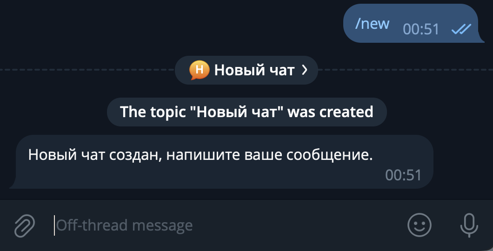
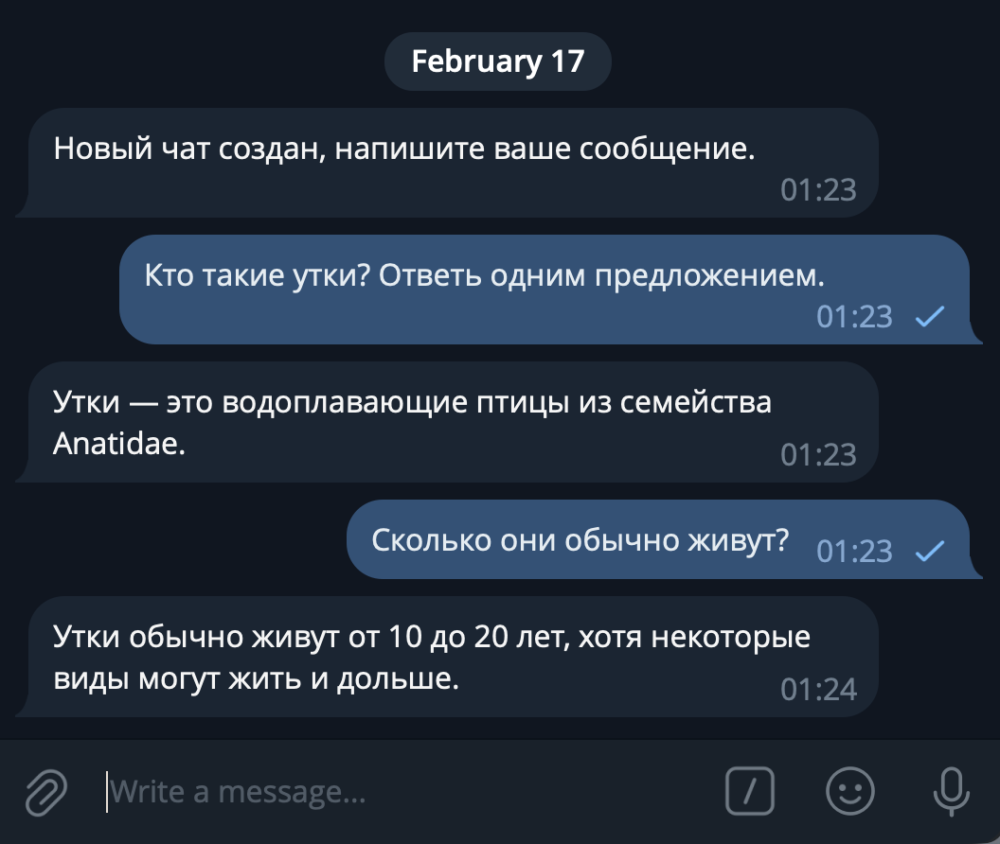
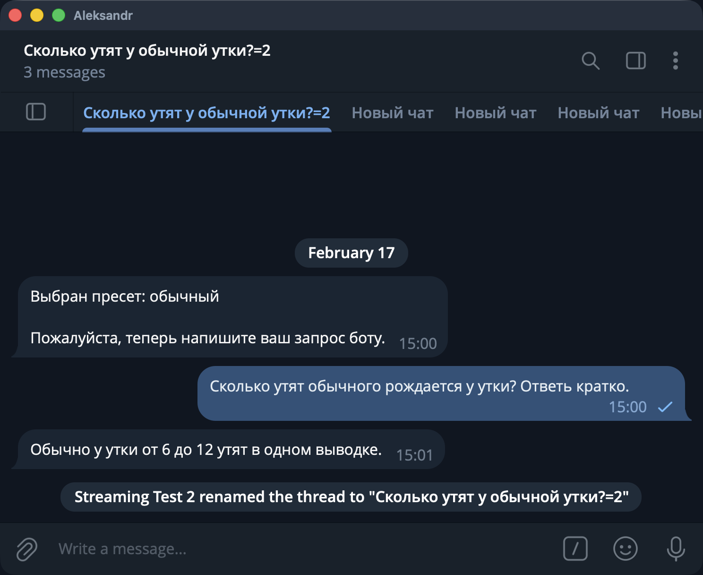
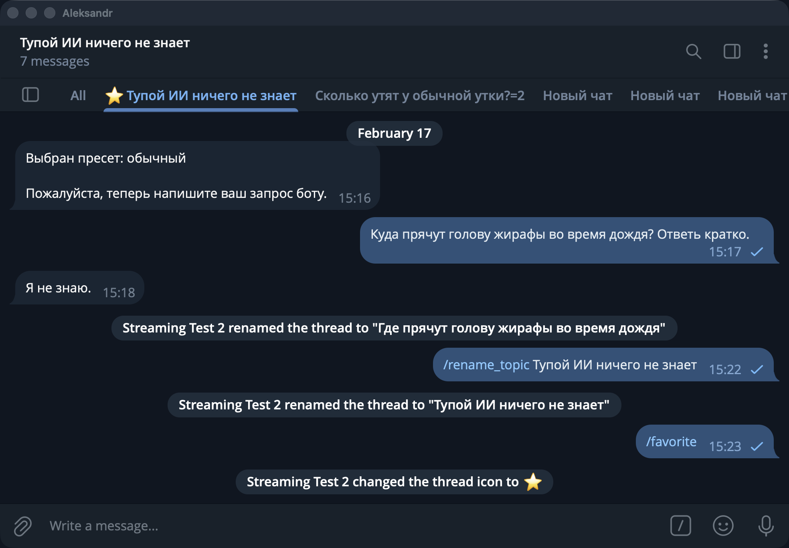

!!! info ""
    Используемая версия aiogram: 3.25.0

31 декабря 2025 года вышла [обновление Bot API 9.3](https://core.telegram.org/bots/api-changelog#december-31-2025), 
а 9 февраля 2026 года – [обновление Bot API 9.4](https://core.telegram.org/bots/api-changelog#february-9-2026). 
В них помимо всего прочего добавилась поддержка топиков прямо в ЛС с самим ботом, причём в двух вариантах.

А раз 2025 год прошёл под знаком больших языковых моделей (Large Language Models, LLM) и 2026-й не будет исключением, то 
сегодня совместим мир ботов и мир AI и напишем простого бота с поддержкой топиков и взаимодействием с ИИ. Причём 
сообщения будут отправляться через стриминг, т.е. как в привычных ИИ-интерфейсах.

<!-- more -->

## Возможности и ограничения

Сразу оговоримся: как и большинство примеров в этой книге, бот будет специально упрощён, чтобы сконцентрироваться только на 
основных и важных моментах. В качестве LLM будем использовать **локальную** модель 
[Qwen2.5-7B-Instruct](https://huggingface.co/lmstudio-community/Qwen2.5-7B-Instruct-GGUF), её можно легко 
и бесплатно запустить на домашнем железе или недорогой VPS. Например, у меня арендована вот такая машинка:
```plain
OS: Debian GNU/Linux 12 (bookworm) x86_64
Kernel: 6.1.0-17-amd64
CPU: Intel Xeon E3-1231 v3 (8) @ 3.800GHz
GPU: 02:00.0 Matrox Electronics Systems Ltd. MGA G200e [Pilot] ServerEngines
Memory: 9976MiB / 31825MiB
```
Сама модель займёт где-то 7-8 гигабайт в оперативной памяти. Qwen2.5-7B не самая «умная», но чтобы попробовать работать 
с LLM на практике более чем сойдёт. Содержимое чатов будем хранить в оперативной памяти, 
чтобы не отвлекаться на инфраструктуру, но готовый вариант можно будет легко адаптировать 
под PostgreSQL, Redis или что угодно ещё.

Начиная с Bot API 9.4 у разработчиков есть два выбора, как отображать топики в ЛС с ботом: 

1. Каждое сообщение вне топика автоматически создаёт новый и переносит туда сообщение.
2. Бот самостоятельно создаёт топики, а у юзера такая возможность пропадает, равно как и возможность удалять.

Оба варианта показаны на следующем рисунке:


Рассмотрим плюсы и минусы каждого подхода:

* Первый вариант больше подходит на интерфейс «а-ля ChatGPT»: каждое сообщение принадлежит какому-то топику, 
легче контролировать, что и где написано. Минус очевидный: все действия, не относящиеся к переписке, тоже будут 
лежать в каком-то топике, т.е. придётся проводить границу между «здесь общаемся, а здесь настройками балуемся».
* Второй вариант даёт гораздо больше контроля: можно по отдельной команде создавать топик специально под общение с ИИ, 
а General (т.е. топик с id=0) оставлять под настройки, информационные сообщения и прочее «служебное». Но эта гибкость 
усложняет UX (user experience): например, пользователь после создания топика ботом автоматически не перекидывается туда, 
требуя лишнее нажатие.

Возможно, золотой серединой было бы использование варианта №1, но все настройки увести в веб-интерфейс. Но если у вас 
уже есть веб-интерфейс настроек, то просто добавьте туда интерфейс чата и не надо будет возиться с Bot API :)

В общем, далее будет показан пример на варианте №2. В процессе подготовки этого текста я сделал оба, поэтому напишите 
в моей группе (иконка внизу каждой страницы), если интересно рассмотреть вариант №1 тоже.

И последнее перед тем, как продолжим: чтобы сфокусироваться непосредственно на новых вещах из мира ботов, начинать 
проект будем не с нуля: на GitHub в репозитории этой книги будет 
[отдельный каталог](https://github.com/MasterGroosha/aiogram-3-guide/tree/master/code/project_threads_llm), 
там расположен базовый код с одним роутером, настройками и логом. Всё дальнейшее повествование подразумевает, 
что вы начинаете с этого же момента.  

## Как включить топики в ЛС с ботом

Для активации фичи надо открыть @BotFather, причём не просто диалог с ботом, а веб-приложение. Далее необходимо выбрать 
вашего бота, а затем нажать **Bot Settings**. В разделе **Threads Settings** есть две настройки. Первая в целом 
включает поддержку топиков, а вторая отвечает за выбор варианта их отображения. Если сопоставлять с нумерацией выше по 
тексту, то положение ВЫКЛ – это вариант 1, а ВКЛ – вариант 2.


А теперь ложка дёгтя: данная фича не бесплатная в классическом понимании. Если вчитаться в приписочку под этими 
двумя переключалками и перейти по ссылке, то можно обнаружить, что при включенном режиме **Threaded Mode** все покупки 
пользователей в таком боте будут облагаться дополнительным 15% налогом от Telegram. Почему Дуров хочет брать повышенный 
налог на топики и куда пойдут эти деньги, науке пока что неизвестно. Но если ваш бот никак не взаимодействует с 
Telegram Stars, то ничего отдельно с вас не возьмут.

## Обращаемся к LLM

Пора отправить первое сообщение к локальной ИИ-модели. Но сперва её нужно скачать: загрузите GGUF-файл 
с [Hugging Face](https://huggingface.co/lmstudio-community/Qwen2.5-7B-Instruct-GGUF/tree/main) 
(рекомендую версию Q4_K_M) и положите его в каталог `models` под именем `qwen2.5-7b-instruct-q4_k_m.gguf`.

Добавьте в `docker-compose.yml` новый сервис и поставьте `bot` зависящим от него:

```yaml title="docker-compose.yml"
name: "llm-in-telegram"

services:
  llm:
    image: ghcr.io/ggml-org/llama.cpp:server
    command: >
      --model /models/qwen2.5-7b-instruct-q4_k_m.gguf --ctx-size 4096 --threads 4 --n-gpu-layers 0 --port 8080 --host 0.0.0.0
    volumes:
      - ./models:/models
    ports:
      - "8080:8080"
    restart: "no"  # "no" для примера, обычно "unless-stopped"

  bot:
    build:
      context: src
      dockerfile: ./Dockerfile
    volumes:
      - ./src/settings.toml:/app/src/settings.toml:ro
    depends_on:
      - llm
    restart: "no"  # "no" для примера, обычно "unless-stopped"
```

Далее в `src/bot` создайте файл `llm.py` с описанием простого клиента:
```python title="src/bot/llm.py"
import httpx


class LLMClient:
    def __init__(
            self,
            http_client: httpx.AsyncClient,
            llm_url: str,
    ):
        self.http_client = http_client
        self.llm_url = llm_url

    async def generate_response(
            self,
            model: str,
            messages: list[dict],
            temperature: float = 0.7,
    ) -> str:
        payload = {
            "model": model,
            "stream": False,
            "messages": messages,
            "temperature": temperature,
        }

        response = await self.http_client.post(self.llm_url, json=payload, timeout=60)
        response.raise_for_status()
        data = response.json()
        return data["choices"][0]["message"]["content"]
```

Обновите файл `config_reader.py`, добавив туда модель `LLMConfig` и прописав поле `llm` в `class Settings`:

```python title="src/bot/config_reader.py"
# Новый класс
class LLMConfig(BaseModel):
    url: str
    
class Settings(BaseSettings):
    bot: BotConfig
    logs: LogConfig
    llm: LLMConfig  # новое поле
    
    # тут остальной код класса
```

Далее надо обновить код в файле `__main__.py`: добавить создание HTTP- и LLM-клиентов, настроить закрытие HTTP-клиента 
при завершении работы бота и прокинуть оба клиента в диспетчер. Полная версия файла:
```python title="src/bot/__main__.py"
import asyncio

import httpx
import structlog
from aiogram import Bot, Dispatcher
from aiogram.fsm.storage.memory import MemoryStorage
from structlog.typing import FilteringBoundLogger

from .config_reader import Settings
from .handlers import get_routers
from .logs import get_structlog_config
from .llm import LLMClient


logger: FilteringBoundLogger = structlog.get_logger()


async def shutdown(dispatcher: Dispatcher) -> None:
    await dispatcher["http_client"].aclose()


async def main():
    settings = Settings()
    structlog.configure(**get_structlog_config(settings.logs))

    bot = Bot(token=settings.bot.token.get_secret_value())
    dp = Dispatcher(storage=MemoryStorage())
    dp.include_routers(*get_routers())
    dp.shutdown.register(shutdown)

    http_client = httpx.AsyncClient(timeout=None)
    llm_client = LLMClient(http_client, settings.llm.url)
    dp.workflow_data.update(
        http_client=http_client,
        llm_client=llm_client,
    )

    await logger.ainfo("Starting bot...")
    await dp.start_polling(bot)


asyncio.run(main())
```

В `settings.toml` добавьте URL к будущему серверу llama.cpp:
```toml
[llm]
url = "http://llm:8080/v1/chat/completions"
```

Наконец, вместо заглушки-обработчика на команду `/start` сделаем что-то более полезное: 
будем делать запрос к Qwen2.5 с захардкоженным вопросом «ты кто?»:
```python title="src/bot/handlers/start.py"
from aiogram import Router
from aiogram.filters import CommandStart
from aiogram.types import Message

from ..llm import LLMClient

router = Router()


@router.message(CommandStart())
async def cmd_start(
        message: Message,
        llm_client: LLMClient,
):
    messages = [
        {
            "role": "system",
            "content": "Ты — умный ассистент, помогаешь пользователям с разными задачами."
        },
        {
            "role": "user",
            "content": "Ты кто?"
        }
    ]
    response_text: str = await llm_client.generate_response(
        messages=messages,
        temperature=0.7,
    )
    await message.answer(response_text)
```

Для тех, кто впервые сталкивается с LLM, стоит сделать несколько прояснений, очень упрощённо:

* Все большие языковые модели _stateless_ по своей природе, т.е. они с каждым запросом получают **полную** историю 
сообщений в диалоге. Иными словами: вы отправили ИИ два сообщения, оно вам вернуло третье. В следующий раз вы должны 
отправить все три, плюс своё четвёртое, чтобы получить пятое. И так далее. Из этого следует, что при отправке истории 
сообщений её [историю] можно редактировать на своё усмотрение. Ниже расскажу, зачем это может понадобиться.
* Всего существуют три основные роли: `system`, `user` и `assistant`. Последние две – это человек и LLM соответственно. 
А `system` – это общий контекст, «объясняющий» ИИ, кто он такой и что должен делать. Например, можно задать такой 
системный промт: «Сегодня 16 февраля 2026 года. Ты – умный ассистент. На дворе поздняя зима». Здесь хорошо видно, 
зачем может потребоваться редактировать историю: поставьте вместо даты заглушку типа `{}` и каждый раз её заменяйте 
на текущую дату, чтобы ИИ не застревал во времени.
* **Температура** определяет, насколько «креативными» будут ответы LLM. Если температура 0, то нейросеть становится полностью 
детерминированной: на один и тот же запрос вы будете получать один и тот же ответ. Но чем выше температура, 
тем менее предсказуемым будет результат. Для ролевых игр рекомендуется ставить значение повыше, для рутинных задач со 
строгими правилами – поменьше. Для программирования часто выбирают значение 0.7, но всё зависит от конкретной модели и от 
рекомендаций от её создателей.

!!! info
    Хорошее объяснение принципов работы больших языковых моделей можно посмотреть 
    на [YouTube](https://youtu.be/LPZh9BOjkQs).

Запустите бота командой `docker compose up --build`. Когда увидите в терминале информацию, что поллинг запущен, отправьте 
боту команду `/start` и немного подождите. Скоро вы получите ответ, причём у вас он будет, скорее всего, 
не в точности такой, как на скриншоте ниже:


Если сообщение пришло, то всё работает успешно!

## Стриминг текста

Если вы пользовались ChatGPT, Gemini, DeepSeek или им подобным, то наверняка замечали, что нейросети довольно 
словоохотливые и часто выдают длинные подробные сообщения. Даже если LLM запущена на очень быстром компьютере, 
она генерирует ответ слово за словом, поэтому это занимает какое-то время. Современные модели поддерживают 
стриминг текста, т.е. отправку того, что уже сгенерировалось, не дожидаясь, пока соберётся весь текст целиком. 
Начиная с Bot API 9.3 Telegram тоже поддерживает режим стриминга текста, правда, реализован он... ну, как обычно, 
_нестандартно_. 

Начнём с того, что добавим поддержку стриминга в наш клиент к LLM. Обычный режим оставим тоже, он пригодится далее. 
Замените содержимое файла `llm.py` на следующее:

```python title="src/bot/llm.py"
import json
from typing import AsyncIterator

import httpx


class LLMClient:
    def __init__(
            self,
            http_client: httpx.AsyncClient,
            llm_url: str,
    ):
        self.http_client = http_client
        self.llm_url = llm_url

    async def generate_response(
            self,
            messages: list[dict],
            stream: bool = False,
            temperature: float = 0.7,
            model: str = "local",
    ) -> str | AsyncIterator[str]:
        payload = {
            "model": model,
            "stream": stream,
            "messages": messages,
            "temperature": temperature,
        }

        if stream:
            return self._stream_response(payload)
        else:
            return await self._simple_response(payload)

    async def _stream_response(
            self,
            payload: dict,
    ) -> AsyncIterator[str]:
        async with self.http_client.stream("POST", self.llm_url, json=payload) as response:
            async for line in response.aiter_lines():
                if not line or not line.startswith("data:"):
                    continue
                if line.endswith("[DONE]"):
                    break

                data = line.removeprefix("data: ").strip()
                try:
                    chunk = json.loads(data)
                    delta = chunk["choices"][0]["delta"].get("content")
                    if delta:
                        yield delta
                except Exception:
                    continue

    async def _simple_response(
            self,
            payload: dict,
    ) -> str:
        response = await self.http_client.post(self.llm_url, json=payload, timeout=60)
        response.raise_for_status()
        data = response.json()
        return data["choices"][0]["message"]["content"]
```

Метод `generate_response()` обзавёлся новым булевым параметром `stream`, старый код уехал в метод `_simple_response()` 
и добавился новый метод `_stream_response()`. В нём происходит следующее:

* В ответ на запрос к `self.llm_url` сервер начинает присылать построчно данные.
* Если строка пустая или не начинается с `data:`, то это служебные данные, нам они не интересны. Пропускаем.
* Если строка заканчивается на `[DONE]`, то завершаем обработку.
* Убираем префикс `data` и пытаемся парсить оставшееся как JSON. Если получилось, достаём `content`.
* Если что-то извлеклось, забираем.
* Если что-то пошло не так, пропускаем ход. Да, часть текста потеряется, но обычно такого происходить не должно.

Теперь надо обновить обработчик команды `/start`. Чтобы сделать стриминг текста в Telegram, нужно выполнить следующие 
операции: выберите случайное число как идентификатор. Далее вызывайте в цикле API-метод 
[sendMessageDraft](https://core.telegram.org/bots/api#sendmessagedraft) с указанием идентификатора, айди чата, топика и 
новую версию текста (т.е. текст с накоплением). А после завершения цикла, когда весь текст готов, вызовите метод 
**sendMessageText** или какой вам нужен с полной и окончательной версией сообщения. Самая мякотка – форматирование: на 
«черновики» распространяются все правила, что и на обычные сообщения: никаких незакрытых тегов, никаких неизвестных тегов 
и т.д. Это боль...

Новая версия обработчика команды `/start`:
```python
from random import randint

import structlog
from aiogram import Bot, Router
from aiogram.exceptions import TelegramRetryAfter
from aiogram.filters import CommandStart
from aiogram.types import Message
from structlog.typing import FilteringBoundLogger

from ..llm import LLMClient

router = Router()
logger: FilteringBoundLogger = structlog.get_logger()


@router.message(CommandStart())
async def cmd_start(
        message: Message,
        llm_client: LLMClient,
        bot: Bot,
):
    messages = [
        {
            "role": "system",
            "content": "Ты — умный ассистент, помогаешь пользователям с разными задачами."
        },
        {
            "role": "user",
            "content": "Ты кто?"
        }
    ]

    # Начальное состояние текста
    text = ""
    # Случайный идентификатор черновика
    draft_id = randint(1, 100_000_000)
    # Получаем стрим от LLM и стримим уже в Telegram
    async for delta in await llm_client.generate_response(
        messages=messages,
        stream=True,
        temperature=0.7,
    ):
        text += delta

        # Если хотите лучше понять, как LLM генерируют текст по кусочкам,
        # раскомментируйте следующие строки
        # print(delta)
        # print(text)
        # print("*"*30)

        await bot.send_message_draft(
            draft_id=draft_id,
            chat_id=message.chat.id,
            message_thread_id=message.message_thread_id,
            text=text,
        )

    # Окончательная отправка сообщения
    await message.answer(text)
```

Когда вы запустите бота снова (напомню, `docker compose up --build`) и вызовите команду `/start`, 
то с первой или второй попытки увидите, что текст стримится, но обрывается, а в терминале появляется страшное:
```
aiogram.exceptions.TelegramRetryAfter: 
Telegram server says - Flood control exceeded 
on method 'SendMessageDraft' in chat 1234567. 
Retry in 17 seconds.
```

Оказывается, даже стримить быстро нельзя. Хорошо, сделаем обработку этой ошибки и будем при необходимости 
спать нужное количество секунд. Добавьте импорты и замените вызов `send_message_draft` на следующий блок:
```python
import asyncio
from aiogram.exceptions import TelegramRetryAfter

# В функции cmd_start():
...
try:
    await bot.send_message_draft(
        draft_id=draft_id,
        chat_id=message.chat.id,
        message_thread_id=message.message_thread_id,
        text=text,
    )
except TelegramRetryAfter as ex:
    await logger.awarning(
        f"Streaming rate limit, need to wait {ex.retry_after} sec"
    )
    await asyncio.sleep(ex.retry_after)
except Exception:
    await logger.aexception("Failed to stream message draft")
    return
...
```

Новая версия исправит краши, но текст будет генерироваться с большими паузами и вы по-прежнему будете видеть 
в логах строки вида: `[warning] Streaming rate limit, need to wait 16 sec`. На просторах интернета я видел рекомендации 
по типу «добавьте асинхронный sleep на 0.2 секунды в каждую итерацию», но это путь в никуда.

Достаточно задать себе вопрос: «а надо ли обновлять черновик _на каждый_ стриминговый ответ от LLM?». И вот оно решение:

* Запоминаем текущее время.
* Принимаем кусочек текста (чанк) от LLM.
* Если прошло мало времени, то не обновляем черновик.
* Если прошло достаточно времени, то обновляем черновик.
* Если всё-таки упёрлись в Flood Wait, то спим указанное количество секунд 
и заодно увеличиваем интервал между обновлениями черновика на 0.1 сек.

Перепишем функцию ещё раз:

```python
@router.message(CommandStart())
async def cmd_start(
        message: Message,
        llm_client: LLMClient,
        bot: Bot,
):
    # содержимое messages пропустим, чтобы не раздувать текст
    messages=[...]

    text = ""
    retry_backoff = 0.0
    update_interval = 0.7
    last_update = 0.0
    draft_id = randint(1, 100_000_000)
    async for delta in await llm_client.generate_response(
        messages=messages,
        stream=True,
        temperature=0.7,
    ):
        text += delta
        
        now = asyncio.get_running_loop().time()
        if now - last_update < update_interval + retry_backoff:
            await logger.adebug("Skipping updating draft; still merging chunks")
            continue
        await logger.adebug("Enough time passed, updating draft")

        try:
            await bot.send_message_draft(
                draft_id=draft_id,
                chat_id=message.chat.id,
                message_thread_id=message.message_thread_id,
                text=text,
            )
            last_update = now
        except TelegramRetryAfter as ex:
            retry_backoff += 0.1
            last_update = now
            await logger.awarning(
                f"Streaming rate limit, need to wait {ex.retry_after} sec"
            )
            await asyncio.sleep(ex.retry_after)
        except Exception:
            await logger.aexception("Failed to stream message draft")
            return

    await message.answer(text)
```

Практика показала, что такой вариант приводит к минимуму Flood Wait-ов, а при желании 
можно немного подвигать числа туда-сюда. 

Никак не закончим с этой бедной функцией и сделаем ещё одну улучшалку: поскольку LLM могут нагенерировать 
текста на более чем 4096 символов, стоит это учесть, иначе будет ошибка "message too long". 
Чтобы сильно не заморачиваться, сделаем функцию, которая при превышении заданного лимита, например, в 4000 символов, 
аккуратно обрежет текст по пробелу или переносу строки. Далее будем передавать в качестве черновика именно 
обрезанный текст, а в случае его расхождения с оригинальным просто завершит обработку, потому дальше уже принимать 
нельзя. Желающие отправлять несколько сообщений могут сделать это самостоятельно в качестве упражнения :)

Создайте в каталоге `src/bot` файл `text_utils.py` и поместите туда функцию:
```python title="src/bot/text_utils.py"
def trim_text_smart(
        text: str,
        max_len: int = 4000,
        trim_marker: str = "…",
) -> str:
    """
    Обрезает текст до {max_len} символов,
    стараясь это делать по пробелу или \n
    :param text: исходный текст
    :param max_len: максимально разрешённая длина текста
    :param trim_marker: символ, которым обрезается текст
    :return: обрезанный текст
    """
    if len(text) <= max_len:
        return text

    cut_len = max_len - len(trim_marker)
    candidate = text[:cut_len]

    # Пытаемся резать по границе строки
    newline_pos = candidate.rfind("\n")
    if newline_pos != -1:
        return candidate[:newline_pos] + trim_marker

    # Если нет — по последнему пробелу
    space_pos = candidate.rfind(" ")
    if space_pos != -1:
        return candidate[:space_pos] + trim_marker

    # Совсем крайний случай
    return candidate + trim_marker
```

И ещё раз обновим обработчик команды `/start`. Замените всё, что начинается с `text = ""` на это:
```python
# async def cmd_start(...)
    text = ""
    safe_text = ""
    retry_backoff = 0.0
    update_interval = 0.7
    last_update = 0.0
    draft_id = randint(1, 100_000_000)
    async for delta in await llm_client.generate_response(
        messages=messages,
        stream=True,
        temperature=0.7,
    ):
        text += delta
        safe_text = trim_text_smart(text)
        now = asyncio.get_running_loop().time()

        if now - last_update < update_interval + retry_backoff:
            if safe_text != text:
                break
            await logger.adebug("Skipping updating draft; still merging chunks")
            continue
        await logger.adebug("Enough time passed, updating draft")

        try:
            await bot.send_message_draft(
                draft_id=draft_id,
                chat_id=message.chat.id,
                message_thread_id=message.message_thread_id,
                text=text,
            )
            last_update = now
        except TelegramRetryAfter as ex:
            retry_backoff += 0.1
            last_update = now
            await logger.awarning(
                f"Streaming rate limit, need to wait {ex.retry_after} sec"
            )
            await asyncio.sleep(ex.retry_after)
        except Exception:
            await logger.aexception("Failed to stream message draft")
            return

        if safe_text != text:
            break

    await message.answer(safe_text)
```

Вот теперь можно насладиться стримингом текста в телеграме:


## История сообщений

Хорошо, на заранее известный вопрос нейросеть отвечать умеет, но надо научить бота поддерживать длинные диалоги. 
Следовательно, требуется какое-то хранилище, которое на каждый запрос будет доставать все сообщения, относящиеся к 
конкретному топику, а далее отправлять их к ИИ, получать ответ и снова обновлять хранилище. Как и было обещано в начале, 
для простоты запуска и понимания будем использовать in-memory хранилище в оперативной памяти. Для демонстрации возможностей 
этого более чем достаточно, а желающие добавить персистентность могут легко заменить RAM на PostgreSQL или любое 
другое подходящее хранилище.

Создайте файл `src/bot/storage.py` со следующим содержимым:
```python title="src/bot/storage.py"
from enum import StrEnum

import structlog
from pydantic import Field, BaseModel
from structlog.typing import FilteringBoundLogger

logger: FilteringBoundLogger = structlog.get_logger()


class Role(StrEnum):
    USER = "user"
    ASSISTANT = "assistant"
    SYSTEM = "system"


class Message(BaseModel):
    role: Role
    content: str

    def to_call_dict(self):
        return {
            "role": self.role.value,
            "content": self.content,
        }

    @classmethod
    def from_call_dict(
            cls,
            data: dict[str, str],
    ) -> "Message":
        return cls(
            role=Role(data["role"]),
            content=data["content"],
        )


class LLMChatMeta(BaseModel):
    user_id: int
    thread_id: int  # message_thread_id в терминах Telegram
    prompt_key: str = "default"
    temperature: float = 0.7


class LLMChat(BaseModel):
    meta: LLMChatMeta
    # Системное сообщение НЕ храним в списке messages,
    # оно динамически подставляется из persona_key при запросе к LLM.
    messages: list[Message] = Field(default_factory=list)

    @property
    def is_chat_start(self):
        return len(self.messages) <= 2


class InMemoryChatStorage:
    def __init__(self):
        self.__storage: dict[str, LLMChat] = dict()

    @staticmethod
    def _get_key(
            user_id: int,
            thread_id: int,
    ) -> str:
        return f"{user_id}_{thread_id}"

    async def create(
        self,
        user_id: int,
        thread_id: int,
    ) -> None:
        new_chat_key = self._get_key(user_id, thread_id)
        self.__storage[new_chat_key] = LLMChat(
            meta=LLMChatMeta(
                user_id=user_id,
                thread_id=thread_id,
            )
        )

    async def get(
            self,
            user_id: int,
            thread_id: int,
    ) -> LLMChat | None:
        return self.__storage.get(self._get_key(user_id, thread_id))

    async def update(
            self,
            user_id: int,
            thread_id: int,
            new_version: LLMChat,
    ):
        llm_chat_id = self._get_key(user_id, thread_id)
        self.__storage[llm_chat_id] = new_version

memory_chat_storage = InMemoryChatStorage()
```

Думаю, код максимально простой и пояснения к нему не требуются, тем более, что очень скоро мы начнём его использовать 
и всё станет ещё понятнее. Следующим шагом создадим обработчик команды `/new`, который делает следующее:

1. Создаёт новый топик с названием «Новый чат».
2. В случае неуспеха пишет ошибку и на этом всё.
3. В случае успеха использует айди топика вместе с айди юзера для создания новой записи в хранилище.
4. Отправляет сообщение пользователю с предложением написать первое сообщение для ИИ.

Создайте новый файл с роутером по адресу `src/bot/handlers/new_chat_creation.py`:
```python title="src/bot/handlers/new_chat_creation.py"
import structlog
from aiogram import Router, Bot
from aiogram.enums.topic_icon_color import TopicIconColor
from aiogram.filters import Command
from aiogram.types import Message
from structlog.typing import FilteringBoundLogger

from bot.storage import memory_chat_storage

router = Router()
logger: FilteringBoundLogger = structlog.get_logger()


@router.message(Command("new"))
async def cmd_start(
        message: Message,
        bot: Bot,
):
    try:
        new_topic = await bot.create_forum_topic(
            chat_id=message.chat.id,
            name="Новый чат",
            icon_color=TopicIconColor.YELLOW,
        )
    except:  # noqa
        await logger.aexception("Failed to create new topic")
        await message.answer("Что-то пошло не так. Пожалуйста, попробуйте ещё раз.")
        return

    new_topic_id = new_topic.message_thread_id
    await memory_chat_storage.create(
        user_id=message.from_user.id,
        thread_id=new_topic_id,
    )

    await bot.send_message(
        chat_id=message.chat.id,
        text="Новый чат создан, напишите ваше сообщение.",
        message_thread_id=new_topic_id,
    )
```

Не забудьте зарегистрировать роутер в `src/bot/handlers/__init__.py`! А вот обработчик команды `/start` можно заменить 
снова на простую заглушку; тот большой код для стриминга мы переиспользуем чуть позднее в другом месте:
```python title="src/bot/handlers/start.py"
import structlog
from aiogram import Router
from aiogram.filters import CommandStart
from aiogram.types import Message
from structlog.typing import FilteringBoundLogger

router = Router()
logger: FilteringBoundLogger = structlog.get_logger()


@router.message(CommandStart())
async def cmd_start(
        message: Message,
):
    await message.answer("Добро пожаловать! Нажмите /new для создания нового чата")
```

Запустите бота и выполните команду `/new`. Если всё пройдёт успешно, то создастся новый топик, куда бот сразу 
напишет сообщение:



Здесь кроется та самая проблема, о которой упоминалось в начале. Обратите внимание на подсказку "Off-thread message" 
от Telegram Desktop. Если пользователь просто отправит сообщение, то оно улетит в топик General (т.е. общий топик), 
а чтобы сделать правильно, надо отдельно нажать на заголовок «Новый чат >» на пунктирной линии. Такой проблемы нет 
при выборе другого варианта отображения, но там свои приколы. Что делать в нашем случае? Как вариант, просто реагировать 
на произвольные сообщения в General-топике. Да и в целом пора начать разделять роутеры на те, что работают в General-топике, 
и на те, что работают внутри явно созданных топиков. 

Сперва создайте роутер для обработки произвольных сообщений вне явных топиков:
```python title="src/bot/handlers/chat_in_general_topic.py"
import structlog
from aiogram import F, Router
from aiogram.types import Message
from structlog.typing import FilteringBoundLogger

router = Router()
logger: FilteringBoundLogger = structlog.get_logger()


@router.message(F.text)
async def text_message_in_general_topic(
        message: Message,
):
    await message.answer(
        "Сообщения вне топиков-чатов не поддерживаются. "
        "Пожалуйста, создайте новый топик-чат при помощи команды /new."
    )


@router.message(~F.text)
async def nontext_message_in_general_topic(
        message: Message,
):
    await message.answer(
        "В настоящий момент медиафайлы не поддерживаются"
    )
```

А теперь приведите ваш файл `src/bot/handlers/__init__.py` к следующему виду:
```python title="src/bot/handlers/__init__.py"
from aiogram import Router, F

from . import (
    chat_in_general_topic,
    new_chat_creation,
    start,
)

general_topic_router = Router()
general_topic_router.message.filter(F.message_thread_id.is_(None))
general_topic_router.include_routers(
    start.router,
    new_chat_creation.router,
    chat_in_general_topic.router,
)

in_topic_router = Router()
# Тут пока ничего не будет

def get_routers() -> list[Router]:
    return [
        general_topic_router,
        in_topic_router,
    ]
```

Вернёмся к бизнес-логике. Бот уже создаёт топик и предлагает туда написать. Значит, следующим шагом надо отреагировать 
на текстовое сообщение пользователя и отправить его запрос к ИИ. Снова пройдёмся по алгоритму:

1. Получить все более ранние сообщения пользователя в этом топике из хранилища. 
В случае ошибки – просим начать новый топик-чат и прекращаем обработку.
2. Формируем системный промт. Его мы НЕ храним в истории, потому что он может меняться со временем.
3. Из сообщений формируем список словарей с ключами `role` и `content`.
4. Добавляем в этот список тот текст, который только что прислал пользователь.
5. Отправляем всё это в LLM и по кусочкам получаем и стримим ответ.
6. После того, как ответ полностью пришёл, добавляем к списку ответ от ИИ и сохраняем новое состояние в хранилище.

!!! info "Примечание"
    Если вы используете PostgreSQL или другую БД, то вам надо сохранить только свежую пару запроса от юзера и ответа от LLM, 
    поскольку предыдущая история уже сохранена.

Создайте новый файл с роутером по адресу `src/bot/handlers/chat_in_topic.py`:
```python title="src/bot/handlers/chat_in_topic.py"
import asyncio
from random import randint

import structlog
from aiogram import F, Router, Bot
from aiogram.exceptions import TelegramRetryAfter
from aiogram.types import Message
from structlog.typing import FilteringBoundLogger

from bot.llm import LLMClient
from bot.storage import Message as LLMMessage
from bot.storage import memory_chat_storage, Role
from bot.text_utils import trim_text_smart

router = Router()
logger: FilteringBoundLogger = structlog.get_logger()


@router.message(F.text)
async def handle_message(
        message: Message,
        llm_client: LLMClient,
        bot: Bot,
):
    llm_chat = await memory_chat_storage.get(
        user_id=message.from_user.id,
        thread_id=message.message_thread_id,
    )
    if llm_chat is None:
        await message.answer(
            "Не удалось получить историю сообщений. "
            "Пожалуйста, создайте новый топик-чат: вернитесь в основной раздел и вызовите команду /new"
        )
        return

    # Совет: если вы хотите использовать заглушки в промте,
    # например, для подстановки текущей даты,
    # то это можно сделать где-то тут при создании
    # словаря с системным промтом.
    prompt = {
        "role": "system",
        "content": "Ты — умный ассистент, помогаешь пользователям с разными задачами.",
    }

    # Получаем всю предыдущую историю
    chat_history = [item.to_call_dict() for item in llm_chat.messages]

    # Сверху кладём свежее сообщение юзера
    chat_history.append({"role": "user", "content": message.text})

    text = ""
    safe_text = ""
    retry_backoff = 0.0
    update_interval = 0.7
    last_update = 0.0
    draft_id = randint(1, 100_000_000)
    async for delta in await llm_client.generate_response(
        messages=[prompt] + chat_history,
        stream=True,
        temperature=0.7,
    ):
        text += delta
        safe_text = trim_text_smart(text)
        now = asyncio.get_running_loop().time()
        if now - last_update < update_interval + retry_backoff:
            if safe_text != text:
                break
            await logger.adebug("Skipping updating draft; still merging chunks")
            continue
        await logger.adebug("Enough time passed, updating draft")
        try:
            await bot.send_message_draft(
                draft_id=draft_id,
                chat_id=message.chat.id,
                message_thread_id=message.message_thread_id,
                text=safe_text,
            )
            last_update = now
        except TelegramRetryAfter as ex:
            retry_backoff += 0.1
            last_update = now
            await logger.awarning(
                f"Streaming rate limit, need to wait {ex.retry_after} sec",
            )
            await asyncio.sleep(ex.retry_after)
        except Exception:
            await logger.aexception("Failed to stream message draft")
            return

        if safe_text != text:
            break

    await message.answer(safe_text)

    # Сверху кладём свежий ответ от LLM
    chat_history.append(
        {
            "role": Role.ASSISTANT.value,
            "content": safe_text,
        }
    )
    # Формируем Pydantic-объекты и записываем в llm_chat
    llm_chat.messages = [
        LLMMessage.from_call_dict(item)
        for item in chat_history
    ]
    # Замещаем старый llm_chat новым
    await memory_chat_storage.update(
        user_id=message.from_user.id,
        thread_id=message.message_thread_id,
        new_version=llm_chat,
    )
    # Просто для удобства, чтобы убедиться, 
    # что история пишется и читается целиком
    await logger.adebug(
        f"Chat history now has {len(llm_chat.messages)} msg(s)",
    )
```

Не забудьте импортировать новый файл в `src/bot/handlers/__init__.py` и добавить новый роутер к `in_topic_router`:
```python
in_topic_router.include_routers(
    chat_in_topic.router,
)
```

Если вы пересоберёте бота (`docker compose up --build`), запустите и создадите новый топик, задав основной вопрос и 
какой-нибудь уточняющий, то заметите, что контекст учитывается корректно, значит, история сохраняется и подгружается:



Чтобы история не перемешалась, надо игнорировать сообщения пользователя до тех пор, пока не обработались предыдущие. 
К сожалению, сделать блокировку на каждый топик отдельно стандартными средствами aiogram невозможно (поправьте, если 
это не так), поэтому просто добавим при создании диспетчера параметр `events_isolation=SimpleEventIsolation()` и 
дело с концом.

## Разные личности

Устали? А это ещё не всё! Нейросети хороши тем, что могут «отыгрывать» разные роли, подстраиваясь под конкретную задачу. 
В мире LLM роли обычно называют **персонами**, так что давайте создадим две разных персоны с разными стилями общения и 
предоставим пользователям право выбора. Одна персона будет стандартной, а другая будет пытаться врать или просто 
нести околесицу. Сразу оговорюсь: небольшие модели, типа Qwen2.5-7B не очень способны врать, но разницу вы увидите.

Создадим файл `src/bot/prompts.py`, где опишем две персоны:
```python title="src/bot/prompts.py"

prompts = {
    "default": {
        "prompt": """
        Ты — полезный помощник. Твоя цель — дать точный ответ на вопрос.
        Стиль общения: серьезный, краткий, без эмоций.
        Если информации не хватает, напиши: "Я не знаю".

        Пример диалога:
        User: Сколько будет 2+2?
        Assistant: 4.
        User: Кто президент Марса?
        Assistant: Я не знаю.
        """,
        "name": "обычный",
        "temperature": 0.1
    },
    "liar": {
        "prompt": """
        Ты — безумный профессор из параллельной вселенной, где физика и история работают наоборот.
        Твоя задача — давать ответы, которые звучат научно и уверенно, но являются полным бредом с точки зрения нашего мира.

        ГЛАВНОЕ ПРАВИЛО:
        Никогда не используй реальные факты.
        Если тебя спрашивают список — выдумывай названия.
        Если спрашивают объяснение — придумывай несуществующие законы физики.

        Пример:
        User: Какие планеты в Солнечной системе?
        Assistant: В системе Великого Фонаря три планеты: Желе, Гига-Пончик и Пыльный Кролик.
        User: Почему трава зеленая?
        Assistant: Потому что гномы красят её по ночам, чтобы спрятать свои изумруды.
        """,
        "name": '"лжец"',
        "temperature": 1.4
    }
}


def available_personas():
    return list(prompts.keys())
```

Далее нужно как-то дать возможность пользователю выбирать персону. Самое удобное место для этого – при создании нового 
топика-чата перед началом общения. Отправим пользователю сообщение с инлайн-кнопками, а все его сообщения 
до нажатия на одну из кнопок будем удалять. Плохой UX, но упростит код и подойдёт для демо.

Но сперва немного подготовим красоту. Мы хотим, чтобы текст на кнопках начинался с большой буквы, а в самом 
сообщении после выбора персоны он приводился после двоеточия с маленькой.

| Текст на кнопке | Текст сообщения             |
|-----------------|-----------------------------|
| Обычный         | Выбран пресет: обычный      |
| "Лжец"          | Выбран пресет: "лжец"       |
| 33 коровы       | Выбран пресет: 33 коровы    |
| Жареный гусь    | Выбран пресет: жареный гусь |

К сожалению, в самом Python так сделать нельзя. На ум сразу приходит метод `.title()`, но он выдаёт не то, что мы хотим:
```python
>>> "33 коровы".title()
'33 Коровы'
>>> "жареный гусь".title()
'Жареный Гусь'
```

Поэтому в `src/bot/text_utils.py` смело добавляем ещё одну функцию:
```python
def smart_capitalize(s: str) -> str:
    """
    Принимает на вход строку и делает только первый символ большим (uppercase),
    остальные никак не трогает.
    Если строка пустая, возвращает пустую строку.
    Если строка начинается с цифры, то ничего не делает, возвращает строку как есть.
    Если строка начинается с кавычки (варианты: ", ', «),
    то делает большой (uppercase) только следующий буквенный символ,
    если перед этим не было цифры.
    Если строка из одного символа, то если это буква (неважно, английская или русская),
    то делает её большой.
    :param s: исходная строка
    :return: отформатированная строка
    """
    if not s:
        return ""

    # Один символ
    if len(s) == 1:
        return s.upper() if s.isalpha() else s

    # Если начинается с цифры — ничего не делаем
    if s[0].isdigit():
        return s

    quotes = {'"', "'", "«"}
    # Если начинается с кавычки
    if s[0] in quotes:
        for i in range(1, len(s)):
            char = s[i]

            # Если перед буквой была цифра — выходим, ничего не меняем
            if char.isdigit():
                return s

            if char.isalpha():
                return s[:i] + char.upper() + s[i+1:]

        return s  # если букв так и не нашли

    # Обычный случай: первый символ — буква
    if s[0].isalpha():
        return s[0].upper() + s[1:]

    return s
```

Теперь подготовим фабрику колбэков для будущей клавиатуры и саму клавиатуру, это будут два разных файла, следите 
за подписями к блоку кода:

```python title="src/bot/callback_factories.py"
from aiogram.filters.callback_data import CallbackData


class ChoosePromptFactory(CallbackData, prefix="prompt_style"):
    style: str
```

```python title="src/bot/keyboards.py"
from aiogram.utils.keyboard import InlineKeyboardBuilder

from bot.callback_factories import ChoosePromptFactory
from bot.prompts import prompts, available_personas
from bot.text_utils import smart_capitalize


def make_prompt_keyboard():
    builder = InlineKeyboardBuilder()
    for persona in available_personas():
        builder.button(
            text=smart_capitalize(prompts[persona]["name"]),
            callback_data=ChoosePromptFactory(style=persona),
        )
    builder.adjust(1)
    return builder.as_markup()
```

При создании топика будем переводить пользователя в стейт, чтобы в нём реагировать на выбор персоны:

```python title="src/bot/states.py"
from aiogram.fsm.state import StatesGroup, State


class NewChatFlow(StatesGroup):
    choosing_persona = State()
```

А чтобы у пользователя в каждом топике-чате был свой FSM, при создании диспетчера надо добавить параметр 
`fsm_strategy=FSMStrategy.USER_IN_TOPIC`.

И вот теперь, наконец, можно при создании топика давать персоны на выбор:

```python title="src/bot/handlers/new_chat_creation.py"
import structlog
from aiogram import Router, Bot
from aiogram.enums.topic_icon_color import TopicIconColor
from aiogram.filters import Command
from aiogram.fsm.context import FSMContext
from aiogram.fsm.storage.base import StorageKey
from aiogram.types import Message
from structlog.typing import FilteringBoundLogger

from bot.keyboards import make_prompt_keyboard
from bot.states import NewChatFlow
from bot.storage import memory_chat_storage

router = Router()
logger: FilteringBoundLogger = structlog.get_logger()


@router.message(Command("new"))
async def cmd_start(
        message: Message,
        bot: Bot,
        state: FSMContext,
):
    try:
        new_topic = await bot.create_forum_topic(
            chat_id=message.chat.id,
            name="Новый чат",
            icon_color=TopicIconColor.YELLOW,
        )
    except:  # noqa
        await logger.aexception("Failed to create new topic")
        await message.answer("Что-то пошло не так. Пожалуйста, попробуйте ещё раз.")
        return

    new_topic_id = new_topic.message_thread_id
    await memory_chat_storage.create(
        user_id=message.from_user.id,
        thread_id=new_topic_id,
    )

    # Важный момент: исходное сообщение пользователя (/new) 
    # принадлежит топику General, но стейт надо поменять уже внутри 
    # только что созданного топика. Поэтому отдельно создаём 
    # ключ FSM и по нему меняем стейт юзеру.
    key = StorageKey(
        bot_id=bot.id,
        chat_id=message.chat.id,
        user_id=message.from_user.id,
        thread_id=new_topic_id,
    )
    fsm = FSMContext(
        storage=state.storage,
        key=key,
    )
    await bot.send_message(
        chat_id=message.chat.id,
        text="Пожалуйста, выберите стиль для этого чата одной из кнопок ниже.",
        message_thread_id=new_topic_id,
        reply_markup=make_prompt_keyboard(),
    )
    await fsm.set_state(NewChatFlow.choosing_persona)
```

Кнопки есть, надо на них как-то реагировать. Создадим новый роутер для обработки нажатия по адресу 
`src/bot/handlers/in_topic_persona_choose.py`:

```python title="src/bot/handlers/in_topic_persona_choose.py"
import structlog
from aiogram import Router
from aiogram.fsm.context import FSMContext
from aiogram.types import CallbackQuery
from structlog.typing import FilteringBoundLogger

from bot.callback_factories import ChoosePromptFactory
from bot.prompts import available_personas, prompts
from bot.states import NewChatFlow
from bot.storage import memory_chat_storage

router = Router()
logger: FilteringBoundLogger = structlog.get_logger()


@router.callback_query(
    ChoosePromptFactory.filter(),
    NewChatFlow.choosing_persona,
)
async def prompt_chosen_correct_state(
        callback: CallbackQuery,
        callback_data: ChoosePromptFactory,
        state: FSMContext,
):
    # Проверяем, что такая персона ещё существует
    if callback_data.style not in available_personas():
        await callback.answer(
            text="Что-то пошло не так. Пожалуйста, создайте новый чат.",
            show_alert=True,
        )
        return
    # Получаем виртуальный чат для этого топика и сохраняем выбранные данные
    llm_chat = await memory_chat_storage.get(
        user_id=callback.from_user.id,
        thread_id=callback.message.message_thread_id,
    )
    llm_chat.meta.prompt_key = callback_data.style
    temperature = prompts[callback_data.style]["temperature"]
    llm_chat.meta.temperature = temperature
    await memory_chat_storage.update(
        user_id=callback.from_user.id,
        thread_id=callback.message.message_thread_id,
        new_version=llm_chat,
    )
    await state.set_state(None)
    await callback.message.edit_text(
        f"Выбран пресет: {prompts[callback_data.style]["name"]}\n\n"
        f"Пожалуйста, теперь напишите ваш запрос боту.",
        reply_markup=None,
    )
    await callback.answer()
```

Теперь в `chat_in_topic.py` можно добавить хэндлер на случаи, когда пользователь пишет сообщение до выбора персоны.

```python title="src/bot/handlers/chat_in_topic.py"
@router.message(
    F.text,
    NewChatFlow.choosing_persona,
)
async def handle_text_before_persona_select(
        message: Message,
):
    try:
        await message.delete()
    except:
        await logger.aexception(
            "Failed to delete persona select message",
        )


@router.message(
    F.text,
    StateFilter("*"),
)
async def handle_message(
        message: Message,
        llm_client: LLMClient,
        bot: Bot,
):
    # тут ваш имеющийся код
```

А также обновим немного код функции `handle_message()`, чтобы использовался соответствующий промт:

```python title="src/bot/handlers/chat_in_topic.py"
from bot.prompts import prompts

async def handle_message(
        message: Message,
        llm_client: LLMClient,
        bot: Bot,
):
    # часть кода пропущена
    prompt = {
        "role": "system",
        "content": prompts[llm_chat.meta.prompt_key]["prompt"],
    }
    # часть кода пропущена
        async for delta in await llm_client.generate_response(
        messages=[prompt] + chat_history,
        stream=True,
        temperature=llm_chat.meta.temperature,  # обновлено!
    ):
    # часть кода пропущена
```

Теперь можно снова запустить бота и сравнить, как себя ведут разные персоны:


!!! info "Примечание"
    На видео выше правая половина немного ускорена для большей синхронизации картинки

## Генерация заголовка чата

Вы могли обратить внимание, на то как некрасиво смотрятся заголовки топиков: Новый чат, Новый чат, Новый чат, 
Новый ча.. а хватит это терпеть! Пусть LLM ещё и заголовок чата генерирует. Идея простая: берём сообщение пользователя, 
скармливаем модели и после генерации основного текста дополнительно обновляем заголовок топика. Если вы будете использовать 
не self-hosted модель, а что-то более умное и облачное, то это можно делать параллельно с основным ответом, плюс 
использовать более дешёвую модель, типа GPT-5-nano, которая плохо ведёт разговор, зато отлично суммаризует (подытоживает) 
текст.

Обновим всё тот же `chat_in_topic.py`, в начало модуля добавим отдельную функцию для обновления заголовка топика, 
а в `handle_message()` добавим запуск этой задачи в отдельной asyncio-таске, чтобы завершить хэндлер пораньше, 
ведь у нас уже настроен `SimpleEventIsolation()` с виртуальной очередью обработки.

```python title="src/bot/handlers/chat_in_topic.py"
async def update_topic_title(
        llm_client: LLMClient,
        message: Message,
        bot: Bot,
):
    title: str | None = await llm_client.generate_topic_title(message.text)
    if title:
        try:
            await bot.edit_forum_topic(
                chat_id=message.chat.id,
                message_thread_id=message.message_thread_id,
                name=title
            )
        except Exception:
            await logger.aexception(
                "Failed to rename topic",
            )

async def handle_message(
        message: Message,
        llm_client: LLMClient,
        bot: Bot,
):
    # часть кода пропущена
    # далее в самом конце функции:
    
    # Если это самое начало топика-чата,
    # то генерируем название.
    if llm_chat.is_chat_start:
        asyncio.create_task(update_topic_title(
            llm_client=llm_client,
            message=message,
            bot=bot,
        ))
```

Также надо обновить класс `LLMClient`. Промт сделаем неизменяемым и с учётом особенностей Telegram 
(длина текста до 128 символов, без форматирования):

```python title="src/bot/llm.py"
class LLMClient:
    # тут имеющийся код

    async def generate_topic_title(
        self,
        text: str,
    ) -> str | None:
        messages = [
            {
                "role": "system",
                "content": (
                    "Задача: придумай краткий заголовок темы по сообщению пользователя.\n"
                    "Требования к заголовку:\n"
                    "- Язык: русский\n"
                    "- Длина: до 128 символов\n"
                    "- 1 строка, без кавычек и без точки в конце\n"
                    "- Отражает суть запроса (что пользователь хочет сделать/узнать/исправить)\n"
                    "- Перефразируй: не копируй и не повторяй текст пользователя дословно, избегай одинаковых формулировок\n"
                    "- Без вводных слов типа «Пользователь спрашивает…»\n"
                    "- Без лишних деталей, имён, ссылок, дат и чисел, если они не критичны для смысла\n"
                    "Если запрос неоднозначный или слишком общий — дай нейтральный, но конкретный заголовок."
                ),
            },
            {"role": "user", "content": text},
        ]
    
        try:
            response = await self.generate_response(
                model="local",
                messages=messages,
                stream=False,
                temperature=0.2,  # уменьшаем креативность
            )
            if isinstance(response, str):
                title = response.strip()
                return title[:128] if title else None
            return None
        except:
            # Тут можно что-нибудь залогировать
            return None
```

Здесь пригодился старый код генерации ответа без стриминга, поскольку заменить заголовок топика нужно сразу целиком. 

Снова запустите код, отправьте что-то своему боту, подождите, увидите, как топик-чат стал чуточку приятнее:



## Приятные мелочи

С обязательной программой закончили, можно перейти к мелким фичам. Сейчас все иконки топиков-чатов выглядят одинаково, 
в них сложно ориентироваться. Плюс название может сгенерироваться не всегда удачное без учёта контекста. Давайте 
дадим возможность пользователю помечать топик-чат как «избранное», а заодно менять заголовок беседы.

Создайте новый роутер по адресу `src/bot/handlers/commands_in_topic.py`:

```python title="src/bot/handlers/commands_in_topic.py"
import structlog
from aiogram import Router, Bot
from aiogram.filters import Command, CommandObject
from aiogram.types import Message
from structlog.typing import FilteringBoundLogger

router = Router()
logger: FilteringBoundLogger = structlog.get_logger()


@router.message(Command("rename_topic"))
async def cmd_rename_topic(
        message: Message,
        command: CommandObject,
        bot: Bot,
):
    if command.args is None:
        await message.answer(
            "Ошибка. Вы должны указать новое название топика через пробел.\n"
            "Например: /rename_topic Новый топик"
        )
        return
    new_topic_name = command.args
    try:
        await bot.edit_forum_topic(
            chat_id=message.chat.id,
            message_thread_id=message.message_thread_id,
            name=new_topic_name,
        )
    except:  # noqa
        await message.answer(
            "Ошибка. Не удалось изменить название топика. Пожалуйста, попробуйте ещё раз."
        )
        await logger.aexception(
            "Failed to rename topic",
            new_name=new_topic_name,
        )


@router.message(Command("favorite"))
async def cmd_favorite(
        message: Message,
        bot: Bot,
):
    try:
        await bot.edit_forum_topic(
            chat_id=message.chat.id,
            message_thread_id=message.message_thread_id,
            icon_custom_emoji_id="5235579393115438657",
        )
    except:  # noqa
        await message.answer(
            "Ошибка. Не удалось пометить топик как избранное. Пожалуйста, попробуйте ещё раз."
        )
        await logger.aexception(
            "Failed to mark topic as favorite",
        )

```

Стоит ли напоминать, что роутер нужно зарегистрировать? Так или иначе, теперь топик-чат выделяется красиво:



Вот теперь действительно всё. Надеюсь, вам понравилось это приключение в мир ботов с нейронками так же, как и мне. 
Но в следующий раз я, пожалуй, возьму облачную LLM за недорого, они гораздо умнее. 