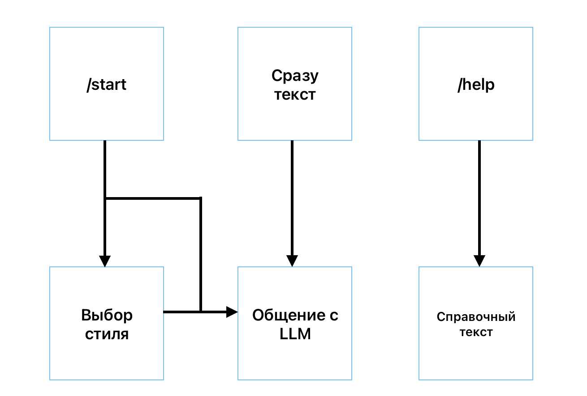
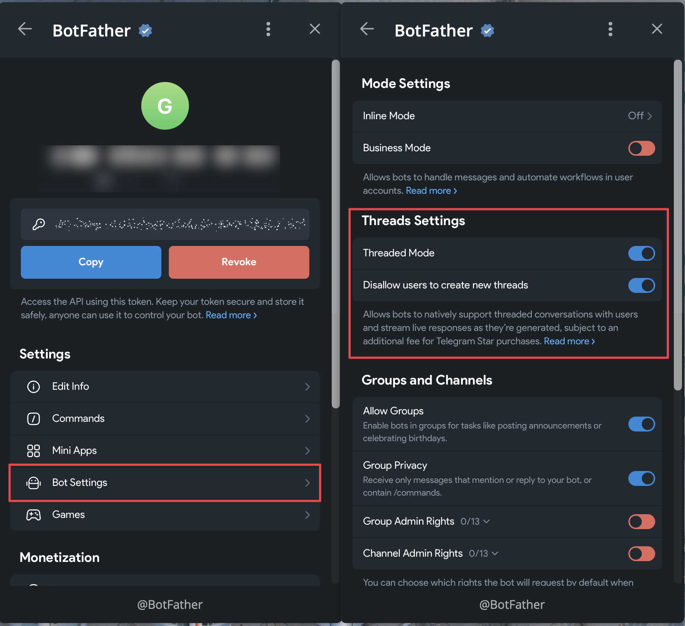
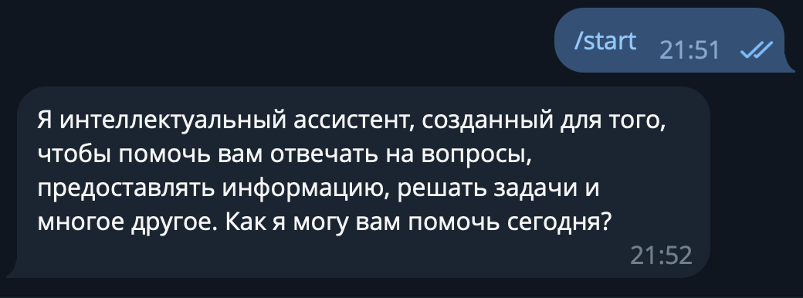

!!! info ""
    Используемая версия aiogram: 3.25.0

31 декабря 2025 года вышла [обновление Bot API 9.3](https://core.telegram.org/bots/api-changelog#december-31-2025), 
а 9 февраля 2026 года – [обновление Bot API 9.4](https://core.telegram.org/bots/api-changelog#february-9-2026). 
В них помимо всего прочего добавилась поддержка топиков прямо в ЛС с самим ботом, причём в двух вариантах.

А раз 2025 год прошёл под знаком больших языковых моделей (Large Language Models, LLM) и 2026-й не будет исключением, то 
сегодня совместим мир ботов и мир AI и напишем простого бота с поддержкой топиков и взаимодействием с ИИ. Причём 
сообщения будут отправляться через стриминг, т.е. как в привычных ИИ-интерфейсах.

<!-- more -->

## Возможности и ограничения

Сразу оговоримся: как и большинство примеров в этой книге, бот будет специально упрощён, чтобы сконцентрироваться только на 
основных и важных моментах. В качестве LLM будем использовать **локальную** модель 
[Qwen2.5-7B-Instruct](https://huggingface.co/lmstudio-community/Qwen2.5-7B-Instruct-GGUF), её можно легко 
и бесплатно запустить на домашнем железе или недорогой VPS. Например, у меня арендована вот такая машинка:
```plain
OS: Debian GNU/Linux 12 (bookworm) x86_64
Kernel: 6.1.0-17-amd64
CPU: Intel Xeon E3-1231 v3 (8) @ 3.800GHz
GPU: 02:00.0 Matrox Electronics Systems Ltd. MGA G200e [Pilot] ServerEngines
Memory: 9976MiB / 31825MiB
```
Сама модель займёт где-то 7-8 гигабайт в оперативной памяти. Qwen2.5-7B не самая «умная», но чтобы попробовать работать 
с LLM на практике более чем сойдёт. Содержимое чатов будем хранить в оперативной памяти, 
чтобы не отвлекаться на инфраструктуру, но готовый вариант можно будет легко адаптировать 
под PostgreSQL, Redis или что угодно ещё.

Начиная с Bot API 9.4 у разработчиков есть два выбора, как отображать топики в ЛС с ботом: 

1. Каждое сообщение вне топика автоматически создаёт новый и переносит туда сообщение.
2. Бот самостоятельно создаёт топики, а у юзера такая возможность пропадает, равно как и возможность удалять.

Оба варианта показаны на следующем рисунке:


Рассмотрим плюсы и минусы каждого подхода:

* Первый вариант больше подходит на интерфейс «а-ля ChatGPT»: каждое сообщение принадлежит какому-то топику, 
легче контролировать, что и где написано. Минус очевидный: все действия, не относящиеся к переписке, тоже будут 
лежать в каком-то топике, т.е. придётся проводить границу между «здесь общаемся, а здесь настройками балуемся».
* Второй вариант даёт гораздо больше контроля: можно по отдельной команде создавать топик специально под общение с ИИ, 
а General (т.е. топик с id=0) оставлять под настройки, информационные сообщения и прочее «служебное». Но эта гибкость 
усложняет UX (user experience): например, пользователь после создания топика ботом автоматически не перекидывается туда, 
требуя лишнее нажатие.

Возможно, золотой серединой было бы использование варианта №1, но все настройки увести в веб-интерфейс. Но если у вас 
уже есть веб-интерфейс настроек, то просто добавьте туда интерфейс чата и не надо будет возиться с Bot API :)

В общем, далее будет показан пример на варианте №2. В процессе подготовки этого текста я сделал оба, поэтому напишите 
в моей группе (иконка внизу каждой страницы), если интересно рассмотреть вариант №1 тоже.

И последнее перед тем, как продолжим: чтобы сфокусироваться непосредственно на новых вещах из мира ботов, начинать 
проект будем не с нуля: на GitHub в репозитории этой книги будет [отдельный каталог] (ССЫЛКА), там расположен 
базовый код с одним роутером, настройками и логом. Всё дальнейшее повествование подразумевает, что вы начинаете 
с этого же момента.  

## Как включить топики в ЛС с ботом

Для активации фичи надо открыть @BotFather, причём не просто диалог с ботом, а веб-приложение. Далее необходимо выбрать 
вашего бота, а затем нажать **Bot Settings**. В разделе **Threads Settings** есть две настройки. Первая в целом 
включает поддержку топиков, а вторая отвечает за выбор варианта их отображения. Если сопоставлять с нумерацией выше по 
тексту, то положение ВЫКЛ – это вариант 1, а ВКЛ – вариант 2.



А теперь ложка дёгтя: данная фича не бесплатная в классическом понимании. Если вчитаться в приписочку под этими 
двумя переключалками и перейти по ссылке, то можно обнаружить, что при включенном режиме **Threaded Mode** все покупки 
пользователей в таком боте будут облагаться дополнительным 15% налогом от Telegram. Почему Дуров хочет брать повышенный 
налог на топики и куда пойдут эти деньги, науке пока что неизвестно. Но если ваш бот никак не взаимодействует с 
Telegram Stars, то ничего отдельно с вас не возьмут.

## Обращаемся к LLM

Пора отправить первое сообщение к локальной ИИ-модели. Но сперва её нужно скачать: загрузите GGUF-файл 
с [Hugging Face](https://huggingface.co/lmstudio-community/Qwen2.5-7B-Instruct-GGUF/tree/main) 
(рекомендую версию Q4_K_M) и положите его в каталог `models` под именем `qwen2.5-7b-instruct-q4_k_m.gguf`.

Добавьте в `docker-compose.yml` новый сервис и поставьте `bot` зависящим от него:

```yaml title="docker-compose.yml"
name: "llm-in-telegram"

services:
  llm:
    image: ghcr.io/ggml-org/llama.cpp:server
    command: >
      --model /models/qwen2.5-7b-instruct-q4_k_m.gguf --ctx-size 4096 --threads 4 --n-gpu-layers 0 --port 8080 --host 0.0.0.0
    volumes:
      - ./models:/models
    ports:
      - "8080:8080"
    restart: "no"  # "no" для примера, обычно "unless-stopped"

  bot:
    build:
      context: src
      dockerfile: ./Dockerfile
    volumes:
      - ./src/settings.toml:/app/src/settings.toml:ro
    depends_on:
      - llm
    restart: "no"  # "no" для примера, обычно "unless-stopped"
```

Далее в `src/bot` создайте файл `llm.py` с описанием простого клиента:
```python title="src/bot/llm.py"
import httpx


class LLMClient:
    def __init__(
            self,
            http_client: httpx.AsyncClient,
            llm_url: str,
    ):
        self.http_client = http_client
        self.llm_url = llm_url

    async def generate_response(
            self,
            model: str,
            messages: list[dict],
            temperature: float = 0.7,
    ) -> str:
        payload = {
            "model": model,
            "stream": False,
            "messages": messages,
            "temperature": temperature,
        }

        response = await self.http_client.post(self.llm_url, json=payload, timeout=60)
        response.raise_for_status()
        data = response.json()
        return data["choices"][0]["message"]["content"]
```

Обновите файл `config_reader.py`, добавив туда модель `LLMConfig` и прописав поле `llm` в `class Settings`:

```python title="src/bot/config_reader.py"
# Новый класс
class LLMConfig(BaseModel):
    url: str
    
class Settings(BaseSettings):
    bot: BotConfig
    logs: LogConfig
    llm: LLMConfig  # новое поле
    
    # тут остальной код класса
```

Далее надо обновить код в файле `__main__.py`: добавить создание HTTP- и LLM-клиентов, настроить закрытие HTTP-клиента 
при завершении работы бота и прокинуть оба клиента в диспетчер. Полная версия файла:
```python title="src/bot/__main__.py"
import asyncio

import httpx
import structlog
from aiogram import Bot, Dispatcher
from aiogram.fsm.storage.memory import MemoryStorage
from structlog.typing import FilteringBoundLogger

from .config_reader import Settings
from .handlers import get_routers
from .logs import get_structlog_config
from .llm import LLMClient


logger: FilteringBoundLogger = structlog.get_logger()


async def shutdown(dispatcher: Dispatcher) -> None:
    await dispatcher["http_client"].aclose()


async def main():
    settings = Settings()
    structlog.configure(**get_structlog_config(settings.logs))

    bot = Bot(token=settings.bot.token.get_secret_value())
    dp = Dispatcher(storage=MemoryStorage())
    dp.include_routers(*get_routers())
    dp.shutdown.register(shutdown)

    http_client = httpx.AsyncClient(timeout=None)
    llm_client = LLMClient(http_client, settings.llm.url)
    dp.workflow_data.update(
        http_client=http_client,
        llm_client=llm_client,
    )

    await logger.ainfo("Starting bot...")
    await dp.start_polling(bot)


asyncio.run(main())
```

В `settings.toml` добавьте URL к будущему серверу llama.cpp:
```toml
[llm]
url = "http://llm:8080/v1/chat/completions"
```

Наконец, вместо заглушки-обработчика на команду `/start` сделаем что-то более полезное: 
будем делать запрос к Qwen2.5 с захардкоженным вопросом «ты кто?»:
```python title="src/bot/handlers/start.py"
from aiogram import Router
from aiogram.filters import CommandStart
from aiogram.types import Message

from ..llm import LLMClient

router = Router()


@router.message(CommandStart())
async def cmd_start(
        message: Message,
        llm_client: LLMClient,
):
    messages = [
        {
            "role": "system",
            "content": "Ты — умный ассистент, помогаешь пользователям с разными задачами."
        },
        {
            "role": "user",
            "content": "Ты кто?"
        }
    ]
    response_text: str = await llm_client.generate_response(
        messages=messages,
        temperature=0.7,
    )
    await message.answer(response_text)
```

Для тех, кто впервые сталкивается с LLM, стоит сделать несколько прояснений, очень упрощённо:

* Все большие языковые модели _stateless_ по своей природе, т.е. они с каждым запросом получают **полную** историю 
сообщений в диалоге. Иными словами: вы отправили ИИ два сообщения, оно вам вернуло третье. В следующий раз вы должны 
отправить все три, плюс своё четвёртое, чтобы получить пятое. И так далее. Из этого следует, что при отправке истории 
сообщений её [историю] можно редактировать на своё усмотрение. Ниже расскажу, зачем это может понадобиться.
* Всего существуют три основные роли: `system`, `user` и `assistant`. Последние две – это человек и LLM соответственно. 
А `system` – это общий контекст, «объясняющий» ИИ, кто он такой и что должен делать. Например, можно задать такой 
системный промт: «Сегодня 16 февраля 2026 года. Ты – умный ассистент. На дворе поздняя зима». Здесь хорошо видно, 
зачем может потребоваться редактировать историю: поставьте вместо даты заглушку типа `{}` и каждый раз её заменяйте 
на текущую дату, чтобы ИИ не застревал во времени.
* **Температура** определяет, насколько «креативными» будут ответы LLM. Если температура 0, то нейросеть становится полностью 
детерминированной: на один и тот же запрос вы будете получать один и тот же ответ. Но чем выше температура, 
тем менее предсказуемым будет результат. Для ролевых игр рекомендуется ставить значение повыше, для рутинных задач со 
строгими правилами – поменьше. Для программирования часто выбирают значение 0.7, но всё зависит от конкретной модели и от 
рекомендаций от её создателей.

!!! info
    Хорошее объяснение принципов работы больших языковых моделей можно посмотреть 
    на [YouTube](https://youtu.be/LPZh9BOjkQs).

Запустите бота командой `docker compose up --build`. Когда увидите в терминале информацию, что поллинг запущен, отправьте 
боту команду `/start` и немного подождите. Скоро вы получите ответ, причём у вас он будет, скорее всего, 
не в точности такой, как на скриншоте ниже:



Если сообщение пришло, то всё работает успешно!

## Стриминг текста

Если вы пользовались ChatGPT, Gemini, DeepSeek или им подобным, то наверняка замечали, что нейросети довольно 
словоохотливые и часто выдают длинные подробные сообщения. Даже если LLM запущена на очень быстром компьютере, 
она генерирует ответ слово за словом, поэтому это занимает какое-то время. Современные модели поддерживают 
стриминг текста, т.е. отправку того, что уже сгенерировалось, не дожидаясь, пока соберётся весь текст целиком. 
Начиная с Bot API 9.3 Telegram тоже поддерживает режим стриминга текста, правда, реализован он... ну, как обычно, 
_нестандартно_. 

Начнём с того, что добавим поддержку стриминга в наш клиент к LLM. Обычный режим оставим тоже, он пригодится далее. 
Замените содержимое файла `llm.py` на следующее:

```python title="src/bot/llm.py"
import json
from typing import AsyncIterator

import httpx


class LLMClient:
    def __init__(
            self,
            http_client: httpx.AsyncClient,
            llm_url: str,
    ):
        self.http_client = http_client
        self.llm_url = llm_url

    async def generate_response(
            self,
            messages: list[dict],
            stream: bool = False,
            temperature: float = 0.7,
            model: str = "local",
    ) -> str | AsyncIterator[str]:
        payload = {
            "model": model,
            "stream": stream,
            "messages": messages,
            "temperature": temperature,
        }

        if stream:
            return self._stream_response(payload)
        else:
            return await self._simple_response(payload)

    async def _stream_response(
            self,
            payload: dict,
    ) -> AsyncIterator[str]:
        async with self.http_client.stream("POST", self.llm_url, json=payload) as response:
            async for line in response.aiter_lines():
                if not line or not line.startswith("data:"):
                    continue
                if line.endswith("[DONE]"):
                    break

                data = line.removeprefix("data: ").strip()
                try:
                    chunk = json.loads(data)
                    delta = chunk["choices"][0]["delta"].get("content")
                    if delta:
                        yield delta
                except Exception:
                    continue

    async def _simple_response(
            self,
            payload: dict,
    ) -> str:
        response = await self.http_client.post(self.llm_url, json=payload, timeout=60)
        response.raise_for_status()
        data = response.json()
        return data["choices"][0]["message"]["content"]
```

Метод `generate_response()` обзавёлся новым булевым параметром `stream`, старый код уехал в метод `_simple_response()` 
и добавился новый метод `_stream_response()`. В нём происходит следующее:

* В ответ на запрос к `self.llm_url` сервер начинает присылать построчно данные.
* Если строка пустая или не начинается с `data:`, то это служебные данные, нам они не интересны. Пропускаем.
* Если строка заканчивается на `[DONE]`, то завершаем обработку.
* Убираем префикс `data` и пытаемся парсить оставшееся как JSON. Если получилось, достаём `content`.
* Если что-то извлеклось, забираем.
* Если что-то пошло не так, пропускаем ход. Да, часть текста потеряется, но обычно такого происходить не должно.

Теперь надо обновить обработчик команды `/start`. Чтобы сделать стриминг текста в Telegram, нужно выполнить следующие 
операции: выберите случайное число как идентификатор. Далее вызывайте в цикле API-метод 
[sendMessageDraft](https://core.telegram.org/bots/api#sendmessagedraft) с указанием идентификатора, айди чата, топика и 
новую версию текста (т.е. текст с накоплением). А после завершения цикла, когда весь текст готов, вызовите метод 
**sendMessageText** или какой вам нужен с полной и окончательной версией сообщения. Самая мякотка – форматирование: на 
«черновики» распространяются все правила, что и на обычные сообщения: никаких незакрытых тегов, никаких неизвестных тегов 
и т.д. Это боль...

Новая версия обработчика команды `/start`:
```python
from random import randint

import structlog
from aiogram import Bot, Router
from aiogram.exceptions import TelegramRetryAfter
from aiogram.filters import CommandStart
from aiogram.types import Message
from structlog.typing import FilteringBoundLogger

from ..llm import LLMClient

router = Router()
logger: FilteringBoundLogger = structlog.get_logger()


@router.message(CommandStart())
async def cmd_start(
        message: Message,
        llm_client: LLMClient,
        bot: Bot,
):
    messages = [
        {
            "role": "system",
            "content": "Ты — умный ассистент, помогаешь пользователям с разными задачами."
        },
        {
            "role": "user",
            "content": "Ты кто?"
        }
    ]

    # Начальное состояние текста
    text = ""
    # Случайный идентификатор черновика
    draft_id = randint(1, 100_000_000)
    # Получаем стрим от LLM и стримим уже в Telegram
    async for delta in await llm_client.generate_response(
        messages=messages,
        stream=True,
        temperature=0.7,
    ):
        text += delta

        # Если хотите лучше понять, как LLM генерируют текст по кусочкам,
        # раскомментируйте следующие строки
        # print(delta)
        # print(text)
        # print("*"*30)

        await bot.send_message_draft(
            draft_id=draft_id,
            chat_id=message.chat.id,
            message_thread_id=message.message_thread_id,
            text=text,
        )

    # Окончательная отправка сообщения
    await message.answer(text)
```

Когда вы запустите бота снова (напомню, `docker compose up --build`) и вызовите команду `/start`, 
то с первой или второй попытки увидите, что текст стримится, но обрывается, а в терминале появляется страшное:
```
aiogram.exceptions.TelegramRetryAfter: 
Telegram server says - Flood control exceeded 
on method 'SendMessageDraft' in chat 1234567. 
Retry in 17 seconds.
```

Оказывается, даже стримить быстро нельзя. Хорошо, сделаем обработку этой ошибки и будем при необходимости 
спать нужное количество секунд. Добавьте импорты и замените вызов `send_message_draft` на следующий блок:
```python
import asyncio
from aiogram.exceptions import TelegramRetryAfter

# В функции cmd_start():
...
try:
    await bot.send_message_draft(
        draft_id=draft_id,
        chat_id=message.chat.id,
        message_thread_id=message.message_thread_id,
        text=text,
    )
except TelegramRetryAfter as ex:
    await logger.awarning(
        f"Streaming rate limit, need to wait {ex.retry_after} sec"
    )
    await asyncio.sleep(ex.retry_after)
except Exception:
    await logger.aexception("Failed to stream message draft")
    return
...
```

Новая версия исправит краши, но текст будет генерироваться с большими паузами и вы по-прежнему будете видеть 
в логах строки вида: `[warning] Streaming rate limit, need to wait 16 sec`. На просторах интернета я видел рекомендации 
по типу «добавьте асинхронный sleep на 0.2 секунды в каждую итерацию», но это путь в никуда.

Достаточно задать себе вопрос: «а надо ли обновлять черновик _на каждый_ стриминговый ответ от LLM?». И вот оно решение:

* Запоминаем текущее время.
* Принимаем кусочек текста (чанк) от LLM.
* Если прошло мало времени, то не обновляем черновик.
* Если прошло достаточно времени, то обновляем черновик.
* Если всё-таки упёрлись в Flood Wait, то спим указанное количество секунд 
и заодно увеличиваем интервал между обновлениями черновика на 0.1 сек.

Перепишем функцию ещё раз:

```python
@router.message(CommandStart())
async def cmd_start(
        message: Message,
        llm_client: LLMClient,
        bot: Bot,
):
    # содержимое messages пропустим, чтобы не раздувать текст
    messages=[...]

    text = ""
    retry_backoff = 0.0
    update_interval = 0.7
    last_update = 0.0
    draft_id = randint(1, 100_000_000)
    async for delta in await llm_client.generate_response(
        messages=messages,
        stream=True,
        temperature=0.7,
    ):
        text += delta
        
        now = asyncio.get_running_loop().time()
        if now - last_update < update_interval + retry_backoff:
            await logger.adebug("Skipping updating draft; still merging chunks")
            continue
        await logger.adebug("Enough time passed, updating draft")

        try:
            await bot.send_message_draft(
                draft_id=draft_id,
                chat_id=message.chat.id,
                message_thread_id=message.message_thread_id,
                text=text,
            )
            last_update = now
        except TelegramRetryAfter as ex:
            retry_backoff += 0.1
            last_update = now
            await logger.awarning(
                f"Streaming rate limit, need to wait {ex.retry_after} sec"
            )
            await asyncio.sleep(ex.retry_after)
        except Exception:
            await logger.aexception("Failed to stream message draft")
            return

    await message.answer(text)
```

Практика показала, что такой вариант приводит к минимуму Flood Wait-ов, а при желании 
можно немного подвигать числа туда-сюда. 

Никак не закончим с этой бедной функцией и сделаем ещё одну улучшалку: поскольку LLM могут нагенерировать 
текста на более чем 4096 символов, стоит это учесть, иначе будет ошибка "message too long". 
Чтобы сильно не заморачиваться, сделаем функцию, которая при превышении заданного лимита, например, в 4000 символов, 
аккуратно обрежет текст по пробелу или переносу строки. Далее будем передавать в качестве черновика именно 
обрезанный текст, а в случае его расхождения с оригинальным просто завершит обработку, потому дальше уже принимать 
нельзя. Желающие отправлять несколько сообщений могут сделать это самостоятельно в качестве упражнения :)

Создайте в каталоге `src/bot` файл `text_utils.py` и поместите туда функцию:
```python title="src/bot/text_utils.py"
def trim_text_smart(
        text: str,
        max_len: int = 4000,
        trim_marker: str = "…",
) -> str:
    """
    Обрезает текст до {max_len} символов,
    стараясь это делать по пробелу или \n
    :param text: исходный текст
    :param max_len: максимально разрешённая длина текста
    :param trim_marker: символ, которым обрезается текст
    :return: обрезанный текст
    """
    if len(text) <= max_len:
        return text

    cut_len = max_len - len(trim_marker)
    candidate = text[:cut_len]

    # Пытаемся резать по границе строки
    newline_pos = candidate.rfind("\n")
    if newline_pos != -1:
        return candidate[:newline_pos] + trim_marker

    # Если нет — по последнему пробелу
    space_pos = candidate.rfind(" ")
    if space_pos != -1:
        return candidate[:space_pos] + trim_marker

    # Совсем крайний случай
    return candidate + trim_marker
```

И ещё раз обновим обработчик команды `/start`. Замените всё, что начинается с `text = ""` на это:
```python
# async def cmd_start(...)
    text = ""
    safe_text = ""
    retry_backoff = 0.0
    update_interval = 0.7
    last_update = 0.0
    draft_id = randint(1, 100_000_000)
    async for delta in await llm_client.generate_response(
        messages=messages,
        stream=True,
        temperature=0.7,
    ):
        text += delta
        safe_text = trim_text_smart(text)
        now = asyncio.get_running_loop().time()

        if now - last_update < update_interval + retry_backoff:
            if safe_text != text:
                break
            await logger.adebug("Skipping updating draft; still merging chunks")
            continue
        await logger.adebug("Enough time passed, updating draft")

        try:
            await bot.send_message_draft(
                draft_id=draft_id,
                chat_id=message.chat.id,
                message_thread_id=message.message_thread_id,
                text=text,
            )
            last_update = now
        except TelegramRetryAfter as ex:
            retry_backoff += 0.1
            last_update = now
            await logger.awarning(
                f"Streaming rate limit, need to wait {ex.retry_after} sec"
            )
            await asyncio.sleep(ex.retry_after)
        except Exception:
            await logger.aexception("Failed to stream message draft")
            return

        if safe_text != text:
            break

    await message.answer(safe_text)
```

Вот теперь можно насладиться стримингом текста в телеграме:


