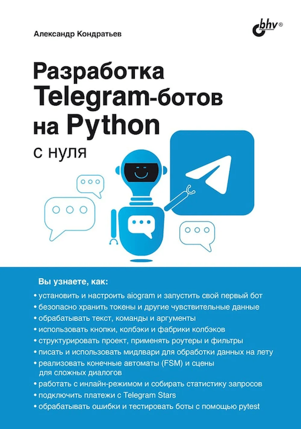

В 2025 году со мной связался редактор издательство БХВ и предложил выпустить эту 
книгу про ботов в печатном виде. А я взял и согласился! 

Квест растянулся на целых полгода, поскольку одно дело – писать в интернет-формате, где есть нормальные ссылки, 
страницы произвольной длины, никаких ограничений на текстовые и медиаблоки, и совсем другое дело – 
адаптировать текст под книжную вёрстку. Но у нас с редакцией это получилось. 
Разумеется, просто копировать текст точь-в-точь смысла мало, поэтому эксклюзивно для бумажной книги 
я добавил две главы: 
одна про сцены ([aiogram scenes](https://docs.aiogram.dev/en/v3.28.2/dispatcher/finite_state_machine/scene.html)), 
а другая про тестирование ботов при помощи `pytest`. К слову, про тестирование также написано в моей 
части [платного курса](advanced-teaser.md), который написан совместно с Михаилом Крыжановским и Александром Даниловым. 
Указанные главы, возможно, появятся когда-нибудь и в этой онлайн-книге.

Купить книгу можно напрямую у издательства, а также на различных интернет-площадках:

* [Сайт издательства БХВ](https://bhv.ru/product/razrabotka-telegram-botov-na-python-s-nulya/)
* [Читай-город](https://www.chitai-gorod.ru/product/razrabotka-telegram-botov-na-python-s-nula-3142340)
* [OZON](https://www.ozon.ru/product/razrabotka-telegram-botov-na-python-s-nulya-kondratev-a-v-3471864792)
* И на любых других по ISBN `978-5-9775-2117-8`

А вот и обложка, чтобы вы не перепутали:

Надеюсь, вам понравится, и приятного чтения!