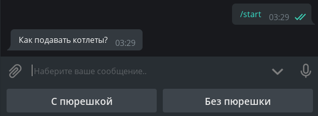
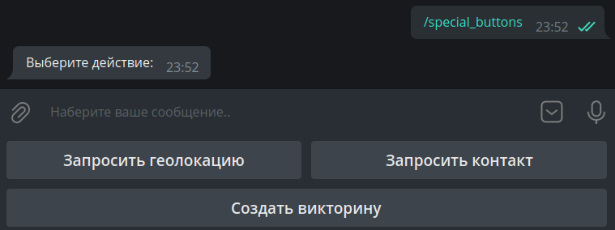

# Кнопки

!!! info ""
    Используемая версия aiogram: 3.0

В этой главе мы познакомимся с такой замечательной фичей Telegram-ботов как кнопки. Прежде всего, чтобы избежать 
путаницы, определимся с названиями. То, что цепляется к низу экрана вашего устройства, будем называть **обычными** 
кнопками, а то, что цепляется непосредственно к сообщениям, назовём **инлайн**-кнопками. Ещё раз картинкой:  


## Обычные кнопки {: id="reply-buttons" }
### Кнопки как шаблоны {: id="reply-as-text" }

Этот вид кнопок появился вместе с Bot API в далёком 2015 году и представляет собой не что иное, как шаблоны сообщений 
(за исключением нескольких особых случаев, но о них позже). Принцип простой: что написано на кнопке, то и будет отправлено 
в текущий чат. Соответственно, чтобы обработать нажатие такой кнопки, бот должен распознавать входящие текстовые сообщения. 

Напишем хэндлер, который будет при нажатии на команду `/start` отправлять сообщение с двумя кнопками:

```python
@dp.message(Command("start"))
async def cmd_start(message: types.Message):
    kb = [
        [types.KeyboardButton(text="С пюрешкой")],
        [types.KeyboardButton(text="Без пюрешки")]
    ]
    keyboard = types.ReplyKeyboardMarkup(keyboard=kb)
    await message.answer("Как подавать котлеты?", reply_markup=keyboard)
```

!!! info ""
    Несмотря на то, что Telegram Bot API [допускает](https://core.telegram.org/bots/api#keyboardbutton) указывать 
    просто строки вместо объектов `KeyboardButton`, при попытке использовать строку aiogram 3.x выкинет ошибку 
    валидации и это не баг, а [фича](https://t.me/aiogram_ru/920453).  
    Живите теперь с этим 🤷‍♂️

Что ж, запустим бота и обалдеем от громадных кнопок:


Как-то некрасиво. Во-первых, хочется сделать кнопки поменьше, а во-вторых, расположить их горизонтально.  
Почему вообще они такие большие? Дело в том, что по умолчанию «кнопочная» клавиатура должна занимать на смартфонах столько 
же места, сколько и обычная буквенная. Для уменьшения кнопок к объекту клавиатуры надо указать дополнительный 
параметр `resize_keyboard=True`.  
Но как заменить вертикальные кнопки на горизонтальные? С точки зрения Bot API, клавиатура — это 
[массив массивов](https://core.telegram.org/bots/api#replykeyboardmarkup) кнопок, а если говорить проще, массив рядов. 
Перепишем наш код, чтобы было красиво, а для 
пущей важности добавим параметр `input_field_placeholder`, который заменит текст в пустой строке ввода, 
когда активна обычная клавиатура:

```python
@dp.message(Command("start"))
async def cmd_start(message: types.Message):
    kb = [
        [
            types.KeyboardButton(text="С пюрешкой"),
            types.KeyboardButton(text="Без пюрешки")
        ],
    ]
    keyboard = types.ReplyKeyboardMarkup(
        keyboard=kb,
        resize_keyboard=True,
        input_field_placeholder="Выберите способ подачи"
    )
    await message.answer("Как подавать котлеты?", reply_markup=keyboard)
```

Смотрим — действительно красиво:



Осталось научить бота реагировать на нажатие таких кнопок. Как уже было сказано выше, необходимо делать проверку 
на полное совпадение текста. Сделаем это при помощи _магического фильтра_ F, подробнее о котором 
поговорим в [другой главе](filters-and-middlewares.md#magic-filters):

```python
# новый импорт!
from aiogram import F

@dp.message(F.text.lower() == "с пюрешкой")
async def with_puree(message: types.Message):
    await message.reply("Отличный выбор!")

@dp.message(F.text.lower() == "без пюрешки")
async def without_puree(message: types.Message):
    await message.reply("Так невкусно!")
```


Чтобы удалить кнопки, необходимо отправить новое сообщение со специальной «удаляющей» клавиатурой типа 
`ReplyKeyboardRemove`. Например: `await message.reply("Отличный выбор!", reply_markup=types.ReplyKeyboardRemove())`

### Keyboard Builder {: id="reply-builder" }

Для более динамической генерации кнопок можно воспользоваться сборщиком клавиатур. Нам пригодятся 
следующие методы:

- `add(<KeyboardButton>)` — добавляет кнопку в память сборщика;
- `adjust(int1, int2, int3...)` — делает строки по `int1, int2, int3...` кнопок;
- `as_markup()` — возвращает готовый объект клавиатуры;
- `button(<params>)` — добавляет кнопку с заданными параметрами, тип кнопки (Reply или Inline) определяется автоматически.

Создадим пронумерованную клавиатуру размером 4×4:

```python
# новый импорт!
from aiogram.utils.keyboard import ReplyKeyboardBuilder

@dp.message(Command("reply_builder"))
async def reply_builder(message: types.Message):
    builder = ReplyKeyboardBuilder()
    for i in range(1, 17):
        builder.add(types.KeyboardButton(text=str(i)))
    builder.adjust(4)
    await message.answer(
        "Выберите число:",
        reply_markup=builder.as_markup(resize_keyboard=True),
    )
```


!!! info ""
    У [объекта обычной клавиатуры](https://core.telegram.org/bots/api#replykeyboardmarkup) есть ещё две полезных опции: 
    `one_time_keyboard` для автоматического скрытия кнопок после нажатия и `selective` для показа клавиатуры 
    лишь некоторым участникам группы. Их использование остаётся для самостоятельного изучения.

### Специальные обычные кнопки {: id="reply-special" }

На момент написания этой главы в Telegram существует шесть специальных видов обычных кнопок, не являющихся 
обычными шаблонами сообщений. Они предназначены для:

- отправки текущей геолокации; 
- отправки своего контакта с номером телефона; 
- создания опроса/викторины; 
- выбора и отправки боту данных пользователя с нужными критериями;
- выбора и отправки боту данных (супер)группы или канала с нужными критериями;
- запуска веб-приложения (WebApp).

Поговорим про них подробнее.

**Отправка текущей геолокации**. Здесь всё просто: где пользователь находится, те координаты и отправляет. 
Это будет статическое гео, а не Live Location, который обновляется автоматически. Разумеется, хитрые юзеры 
могут подменить своё местонахождение, иногда даже на уровне всей системы (Android).  

**Отправка своего контакта с номером телефона**. При нажатии на кнопку (с предварительным подтверждением) 
пользователь отправляет свой контакт с номером телефона боту. Те же хитрые юзеры могут проигнорировать кнопку 
и отправить любой контакт, но в этом случае на них можно найти управу: достаточно проверить в хэндлере или 
в фильтре равенство `message.contact.user_id == message.from_user.id`.

**Создание опроса/викторины**. По нажатию на кнопку пользователю предлагается создать опрос или викторину, которые 
потом отправятся в текущий чат. Необходимо передать 
объект [KeyboardButtonPollType](https://core.telegram.org/bots/api#keyboardbuttonpolltype), 
необязательный аргумент `type` служит для уточнения типа опроса (опрос или викторина).

**Выбор и отправка боту данных пользователя с нужными критериями**. Показывает окно выбора пользователя из списка чатов 
юзера, нажавшего на кнопку. Необходимо передать объект 
[KeyboardButtonRequestUser](https://core.telegram.org/bots/api#keyboardbuttonrequestuser), в котором надо указать 
сгенерированный любым способом айди запроса и критерии, например, "бот", "есть подписка Telegram Premium" и т.д. 
После выбора юзера бот получит сервисное сообщение с типом [UserShared](https://core.telegram.org/bots/api#usershared).

**Выбор и отправка боту чата с нужными критериями**. Показывает окно выбора пользователя из списка чатов 
юзера, нажавшего на кнопку. Необходимо передать объект 
[KeyboardButtonRequestChat](https://core.telegram.org/bots/api#keyboardbuttonrequestchat), в котором надо указать 
сгенерированный любым способом айди запроса и критерии, например, "группа или канал", "юзер — создатель чата" и т.д.
После выбора юзера бот получит сервисное сообщение с типом [ChatShared](https://core.telegram.org/bots/api#chatshared).

**Запуск веб-приложения (WebApp)**. При нажатии на кнопку открывает [WebApp](https://core.telegram.org/bots/webapps). 
Необходимо передать объект [WebAppInfo](https://core.telegram.org/bots/api#webappinfo). 
В этой книге веб-аппы пока рассматриваться не будут.

Впрочем, проще один раз увидеть код:
```python
@dp.message(Command("special_buttons"))
async def cmd_special_buttons(message: types.Message):
    builder = ReplyKeyboardBuilder()
    # метод row позволяет явным образом сформировать ряд
    # из одной или нескольких кнопок. Например, первый ряд
    # будет состоять из двух кнопок...
    builder.row(
        types.KeyboardButton(text="Запросить геолокацию", request_location=True),
        types.KeyboardButton(text="Запросить контакт", request_contact=True)
    )
    # ... второй из одной ...
    builder.row(types.KeyboardButton(
        text="Создать викторину",
        request_poll=types.KeyboardButtonPollType(type="quiz"))
    )
    # ... а третий снова из двух
    builder.row(
        types.KeyboardButton(
            text="Выбрать премиум пользователя",
            request_user=types.KeyboardButtonRequestUser(
                request_id=1,
                user_is_premium=True
            )
        ),
        types.KeyboardButton(
            text="Выбрать супергруппу с форумами",
            request_chat=types.KeyboardButtonRequestChat(
                request_id=2,
                chat_is_channel=False,
                chat_is_forum=True
            )
        )
    )
    # WebApp-ов пока нет, сорри :(

    await message.answer(
        "Выберите действие:",
        reply_markup=builder.as_markup(resize_keyboard=True),
    )
```



Напоследок, две заготовки хэндлеров на приём нажатий от нижних двух кнопок:

```python
# новый импорт
from aiogram import F

@dp.message(F.user_shared)
async def on_user_shared(message: types.Message):
    print(
        f"Request {message.user_shared.request_id}. "
        f"User ID: {message.user_shared.user_id}"
    )


@dp.message(F.chat_shared)
async def on_user_shared(message: types.Message):
    print(
        f"Request {message.chat_shared.request_id}. "
        f"User ID: {message.chat_shared.chat_id}"
    )
```


## Инлайн-кнопки {: id="inline-buttons" }
### URL-кнопки {: id="url-buttons" }

В отличие от обычных кнопок, инлайновые цепляются не к низу экрана, а к сообщению, с которым были отправлены. 
В этой главе мы рассмотрим два типа таких кнопок: URL и Callback. Ещё один — Switch — будет рассмотрен 
в главе про [инлайн-режим](inline_mode.md).

!!! info ""
    Login- и Pay-кнопки в книге рассматриваться не будут вообще. Если у кого-то есть желание помочь хотя бы 
    с рабочим кодом для авторизации или оплаты, пожалуйста, создайте Pull Request на 
    [GitHub](https://github.com/MasterGroosha/aiogram-3-guide). Спасибо!

Самые простые инлайн-кнопки относятся к типу URL, т.е. «ссылка». Поддерживаются только протоколы HTTP(S) и tg://

```python
# новый импорт
from aiogram.utils.keyboard import InlineKeyboardBuilder

@dp.message(Command("inline_url"))
async def cmd_inline_url(message: types.Message, bot: Bot):
    builder = InlineKeyboardBuilder()
    builder.row(types.InlineKeyboardButton(
        text="GitHub", url="https://github.com")
    )
    builder.row(types.InlineKeyboardButton(
        text="Оф. канал Telegram",
        url="tg://resolve?domain=telegram")
    )

    # Чтобы иметь возможность показать ID-кнопку,
    # У юзера должен быть False флаг has_private_forwards
    user_id = 1234567890
    chat_info = await bot.get_chat(user_id)
    if not chat_info.has_private_forwards:
        builder.row(types.InlineKeyboardButton(
            text="Какой-то пользователь",
            url=f"tg://user?id={user_id}")
        )

    await message.answer(
        'Выберите ссылку',
        reply_markup=builder.as_markup(),
    )
```

Отдельно остановимся на среднем блоке кода. Дело в том, что в марте 2019 года разработчики Telegram 
[добавили возможность](https://telegram.org/blog/unsend-privacy-emoji#anonymous-forwarding) отключать переход 
к профилю пользователя у пересланного сообщения. При попытке создать URL-кнопку с ID юзера, у которого отключен 
переход по форварду, бот получит ошибку `Bad Request: BUTTON_USER_PRIVACY_RESTRICTED`. Соответственно, прежде чем 
показывать такую кнопку, необходимо выяснить состояние упомянутой настройки. Для этого можно вызвать метод 
[getChat](https://core.telegram.org/bots/api#getchat) и в ответе проверить состояние поля `has_private_forwards`. 
Если оно равно `True`, значит, попытка добавить URL-ID кнопку приведёт к ошибке. 

### Колбэки {: id="callback-buttons" }

С URL-кнопками больше обсуждать, по сути, нечего, поэтому перейдём к гвоздю сегодняшней программы — Callback-кнопкам. 
Это очень мощная штука, которую вы можете встретить практически везде. Кнопки-реакции у постов (лайки), меню у @BotFather 
и т.д. Суть в чём: у колбэк-кнопок есть специальное значение (data), по которому ваше приложение опознаёт, что нажато и что надо сделать. 
И выбор правильного data **очень важен**! Стоит также отметить, что, в отличие от обычных кнопок, нажатие на колбэк-кнопку 
позволяет сделать практически что угодно, от заказа пиццы до запуска вычислений на кластере суперкомпьютеров.

Напишем хэндлер, который по команде `/random` будет отправлять сообщение с колбэк-кнопкой:
```python
@dp.message(Command("random"))
async def cmd_random(message: types.Message):
    builder = InlineKeyboardBuilder()
    builder.add(types.InlineKeyboardButton(
        text="Нажми меня",
        callback_data="random_value")
    )
    await message.answer(
        "Нажмите на кнопку, чтобы бот отправил число от 1 до 10",
        reply_markup=builder.as_markup()
    )
```

Но как же обработать нажатие? Если раньше мы использовали хэндлер на `message` для обработки входящих сообщений, то теперь 
будем использовать хэндлер на `callback_query` для обработки колбэков. Ориентироваться будем на «значение» кнопки, т.е. на 
её data:

```python
@dp.callback_query(F.data == "random_value")
async def send_random_value(callback: types.CallbackQuery):
    await callback.message.answer(str(randint(1, 10)))
```


Ой, а что это за часики? Оказывается, сервер Telegram ждёт от нас подтверждения о доставке колбэка, иначе в течение 30 
секунд будет показывать специальную иконку. Чтобы скрыть часики, нужно вызвать метод `answer()` у колбэка (или использовать 
метод API `answer_callback_query()`). В общем случае, в метод `answer()` можно ничего не передавать, но можно вызвать 
специальное окошко (всплывающее сверху или поверх экрана):

```python
@dp.callback_query(F.data == "random_value")
async def send_random_value(callback: types.CallbackQuery):
    await callback.message.answer(str(randint(1, 10)))
    await callback.answer(
        text="Спасибо, что воспользовались ботом!",
        show_alert=True
    )
    # или просто await callback.answer()
```


У читателя может возникнуть вопрос: в какой момент обработки отвечать на колбэк методом `answer()`? В общем случае, главное — просто не забыть сообщить Telegram о получении колбэк-запроса, но я рекомендую ставить 
    вызов `answer()` в самом конце, и вот почему: если вдруг в процессе обработки колбэка случится какая-то ошибка и 
    бот нарвётся на необработанное исключение, пользователь увидит неубирающиеся полминуты часики и поймёт, что что-то 
    не так. В противном случае часики исчезнут, а пользователь останется в неведении, выполнился его запрос успешно или нет.

!!! info "Обратите внимание"
    В функции `send_random_value` мы вызывали метод `answer()` не у `message`, а у `callback.message`. Это связано с тем, 
    что колбэк-хэндлеры работают не с сообщениями (тип [Message](https://core.telegram.org/bots/api#message)), 
    а с колбэками (тип [CallbackQuery](https://core.telegram.org/bots/api#callbackquery)), у которого другие поля, и 
    само сообщение — всего лишь его часть. Учтите также, что `message` — это сообщение, к которому была прицеплена 
    кнопка (т.е. отправитель такого сообщения — сам бот). Если хотите узнать, кто нажал на кнопку, смотрите 
    поле `from` (в вашем коде это будет `callback.from_user`, т.к. слово `from` зарезервировано в Python)

!!! warning "Про объект `message` в колбэке"
    Если сообщение отправлено из [инлайн-режима](inline_mode.md), то поле `message` у колбэка будет пустым. 
    У вас не будет возможности получить содержимое такого сообщения, если только заранее где-то его не сохранить.

Перейдём к примеру посложнее. Пусть пользователю предлагается сообщение с числом 0, а внизу три кнопки: +1, -1 и Подтвердить. 
Первыми двумя он может редактировать число, а последняя удаляет всю клавиатуру, фиксируя изменения. Хранить значения будем 
в памяти в словаре (про конечные автоматы поговорим как-нибудь _в другой раз_).

```python
# Здесь хранятся пользовательские данные.
# Т.к. это словарь в памяти, то при перезапуске он очистится
user_data = {}

def get_keyboard():
    buttons = [
        [
            types.InlineKeyboardButton(text="-1", callback_data="num_decr"),
            types.InlineKeyboardButton(text="+1", callback_data="num_incr")
        ],
        [types.InlineKeyboardButton(text="Подтвердить", callback_data="num_finish")]
    ]
    keyboard = types.InlineKeyboardMarkup(inline_keyboard=buttons)
    return keyboard


async def update_num_text(message: types.Message, new_value: int):
    await message.edit_text(
        f"Укажите число: {new_value}",
        reply_markup=get_keyboard()
    )

        
@dp.message(Command("numbers"))
async def cmd_numbers(message: types.Message):
    user_data[message.from_user.id] = 0
    await message.answer("Укажите число: 0", reply_markup=get_keyboard())

    
@dp.callback_query(F.data.startswith("num_"))
async def callbacks_num(callback: types.CallbackQuery):
    user_value = user_data.get(callback.from_user.id, 0)
    action = callback.data.split("_")[1]

    if action == "incr":
        user_data[callback.from_user.id] = user_value+1
        await update_num_text(callback.message, user_value+1)
    elif action == "decr":
        user_data[callback.from_user.id] = user_value-1
        await update_num_text(callback.message, user_value-1)
    elif action == "finish":
        await callback.message.edit_text(f"Итого: {user_value}")

    await callback.answer()
```

И, казалось бы, всё работает: 


Но теперь представим, что ушлый пользователь сделал следующее: вызвал команду `/numbers` (значение 0), увеличил значение 
до 1, снова вызвал `/numbers` (значение сбросилось до 0) и отредактировал и нажал кнопку "+1" на первом сообщении. 
Что произойдёт? Бот по-честному отправит запрос на редактирование текста со значением 1, но т.к. на том сообщении 
уже стоит цифра 1, то Bot API вернёт ошибку, что старый и новый тексты совпадают, а бот словит исключение: 
`Bad Request: message is not modified: specified new message content and reply markup are exactly the same 
as a current content and reply markup of the message`


С этой ошибкой вы, скорее всего, будете поначалу часто сталкиваться, пытаясь редактировать сообщения. 
Вообще говоря, подобная ошибка часто говорит о проблемах с логикой генерации/обновления данных в сообщении, но иногда, 
как в примере выше, может быть ожидаемым поведением. 

В данном случае проигнорируем ошибку целиком, т.к. нам важен 
лишь итоговый результат, который точно будет правильным. Ошибка **MessageNotModified** относится к категории Bad Request, 
поэтому у нас есть выбор: проигнорировать весь подобный класс ошибок, либо отловить весь класс BadRequest 
и попытаться по тексту ошибки опознать конкретную причину. 
Чтобы не слишком усложнять пример, обойдёмся первым способом и немного обновим функцию `update_num_text()`:

```python
# Новые импорты!
from contextlib import suppress
from aiogram.exceptions import TelegramBadRequest

async def update_num_text(message: types.Message, new_value: int):
    with suppress(TelegramBadRequest):
        await message.edit_text(
            f"Укажите число: {new_value}",
            reply_markup=get_keyboard()
        )
```

Если теперь вы попробуете повторить пример выше, то указанное исключение в этом блоке кода бот просто-напросто проигнорирует.

### Фабрика колбэков {: id="callback-factory" }

Когда вы оперируете какими-то простыми колбэками с общим префиксом, типа `order_1`, `order_2`... вам может показаться, 
что довольно легко вызывать `split()` и делить строку по какому-то разделителю. А теперь представьте, что вам нужно 
хранить не одно значение, а три: `order_1_1994_2731519`. Что здесь артикул, цена, количество? А может быть, тут вообще 
год выпуска? Да и разбиение строки начинает выглядеть страшно: `.split("_")[2]`. А почему не 1 или 3? 

В какой-то момент возникает необходимость структурировать содержимое таких callback data, и в aiogram есть решение! 
Вы создаёте объекты типа `CallbackData`, указываете префикс, описываете структуру, а дальше фреймворк самостоятельно собирает 
строку с данными колбэка и, что важнее, корректно разбирает входящее значение. Снова разберёмся на конкретном примере; 
создадим класс `NumbersCallbackFactory` с префиксом `fabnum` и двумя полями `action` и `value`. Поле `action` определяет, 
что делать, менять значение (change) или зафиксировать (finish), а поле `value` показывает, на сколько изменять 
значение. По умолчанию оно будет None, т.к. для действия "finish" дельта изменения не требуется. Код:

```python
# новые импорты!
from typing import Optional
from aiogram.filters.callback_data import CallbackData

class NumbersCallbackFactory(CallbackData, prefix="fabnum"):
    action: str
    value: Optional[int] = None
```

Наш класс обязательно должен наследоваться от `CallbackData` и принимать значение префикса. Префикс — это 
общая подстрока в начале, по которой фреймворк будет определять, какая структура лежит в колбэке. 

Теперь напишем функцию генерации клавиатуры. Здесь нам пригодится метод `button()`, который автоматически 
будет создавать кнопку с нужным типом, а от нас требуется только передать аргументы. 
В качестве аргумента `callback_data` вместо строки будем указывать 
экземпляр нашего класса `NumbersCallbackFactory`:

```python
def get_keyboard_fab():
    builder = InlineKeyboardBuilder()
    builder.button(
        text="-2", callback_data=NumbersCallbackFactory(action="change", value=-2)
    )
    builder.button(
        text="-1", callback_data=NumbersCallbackFactory(action="change", value=-1)
    )
    builder.button(
        text="+1", callback_data=NumbersCallbackFactory(action="change", value=1)
    )
    builder.button(
        text="+2", callback_data=NumbersCallbackFactory(action="change", value=2)
    )
    builder.button(
        text="Подтвердить", callback_data=NumbersCallbackFactory(action="finish")
    )
    # Выравниваем кнопки по 4 в ряд, чтобы получилось 4 + 1
    builder.adjust(4)
    return builder.as_markup()
```

Методы отправки сообщения и его редактирования оставляем теми же (в названиях и командах добавим суффикс `_fab`):

```python
async def update_num_text_fab(message: types.Message, new_value: int):
    with suppress(TelegramBadRequest):
        await message.edit_text(
            f"Укажите число: {new_value}",
            reply_markup=get_keyboard_fab()
        )

@dp.message(Command("numbers_fab"))
async def cmd_numbers_fab(message: types.Message):
    user_data[message.from_user.id] = 0
    await message.answer("Укажите число: 0", reply_markup=get_keyboard_fab())
```

Наконец, переходим к главному — обработке колбэков. Для этого в декоратор надо передать класс, колбэки с которым 
мы ловим, с вызванным методом `filter()`. Также появляется дополнительный аргумент с названием `callback_data` 
(имя должно быть именно таким!), и имеющим тот же тип, что и фильтруемый класс:

```python
@dp.callback_query(NumbersCallbackFactory.filter())
async def callbacks_num_change_fab(
        callback: types.CallbackQuery, 
        callback_data: NumbersCallbackFactory
):
    # Текущее значение
    user_value = user_data.get(callback.from_user.id, 0)
    # Если число нужно изменить
    if callback_data.action == "change":
        user_data[callback.from_user.id] = user_value + callback_data.value
        await update_num_text_fab(callback.message, user_value + callback_data.value)
    # Если число нужно зафиксировать
    else:
        await callback.message.edit_text(f"Итого: {user_value}")
    await callback.answer()
```

Ещё немного конкретизируем наши хэндлеры и сделаем отдельный обработчик 
для числовых кнопок и для кнопки «Подтвердить». Фильтровать будем по значению `action` и в этом нам помогут 
«магические фильтры» aiogram 3.x. Серьёзно, они так и называются: Magic Filter. Подробнее сие чародейство рассмотрим 
в другой главе, а сейчас просто воспользуемся «магией» и примем это на веру:

```python
# новый импорт!
from magic_filter import F

# Нажатие на одну из кнопок: -2, -1, +1, +2
@dp.callback_query(NumbersCallbackFactory.filter(F.action == "change"))
async def callbacks_num_change_fab(
        callback: types.CallbackQuery, 
        callback_data: NumbersCallbackFactory
):
    # Текущее значение
    user_value = user_data.get(callback.from_user.id, 0)

    user_data[callback.from_user.id] = user_value + callback_data.value
    await update_num_text_fab(callback.message, user_value + callback_data.value)
    await callback.answer()


# Нажатие на кнопку "подтвердить"
@dp.callback_query(NumbersCallbackFactory.filter(F.action == "finish"))
async def callbacks_num_finish_fab(callback: types.CallbackQuery):
    # Текущее значение
    user_value = user_data.get(callback.from_user.id, 0)

    await callback.message.edit_text(f"Итого: {user_value}")
    await callback.answer()
```


На первый взгляд то, что мы сделали, может показаться сложным, но в действительности фабрика колбэков позволяет 
создавать продвинутые колбэк-кнопки и удобно дробить код на логические сущности. Увидеть применение фабрики 
на практике вы можете в [боте для игры в «Сапёра»](https://github.com/MasterGroosha/telegram-bombsweeper-bot), 
написанным вашим любимым автором :)

### Автоответ на колбэки {: id="callback-autoreply" }

Если у вас очень много колбэк-хэндлеров, на которые нужно либо просто отвечать, либо отвечать однотипно, можно 
немного упростить себе жизнь, воспользовавшись специальной мидлварью. В целом про такое мы поговорим 
[отдельно](filters-and-middlewares.md#middlewares), а сейчас просто познакомимся.

Итак, самый простой вариант — это добавить вот такую строчку после создания диспетчера:

```python
# не забываем про новый импорт
from aiogram.utils.callback_answer import CallbackAnswerMiddleware

dp = Dispatcher()
dp.callback_query.middleware(CallbackAnswerMiddleware())
```

В этом случае после выполнения хэндлера aiogram будет автоматически отвечать на колбэк. 
Можно переопределить 
[стандартные настройки](https://github.com/aiogram/aiogram/blob/5adaf7a567e976da64e418eee5df31682ad2496c/aiogram/utils/callback_answer.py#L133-L137) 
и указать свои, например: 

```python
dp.callback_query.middleware(
    CallbackAnswerMiddleware(
        pre=True, text="Готово!", show_alert=True
    )
)
```

Увы, ситуации, когда на все колбэк-хэндлеры одинаковый ответ, довольно редки. К счастью, переопределить 
поведение мидлвари в конкретном обработчике довольно просто: достаточно пробросить аргумент `callback_answer` 
и выставить ему новые значения:

```python
# новый импорт!
from aiogram.utils.callback_answer import CallbackAnswer

@dp.callback_query()
async def my_handler(callback: CallbackQuery, callback_answer: CallbackAnswer):
    ... # тут какой-то код
    if <everything is ok>:
        callback_answer.text = "Отлично!"
    else:
        callback_answer.text = "Что-то пошло не так. Попробуйте позже"
        callback_answer.cache_time = 10
    ... # тут какой-то код
```

**Важно**: этот способ не будет работать, если у мидлвари выставлен флаг `pre=True`. В этом случае надо полностью 
переопределять набор параметров мидлвари через флаги, с которыми мы подробнее познакомимся 
[позже](filters-and-middlewares.md#flags):

```python
from aiogram import flags
from aiogram.utils.callback_answer import CallbackAnswer

@dp.callback_query()
@flags.callback_answer(pre=False)  # переопределяем флаг pre
async def my_handler(callback: CallbackQuery, callback_answer: CallbackAnswer):
    ... # тут какой-то код
    if <everything is ok>:
        callback_answer.text = "Теперь этот текст будет видно!"
    ... # тут какой-то код
```

На этом мы пока завершим знакомство с кнопками.
