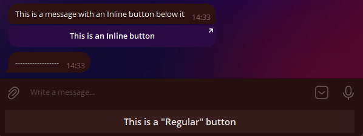
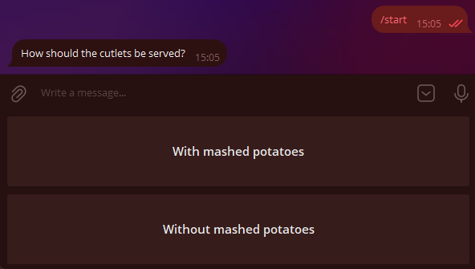
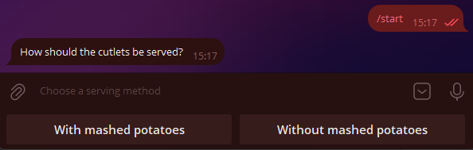
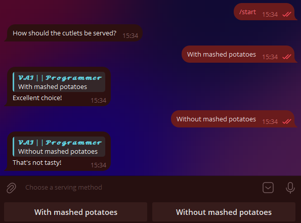

# Buttons

!!! info ""
    Using aiogram version: 3.7.0

In this chapter, we will explore the wonderful feature of Telegram bots known as buttons. 
First, to avoid confusion, let's define the terms. 
What attaches to the bottom of your device's screen, 
we'll call **regular** buttons, and what attaches directly to messages, 
we'll call **inline** buttons. Here's a picture to illustrate:



/// details | P.S: Recreated by the translator.

I had to recreate this code since it was not originally in the guide. :(
```python
@dp.message(Command("buttons_example"))
async def examples_buttons(message: types.Message):
    kbr = types.ReplyKeyboardMarkup(
        keyboard=[
            [
                types.KeyboardButton(
                    text='This is a "Regular" button'
                )
            ]
        ],
        resize_keyboard=True
    )
    kbi = types.InlineKeyboardMarkup(
        inline_keyboard=[
            [
                types.InlineKeyboardButton(
                    text='This is an Inline button',
                    url="https://vadim-khristenko.github.io/aiogram-3-guide/en/buttons/"
                    # Failure to specify one of the Optional parameters will
                    # result in an error.
                )
            ]
        ]
    )
    await message.answer(
        text="This is a message with an Inline button below it",
        reply_markup=kbi
    )
    await message.answer(
        text="------------------",
        reply_markup=kbr
    )
```
///

## Regular Buttons {: id="reply-buttons" }
### Buttons as Templates {: id="reply-as-text" }

This type of button appeared with the Bot API back in 2015 and is essentially message templates (with a few special cases, which we'll discuss later). 
The principle is simple: whatever is written on the button will be sent to the current chat. 
Accordingly, to handle the pressing of such a button, the bot needs to recognize incoming text messages.

Let's write a handler that will send a message with two buttons when the `/start` command is pressed:

```python
@dp.message(Command("start"))
async def cmd_start(message: types.Message):
    kb = [
        [types.KeyboardButton(text="With mashed potatoes")],
        [types.KeyboardButton(text="Without mashed potatoes")]
    ]
    keyboard = types.ReplyKeyboardMarkup(keyboard=kb)
    await message.answer("How should the cutlets be served?", reply_markup=keyboard)
```

!!! info ""
    Although the Telegram Bot API [allows](https://core.telegram.org/bots/api#keyboardbutton) using plain strings instead of `KeyboardButton` objects, 
    attempting to use a string in aiogram 3.x will throw a validation error. 
    This is not a bug, but a feature.

    /// details | Why does a validation error occur?
    
    > Translated by VAI. [Source](https://t.me/aiogram_pcr/1/920453)

    Gabben, [29.12.2021 12:35]
    Instead of "1", you need to use `KeyboardButton(text="1")`.
    
    Groosha, [29.12.2021 12:35]
    Then it looks like an issue with Aiogram.
    
    Gabben, [29.12.2021 12:37]
    This will break our codegen.
    ///

    Now you have to live with it 🤷‍♂️

Alright, let's run the bot and marvel at the enormous buttons:



It doesn't look very neat. Firstly, we want to make the buttons smaller, and secondly, arrange them horizontally.  
Why are they so big in the first place? The thing is, by default, 
the "button" keyboard should take up as much space on smartphones as the regular letter keyboard. 
To reduce the size of the buttons, you need to specify an additional parameter `resize_keyboard=True` to the keyboard object.  
But how do you replace vertical buttons with horizontal ones? 
From the perspective of the Bot API, a keyboard is an [array of arrays](https://core.telegram.org/bots/api#replykeyboardmarkup) of buttons, 
or to put it simply, an array of rows. Let's rewrite our code to make it look nice, 
and for added emphasis, we'll add the `input_field_placeholder` parameter, 
which will replace the text in the empty input field when the regular keyboard is active:

```python
@dp.message(Command("start"))
async def cmd_start(message: types.Message):
    kb = [
        [
            types.KeyboardButton(text="With mashed potatoes"),
            types.KeyboardButton(text="Without mashed potatoes")
        ],
    ]
    keyboard = types.ReplyKeyboardMarkup(
        keyboard=kb,
        resize_keyboard=True,
        input_field_placeholder="Choose a serving method"
    )
    await message.answer("How should the cutlets be served?", reply_markup=keyboard)
```

Looking at it now — it indeed looks nice:



All that's left is to teach the bot to respond to pressing such buttons. 
As mentioned earlier, you need to check for an exact text match. 
We'll do this using the _magic filter_ `F`, which we'll discuss in [another chapter](filters-and-middlewares.md#magic-filters):

```python
# new import!
from aiogram import F

@dp.message(F.text.lower() == "with mashed potatoes")
async def with_puree(message: types.Message):
    await message.reply("Excellent choice!")

@dp.message(F.text.lower() == "without mashed potatoes")
async def without_puree(message: types.Message):
    await message.reply("That's not tasty!")
```



To remove the buttons, you need to send a new message with a special "removing" keyboard of type `ReplyKeyboardRemove`. 
For example: `await message.reply("Excellent choice!", reply_markup=types.ReplyKeyboardRemove())`
