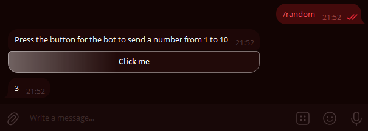
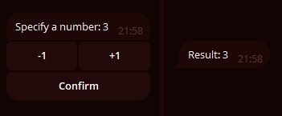
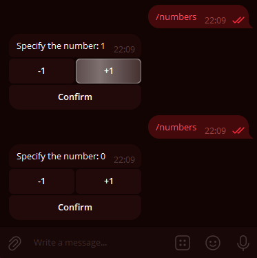

# Buttons

!!! info ""
    Using aiogram version: 3.7.0

In this chapter, we will explore the wonderful feature of Telegram bots known as buttons. 
First, to avoid confusion, let's define the terms. 
What attaches to the bottom of your device's screen, 
we'll call **regular** buttons, and what attaches directly to messages, 
we'll call **inline** buttons. Here's a picture to illustrate:


/// details | P.S: Recreated by the translator.

I had to recreate this code since it was not originally in the guide. :(
```python
@dp.message(Command("buttons_example"))
async def examples_buttons(message: types.Message):
    kbr = types.ReplyKeyboardMarkup(
        keyboard=[
            [
                types.KeyboardButton(
                    text='This is a "Regular" button'
                )
            ]
        ],
        resize_keyboard=True
    )
    kbi = types.InlineKeyboardMarkup(
        inline_keyboard=[
            [
                types.InlineKeyboardButton(
                    text='This is an Inline button',
                    url="https://vadim-khristenko.github.io/aiogram-3-guide/en/buttons/"
                    # Failure to specify one of the Optional parameters will
                    # result in an error.
                )
            ]
        ]
    )
    await message.answer(
        text="This is a message with an Inline button below it",
        reply_markup=kbi
    )
    await message.answer(
        text="------------------",
        reply_markup=kbr
    )
```
///

## Regular Buttons {: id="reply-buttons" }
### Buttons as Templates {: id="reply-as-text" }

This type of button appeared with the Bot API back in 2015 and is essentially message templates (with a few special cases, which we'll discuss later). 
The principle is simple: whatever is written on the button will be sent to the current chat. 
Accordingly, to handle the pressing of such a button, the bot needs to recognize incoming text messages.

Let's write a handler that will send a message with two buttons when the `/start` command is pressed:

```python
@dp.message(Command("start"))
async def cmd_start(message: types.Message):
    kb = [
        [types.KeyboardButton(text="With mashed potatoes")],
        [types.KeyboardButton(text="Without mashed potatoes")]
    ]
    keyboard = types.ReplyKeyboardMarkup(keyboard=kb)
    await message.answer(
        "How should the cutlets be served?", 
        reply_markup=keyboard
    )
```

!!! info ""
    Although the Telegram Bot API [allows](https://core.telegram.org/bots/api#keyboardbutton) using plain strings instead of `KeyboardButton` objects, 
    attempting to use a string in aiogram 3.x will throw a validation error. 
    This is not a bug, but a feature.

    /// details | Why does a validation error occur?
    
    > Translated by VAI. [Source](https://t.me/aiogram_pcr/1/920453)

    Gabben, [29.12.2021 12:35]
    Instead of "1", you need to use `KeyboardButton(text="1")`.
    
    Groosha, [29.12.2021 12:35]
    Then it looks like an issue with Aiogram.
    
    Gabben, [29.12.2021 12:37]
    This will break our codegen.
    ///

    Now you have to live with it 🤷‍♂️

Alright, let's run the bot and marvel at the enormous buttons:


It doesn't look very neat. Firstly, we want to make the buttons smaller, and secondly, arrange them horizontally.  
Why are they so big in the first place? The thing is, by default, 
the "button" keyboard should take up as much space on smartphones as the regular letter keyboard. 
To reduce the size of the buttons, you need to specify an additional parameter `resize_keyboard=True` to the keyboard object.  
But how do you replace vertical buttons with horizontal ones? 
From the perspective of the Bot API, a keyboard is an [array of arrays](https://core.telegram.org/bots/api#replykeyboardmarkup) of buttons, 
or to put it simply, an array of rows. Let's rewrite our code to make it look nice, 
and for added emphasis, we'll add the `input_field_placeholder` parameter, 
which will replace the text in the empty input field when the regular keyboard is active:

```python
@dp.message(Command("start"))
async def cmd_start(message: types.Message):
    kb = [
        [
            types.KeyboardButton(text="With mashed potatoes"),
            types.KeyboardButton(text="Without mashed potatoes")
        ],
    ]
    keyboard = types.ReplyKeyboardMarkup(
        keyboard=kb,
        resize_keyboard=True,
        input_field_placeholder="Choose a serving method"
    )
    await message.answer(
        "How should the cutlets be served?", 
        reply_markup=keyboard
    )
```

Looking at it now — it indeed looks nice:


All that's left is to teach the bot to respond to pressing such buttons. 
As mentioned earlier, you need to check for an exact text match. 
We'll do this using the _magic filter_ `F`, which we'll discuss in [another chapter](filters-and-middlewares.md#magic-filters):

```python
# new import!
from aiogram import F

@dp.message(F.text.lower() == "with mashed potatoes")
async def with_puree(message: types.Message):
    await message.reply("Excellent choice!")

@dp.message(F.text.lower() == "without mashed potatoes")
async def without_puree(message: types.Message):
    await message.reply("That's not tasty!")
```


To remove the buttons, you need to send a new message with a special "removing" keyboard of type `ReplyKeyboardRemove`. 
For example: `await message.reply("Excellent choice!", reply_markup=types.ReplyKeyboardRemove())`

### Keyboard Builder {: id="reply-builder" }

For more dynamic button generation, you can use a keyboard builder. The following methods will be useful:

- `add(<KeyboardButton>)` — adds a button to the builder's memory;
- `adjust(int1, int2, int3...)` — arranges rows with `int1, int2, int3...` buttons;
- `as_markup()` — returns the ready keyboard object;
- `button(<params>)` — adds a button with specified parameters, automatically determining the button type (Reply or Inline).

Let's create a numbered keyboard of size 4×4:

```python
# new import!
from aiogram.utils.keyboard import ReplyKeyboardBuilder

@dp.message(Command("reply_builder"))
async def reply_builder(message: types.Message):
    builder = ReplyKeyboardBuilder()
    for i in range(1, 17):
        builder.add(types.KeyboardButton(text=str(i)))
    builder.adjust(4)
    await message.answer(
        "Choose a number:",
        reply_markup=builder.as_markup(resize_keyboard=True),
    )
```


!!! info ""
    The [ReplyKeyboardMarkup](https://core.telegram.org/bots/api#replykeyboardmarkup) object also has two useful options: 
    `one_time_keyboard` for automatically hiding the keyboard after a button is pressed, 
    and `selective` for displaying the keyboard only to certain members of a group. 
    Their usage is left for self-study.

### Special Regular Buttons {: id="reply-special" }

As of the writing of this chapter, 
Telegram supports six special types of regular buttons that are not just regular message templates. 
They are designed for:

- Sending the current location;
- Sending the user's contact with a phone number;
- Creating a poll/quiz;
- Selecting and sending user data to the bot based on specified criteria;
- Selecting and sending (super)group or channel data to the bot based on specified criteria;
- Launching a WebApp.

Let's discuss them in more detail.

**Sending Current Location**: 
This is straightforward; it sends the user's current coordinates. 
This is static location data, not the Live Location, which updates automatically. 
Users can fake their location at the system level (Android).

**Sending User Contact with Phone Number**: 
When the button is pressed (with prior confirmation), 
the user sends their contact with a phone number to the bot. 
Users can ignore the button and send any contact, 
but you can handle this by verifying in the handler 
or filter that `message.contact.user_id == message.from_user.id`.

**Creating a Poll/Quiz**:
When the button is pressed, the user is prompted to create a poll or quiz, 
which is then sent to the current chat. 
You need to pass a [KeyboardButtonPollType](https://core.telegram.org/bots/api#keyboardbuttonpolltype) object. 
The optional `type` argument specifies the poll type (poll or quiz).

**Selecting and Sending User Data to the Bot**: 
Displays a window to select a user from the chat list of the user who pressed the button. 
You need to pass a [KeyboardButtonRequestUser](https://core.telegram.org/bots/api#keyboardbuttonrequestuser) object with a generated request ID and criteria, 
such as "is bot," "has Telegram Premium," etc. 
After selecting a user, the bot receives a [UserShared](https://core.telegram.org/bots/api#usershared) service message.

**Selecting and Sending Chat Data to the Bot**: 
Displays a window to select a chat from the chat list of the user who pressed the button. 
You need to pass a [KeyboardButtonRequestChat](https://core.telegram.org/bots/api#keyboardbuttonrequestchat) object with a generated request ID and criteria, 
such as "is a group or channel," "user is chat creator," etc. 
After selecting a chat, the bot receives a [ChatShared](https://core.telegram.org/bots/api#chatshared) service message.

**Launching a WebApp**: 
When the button is pressed, it opens a [WebApp](https://core.telegram.org/bots/webapps). 
You need to pass a [WebAppInfo](https://core.telegram.org/bots/api#webappinfo) object. 
WebApps will not be covered in this book.

Here's some code for illustration:
```python
@dp.message(Command("special_buttons"))
async def cmd_special_buttons(message: types.Message):
    builder = ReplyKeyboardBuilder()
    # The row method explicitly forms a row
    # of one or more buttons. For example, the first row
    # will consist of two buttons...
    builder.row(
        types.KeyboardButton(
            text="Request Location", 
            request_location=True
        ),
        types.KeyboardButton(
            text="Request Contact", 
            request_contact=True
        )
    )
    # ... the second row consists of one button ...
    builder.row(types.KeyboardButton(
        text="Create Quiz",
        request_poll=types.KeyboardButtonPollType(type="quiz"))
    )
    # ... and the third row again consists of two buttons
    builder.row(
        types.KeyboardButton(
            text="Select Premium User",
            request_user=types.KeyboardButtonRequestUser(
                request_id=1,
                user_is_premium=True
            )
        ),
        types.KeyboardButton(
            text="Select Supergroup with Forums",
            request_chat=types.KeyboardButtonRequestChat(
                request_id=2,
                chat_is_channel=False,
                chat_is_forum=True
            )
        )
    )
    # No WebApps yet, sorry :(

    await message.answer(
        "Choose an action:",
        reply_markup=builder.as_markup(resize_keyboard=True),
    )
```


Finally, two handler templates for handling button presses from the bottom two buttons:

```python
# new import
from aiogram import F

@dp.message(F.user_shared)
async def on_user_shared(message: types.Message):
    print(
        f"Request {message.user_shared.request_id}. "
        f"User ID: {message.user_shared.user_id}"
    )


@dp.message(F.chat_shared)
async def on_chat_shared(message: types.Message):
    print(
        f"Request {message.chat_shared.request_id}. "
        f"Chat ID: {message.chat_shared.chat_id}"
    )
```

## Inline Buttons {: id="inline-buttons" }
### URL Buttons {: id="url-buttons" }

Unlike regular buttons, inline buttons are attached not to the bottom of the screen but to the message they were sent with. 
In this chapter, we will look at two types of such buttons: URL and Callback. 
Another type — Switch — will be considered in the chapter on [inline mode](inline-mode.md).

!!! info ""
    Login and Pay buttons will not be covered in this book at all. If anyone is willing to help with at least 
    working code for authorization or payment, please create a Pull Request on 
    [GitHub](https://github.com/MasterGroosha/aiogram-3-guide). Thank you!

The simplest inline buttons are of the URL type, i.e., "link". 
Only HTTP(S) and tg:// protocols are supported.

```python
# new import
from aiogram.utils.keyboard import InlineKeyboardBuilder

@dp.message(Command("inline_url"))
async def cmd_inline_url(message: types.Message, bot: Bot):
    builder = InlineKeyboardBuilder()
    builder.row(types.InlineKeyboardButton(
        text="GitHub", url="https://github.com")
    )
    builder.row(types.InlineKeyboardButton(
        text="Official Telegram Channel",
        url="tg://resolve?domain=telegram")
    )

    # To be able to show the ID button,
    # The user must have the has_private_forwards flag set to False
    user_id = 1234567890
    chat_info = await bot.get_chat(user_id)
    if not chat_info.has_private_forwards:
        builder.row(types.InlineKeyboardButton(
            text="Some User",
            url=f"tg://user?id={user_id}")
        )

    await message.answer(
        'Choose a link',
        reply_markup=builder.as_markup(),
    )
```

Let's take a closer look at the middle block of code. The fact is that in March 2019, 
Telegram developers [added the ability](https://telegram.org/blog/unsend-privacy-emoji#anonymous-forwarding) to disable user profile 
links in forwarded messages. When trying to create a URL button with a user ID who has disabled forwarding links, 
the bot will receive an error `Bad Request: BUTTON_USER_PRIVACY_RESTRICTED`. 
Therefore, before displaying such a button, it is necessary to check the state of this setting. 
To do this, you can call the [getChat](https://core.telegram.org/bots/api#getchat) method and check the state of the `has_private_forwards` field 
in the response. If it is `True`, then the attempt to add a URL-ID button will result in an error.

### Callbacks {: id="callback-buttons" }

There isn't much more to discuss about URL buttons, so let's move on to the highlight of today's program — Callback buttons. 
These are very powerful and can be found almost everywhere. Reaction buttons on posts (likes), menus in @BotFather, etc. 
The essence is that callback buttons have a special value (data) by which your application recognizes what was pressed and what needs to be done. 
Choosing the right data is **very important**! It is also worth noting that, unlike regular buttons, pressing a callback button 
allows you to do almost anything, from ordering pizza to launching computations on a supercomputer cluster.

Let's write a handler that will send a message with a callback button on the `/random` command:
```python
@dp.message(Command("random"))
async def cmd_random(message: types.Message):
    builder = InlineKeyboardBuilder()
    builder.add(types.InlineKeyboardButton(
        text="Press me",
        callback_data="random_value")
    )
    await message.answer(
        "Press the button for the bot to send a number from 1 to 10",
        reply_markup=builder.as_markup()
    )
```

But how do we handle the press? If earlier we used a handler on `message` to handle incoming messages, now 
we will use a handler on `callback_query` to handle callbacks. We will focus on the button's "value", i.e., its data:

```python
@dp.callback_query(F.data == "random_value")
async def send_random_value(callback: types.CallbackQuery):
    await callback.message.answer(str(randint(1, 10)))
```



Oh, what are those clocks? It turns out that the Telegram server is waiting for us to confirm the delivery of the callback, otherwise, within 30 
seconds, it will show a special icon. To hide the clocks, you need to call the `answer()` method on the callback (or use 
the API method `answer_callback_query()`). In general, you can call the `answer()` method without any arguments, but you can also call 
a special window (pop-up or overlay):

```python
@dp.callback_query(F.data == "random_value")
async def send_random_value(callback: types.CallbackQuery):
    await callback.message.answer(str(randint(1, 10)))
    await callback.answer(
        text="Thank you for using the bot!",
        show_alert=True
    )
    # or just await callback.answer()
```


The reader may wonder: at what point in the processing should we respond to the callback with the `answer()` method? In general, the main thing is to simply not forget to inform Telegram about receiving the callback request, but I recommend placing 
the `answer()` call at the very end, and here's why: if an error occurs during the callback processing and 
the bot encounters an unhandled exception, the user will see the non-disappearing clocks for half a minute and understand that something 
is wrong. Otherwise, the clocks will disappear, and the user will remain unaware of whether their request was successfully processed or not.

!!! info "Note"
    In the `send_random_value` function, we called the `answer()` method not on `message`, but on `callback.message`. This is because 
    callback handlers work not with messages (type [Message](https://core.telegram.org/bots/api#message)), 
    but with callbacks (type [CallbackQuery](https://core.telegram.org/bots/api#callbackquery)), which have different fields, and 
    the message itself is just a part of it. Also, note that `message` is the message to which the 
    button was attached (i.e., the sender of such a message is the bot itself). If you want to know who pressed the button, look at 
    the `from` field (in your code, it will be `callback.from_user`, as the word `from` is reserved in Python).

!!! warning "About the `message` object in the callback"
    If the message was sent from [inline mode](inline-mode.md), the `message` field in the callback will be empty. 
    You will not be able to get the content of such a message unless you save it somewhere in advance.

Let's move on to a more complex example. Suppose the user is offered a message with the number 0, and below it are three buttons: +1, -1, and Confirm. 
With the first two, they can edit the number, and the last one removes the entire keyboard, fixing the changes. We will store the values in 
memory in a dictionary (we will talk about finite state machines _another time_).

```python
# This is where user data is stored.
# Since this is an in-memory dictionary, it will be cleared upon restart
user_data = {}

def get_keyboard():
    buttons = [
        [
            types.InlineKeyboardButton(text="-1", callback_data="num_decr"),
            types.InlineKeyboardButton(text="+1", callback_data="num_incr")
        ],
        [types.InlineKeyboardButton(text="Confirm", callback_data="num_finish")]
    ]
    keyboard = types.InlineKeyboardMarkup(inline_keyboard=buttons)
    return keyboard


async def update_num_text(message: types.Message, new_value: int):
    await message.edit_text(
        f"Specify the number: {new_value}",
        reply_markup=get_keyboard()
    )

        
@dp.message(Command("numbers"))
async def cmd_numbers(message: types.Message):
    user_data[message.from_user.id] = 0
    await message.answer("Specify the number: 0", reply_markup=get_keyboard())

    
@dp.callback_query(F.data.startswith("num_"))
async def callbacks_num(callback: types.CallbackQuery):
    user_value = user_data.get(callback.from_user.id, 0)
    action = callback.data.split("_")[1]

    if action == "incr":
        user_data[callback.from_user.id] = user_value+1
        await update_num_text(callback.message, user_value+1)
    elif action == "decr":
        user_data[callback.from_user.id] = user_value-1
        await update_num_text(callback.message, user_value-1)
    elif action == "finish":
        await callback.message.edit_text(f"Total: {user_value}")

    await callback.answer()
```

And it seems to work:



But now imagine that a cunning user did the following: called the `/numbers` command (value 0), increased the value 
to 1, called `/numbers` again (the value reset to 0), and edited and pressed the "+1" button on the first message. 
What will happen? The bot will honestly send a request to edit the text with the value 1, but since the message 
already has the number 1, the Bot API will return an error that the old and new texts match, and the bot will catch an exception: 
`Bad Request: message is not modified: specified new message content and reply markup are exactly the same 
as a current content and reply markup of the message`



You will likely encounter this error often at first when trying to edit messages. 
Generally speaking, such an error often indicates problems with the logic of generating/updating data in the message, but sometimes, 
as in the example above, it can be expected behavior. 

In this case, we will ignore the error entirely, as we only care about 
the final result, which will definitely be correct. The **MessageNotModified** error belongs to the Bad Request category, 
so we have a choice: ignore the entire class of such errors, or catch the entire BadRequest class 
and try to identify the specific cause by the error text. 
To avoid complicating the example too much, we will use the first method and slightly update the `update_num_text()` function:

```python
# New imports!
from contextlib import suppress
from aiogram.exceptions import TelegramBadRequest

async def update_num_text(message: types.Message, new_value: int):
    with suppress(TelegramBadRequest):
        await message.edit_text(
            f"Specify the number: {new_value}",
            reply_markup=get_keyboard()
        )
```

If you now try to repeat the example above, the bot will simply ignore the specified exception in this block of code.

### Callback Factory {: id="callback-factory" }

When you operate with some simple callbacks with a common prefix, like `order_1`, `order_2`... it may seem 
easy to call `split()` and split the string by some delimiter. But now imagine that you need 
to store not one value, but three: `order_1_1994_2731519`. What is the article, price, quantity here? Or maybe it's the year of release? 
And splitting the string starts to look scary: `.split("_")[2]`. Why not 1 or 3? 

At some point, there is a need to structure the content of such callback data, and aiogram has a solution! 
You create `CallbackData` objects, specify a prefix, describe the structure, and then the framework independently assembles 
the string with callback data and, more importantly, correctly parses the incoming value. Let's understand this with a specific example; 
we will create a `NumbersCallbackFactory` class with the prefix `fabnum` and two fields `action` and `value`. The `action` field determines 
what to do, change the value (change) or fix it (finish), and the `value` field shows by how much to change 
the value. By default, it will be None, as the "finish" action does not require a change delta. Code:

```python
# new imports!
from typing import Optional
from aiogram.filters.callback_data import CallbackData

class NumbersCallbackFactory(CallbackData, prefix="fabnum"):
    action: str
    value: Optional[int] = None
```

Our class must inherit from `CallbackData` and accept the prefix value. The prefix is 
a common substring at the beginning by which the framework will determine which structure is in the callback. 

Now let's write the function to generate the keyboard. Here we will use the `button()` method, which will automatically 
create a button with the required type, and we only need to pass the arguments. 
As the `callback_data` argument, instead of a string, we will specify 
an instance of our `NumbersCallbackFactory` class:

```python
def get_keyboard_fab():
    builder = InlineKeyboardBuilder()
    builder.button(
        text="-2", callback_data=NumbersCallbackFactory(action="change", value=-2)
    )
    builder.button(
        text="-1", callback_data=NumbersCallbackFactory(action="change", value=-1)
    )
    builder.button(
        text="+1", callback_data=NumbersCallbackFactory(action="change", value=1)
    )
    builder.button(
        text="+2", callback_data=NumbersCallbackFactory(action="change", value=2)
    )
    builder.button(
        text="Confirm", callback_data=NumbersCallbackFactory(action="finish")
    )
    # Align buttons 4 per row to get 4 + 1
    builder.adjust(4)
    return builder.as_markup()
```

We leave the message sending and editing methods the same (we will add the `_fab` suffix to the names and commands):

```python
async def update_num_text_fab(message: types.Message, new_value: int):
    with suppress(TelegramBadRequest):
        await message.edit_text(
            f"Specify the number: {new_value}",
            reply_markup=get_keyboard_fab()
        )

@dp.message(Command("numbers_fab"))
async def cmd_numbers_fab(message: types.Message):
    user_data[message.from_user.id] = 0
    await message.answer("Specify the number: 0", reply_markup=get_keyboard_fab())
```

Finally, we move on to the main part — handling callbacks. To do this, we need to pass the class whose callbacks we are catching 
to the decorator with the `filter()` method called. There is also an additional argument named `callback_data` 
(the name must be exactly this!), and it has the same type as the filtered class:

```python
@dp.callback_query(NumbersCallbackFactory.filter())
async def callbacks_num_change_fab(
        callback: types.CallbackQuery, 
        callback_data: NumbersCallbackFactory
):
    # Current value
    user_value = user_data.get(callback.from_user.id, 0)
    # If the number needs to be changed
    if callback_data.action == "change":
        user_data[callback.from_user.id] = user_value + callback_data.value
        await update_num_text_fab(callback.message, user_value + callback_data.value)
    # If the number needs to be fixed
    else:
        await callback.message.edit_text(f"Total: {user_value}")
    await callback.answer()
```

Let's further specify our handlers and make a separate handler 
for numeric buttons and for the "Confirm" button. We will filter by the `action` value, and the "magic filters" of aiogram 3.x will help us with this. 
Seriously, they are called that: Magic Filter. We will discuss this magic in more detail 
in another chapter, but for now, let's just use the "magic" and take it on faith:

```python
# new import!
from magic_filter import F

# Pressing one of the buttons: -2, -1, +1, +2
@dp.callback_query(NumbersCallbackFactory.filter(F.action == "change"))
async def callbacks_num_change_fab(
        callback: types.CallbackQuery, 
        callback_data: NumbersCallbackFactory
):
    # Current value
    user_value = user_data.get(callback.from_user.id, 0)

    user_data[callback.from_user.id] = user_value + callback_data.value
    await update_num_text_fab(callback.message, user_value + callback_data.value)
    await callback.answer()


# Pressing the "confirm" button
@dp.callback_query(NumbersCallbackFactory.filter(F.action == "finish"))
async def callbacks_num_finish_fab(callback: types.CallbackQuery):
    # Current value
    user_value = user_data.get(callback.from_user.id, 0)

    await callback.message.edit_text(f"Total: {user_value}")
    await callback.answer()
```


At first glance, what we did may seem complicated, but in reality, the callback factory allows 
you to create advanced callback buttons and conveniently break the code into logical entities. You can see the application of the factory 
in practice in the [Minesweeper game bot](https://github.com/MasterGroosha/telegram-bombsweeper-bot), 
written by your favorite author :)

### Auto-reply to Callbacks {: id="callback-autoreply" }

If you have a lot of callback handlers that need either a simple reply or a uniform reply, you can 
simplify your life a bit by using a special middleware. We will talk about such things 
[separately](filters-and-middlewares.md#middlewares), but for now, let's get acquainted.

So, the simplest option is to add this line after creating the dispatcher:

```python
# don't forget the new import
from aiogram.utils.callback_answer import CallbackAnswerMiddleware

dp = Dispatcher()
dp.callback_query.middleware(CallbackAnswerMiddleware())
```

In this case, after the handler is executed, aiogram will automatically respond to the callback. 
You can override 
[default settings](https://github.com/aiogram/aiogram/blob/5adaf7a567e976da64e418eee5df31682ad2496c/aiogram/utils/callback_answer.py#L133-L137) 
and specify your own, for example: 

```python
dp.callback_query.middleware(
    CallbackAnswerMiddleware(
        pre=True, text="Done!", show_alert=True
    )
)
```

Unfortunately, situations where all callback handlers have the same response are quite rare. Fortunately, overriding 
the middleware behavior in a specific handler is quite simple: just pass the `callback_answer` argument 
and set new values for it:

```python
# new import!
from aiogram.utils.callback_answer import CallbackAnswer

@dp.callback_query()
async def my_handler(callback: CallbackQuery, callback_answer: CallbackAnswer):
    ... # some code here
    if <everything is ok>:
        callback_answer.text = "Great!"
    else:
        callback_answer.text = "Something went wrong. Try again later"
        callback_answer.cache_time = 10
    ... # some code here
```

**Important**: this method will not work if the middleware has the `pre=True` flag set. In this case, you need to completely 
override the middleware parameter set through flags, which we will discuss 
[later](filters-and-middlewares.md#flags):

```python
from aiogram import flags
from aiogram.utils.callback_answer import CallbackAnswer

@dp.callback_query()
@flags.callback_answer(pre=False)  # override the pre flag
async def my_handler(callback: CallbackQuery, callback_answer: CallbackAnswer):
    ... # some code here
    if <everything is ok>:
        callback_answer.text = "Now this text will be visible!"
    ... # some code here
```

For now, we will conclude our acquaintance with buttons.

