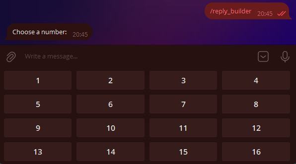
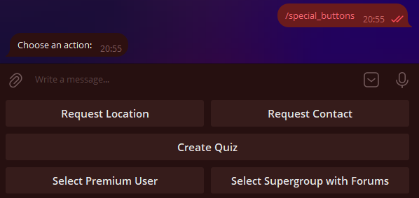

# Buttons

!!! info ""
    Using aiogram version: 3.7.0

In this chapter, we will explore the wonderful feature of Telegram bots known as buttons. 
First, to avoid confusion, let's define the terms. 
What attaches to the bottom of your device's screen, 
we'll call **regular** buttons, and what attaches directly to messages, 
we'll call **inline** buttons. Here's a picture to illustrate:


/// details | P.S: Recreated by the translator.

I had to recreate this code since it was not originally in the guide. :(
```python
@dp.message(Command("buttons_example"))
async def examples_buttons(message: types.Message):
    kbr = types.ReplyKeyboardMarkup(
        keyboard=[
            [
                types.KeyboardButton(
                    text='This is a "Regular" button'
                )
            ]
        ],
        resize_keyboard=True
    )
    kbi = types.InlineKeyboardMarkup(
        inline_keyboard=[
            [
                types.InlineKeyboardButton(
                    text='This is an Inline button',
                    url="https://vadim-khristenko.github.io/aiogram-3-guide/en/buttons/"
                    # Failure to specify one of the Optional parameters will
                    # result in an error.
                )
            ]
        ]
    )
    await message.answer(
        text="This is a message with an Inline button below it",
        reply_markup=kbi
    )
    await message.answer(
        text="------------------",
        reply_markup=kbr
    )
```
///

## Regular Buttons {: id="reply-buttons" }
### Buttons as Templates {: id="reply-as-text" }

This type of button appeared with the Bot API back in 2015 and is essentially message templates (with a few special cases, which we'll discuss later). 
The principle is simple: whatever is written on the button will be sent to the current chat. 
Accordingly, to handle the pressing of such a button, the bot needs to recognize incoming text messages.

Let's write a handler that will send a message with two buttons when the `/start` command is pressed:

```python
@dp.message(Command("start"))
async def cmd_start(message: types.Message):
    kb = [
        [types.KeyboardButton(text="With mashed potatoes")],
        [types.KeyboardButton(text="Without mashed potatoes")]
    ]
    keyboard = types.ReplyKeyboardMarkup(keyboard=kb)
    await message.answer(
        "How should the cutlets be served?", 
        reply_markup=keyboard
    )
```

!!! info ""
    Although the Telegram Bot API [allows](https://core.telegram.org/bots/api#keyboardbutton) using plain strings instead of `KeyboardButton` objects, 
    attempting to use a string in aiogram 3.x will throw a validation error. 
    This is not a bug, but a feature.

    /// details | Why does a validation error occur?
    
    > Translated by VAI. [Source](https://t.me/aiogram_pcr/1/920453)

    Gabben, [29.12.2021 12:35]
    Instead of "1", you need to use `KeyboardButton(text="1")`.
    
    Groosha, [29.12.2021 12:35]
    Then it looks like an issue with Aiogram.
    
    Gabben, [29.12.2021 12:37]
    This will break our codegen.
    ///

    Now you have to live with it 🤷‍♂️

Alright, let's run the bot and marvel at the enormous buttons:


It doesn't look very neat. Firstly, we want to make the buttons smaller, and secondly, arrange them horizontally.  
Why are they so big in the first place? The thing is, by default, 
the "button" keyboard should take up as much space on smartphones as the regular letter keyboard. 
To reduce the size of the buttons, you need to specify an additional parameter `resize_keyboard=True` to the keyboard object.  
But how do you replace vertical buttons with horizontal ones? 
From the perspective of the Bot API, a keyboard is an [array of arrays](https://core.telegram.org/bots/api#replykeyboardmarkup) of buttons, 
or to put it simply, an array of rows. Let's rewrite our code to make it look nice, 
and for added emphasis, we'll add the `input_field_placeholder` parameter, 
which will replace the text in the empty input field when the regular keyboard is active:

```python
@dp.message(Command("start"))
async def cmd_start(message: types.Message):
    kb = [
        [
            types.KeyboardButton(text="With mashed potatoes"),
            types.KeyboardButton(text="Without mashed potatoes")
        ],
    ]
    keyboard = types.ReplyKeyboardMarkup(
        keyboard=kb,
        resize_keyboard=True,
        input_field_placeholder="Choose a serving method"
    )
    await message.answer(
        "How should the cutlets be served?", 
        reply_markup=keyboard
    )
```

Looking at it now — it indeed looks nice:


All that's left is to teach the bot to respond to pressing such buttons. 
As mentioned earlier, you need to check for an exact text match. 
We'll do this using the _magic filter_ `F`, which we'll discuss in [another chapter](filters-and-middlewares.md#magic-filters):

```python
# new import!
from aiogram import F

@dp.message(F.text.lower() == "with mashed potatoes")
async def with_puree(message: types.Message):
    await message.reply("Excellent choice!")

@dp.message(F.text.lower() == "without mashed potatoes")
async def without_puree(message: types.Message):
    await message.reply("That's not tasty!")
```


To remove the buttons, you need to send a new message with a special "removing" keyboard of type `ReplyKeyboardRemove`. 
For example: `await message.reply("Excellent choice!", reply_markup=types.ReplyKeyboardRemove())`

### Keyboard Builder {: id="reply-builder" }

For more dynamic button generation, you can use a keyboard builder. The following methods will be useful:

- `add(<KeyboardButton>)` — adds a button to the builder's memory;
- `adjust(int1, int2, int3...)` — arranges rows with `int1, int2, int3...` buttons;
- `as_markup()` — returns the ready keyboard object;
- `button(<params>)` — adds a button with specified parameters, automatically determining the button type (Reply or Inline).

Let's create a numbered keyboard of size 4×4:

```python
# new import!
from aiogram.utils.keyboard import ReplyKeyboardBuilder

@dp.message(Command("reply_builder"))
async def reply_builder(message: types.Message):
    builder = ReplyKeyboardBuilder()
    for i in range(1, 17):
        builder.add(types.KeyboardButton(text=str(i)))
    builder.adjust(4)
    await message.answer(
        "Choose a number:",
        reply_markup=builder.as_markup(resize_keyboard=True),
    )
```



!!! info ""
    The [ReplyKeyboardMarkup](https://core.telegram.org/bots/api#replykeyboardmarkup) object also has two useful options: 
    `one_time_keyboard` for automatically hiding the keyboard after a button is pressed, 
    and `selective` for displaying the keyboard only to certain members of a group. 
    Their usage is left for self-study.

### Special Regular Buttons {: id="reply-special" }

As of the writing of this chapter, 
Telegram supports six special types of regular buttons that are not just regular message templates. 
They are designed for:

- Sending the current location;
- Sending the user's contact with a phone number;
- Creating a poll/quiz;
- Selecting and sending user data to the bot based on specified criteria;
- Selecting and sending (super)group or channel data to the bot based on specified criteria;
- Launching a WebApp.

Let's discuss them in more detail.

**Sending Current Location**: 
This is straightforward; it sends the user's current coordinates. 
This is static location data, not the Live Location, which updates automatically. 
Users can fake their location at the system level (Android).

**Sending User Contact with Phone Number**: 
When the button is pressed (with prior confirmation), 
the user sends their contact with a phone number to the bot. 
Users can ignore the button and send any contact, 
but you can handle this by verifying in the handler 
or filter that `message.contact.user_id == message.from_user.id`.

**Creating a Poll/Quiz**:
When the button is pressed, the user is prompted to create a poll or quiz, 
which is then sent to the current chat. 
You need to pass a [KeyboardButtonPollType](https://core.telegram.org/bots/api#keyboardbuttonpolltype) object. 
The optional `type` argument specifies the poll type (poll or quiz).

**Selecting and Sending User Data to the Bot**: 
Displays a window to select a user from the chat list of the user who pressed the button. 
You need to pass a [KeyboardButtonRequestUser](https://core.telegram.org/bots/api#keyboardbuttonrequestuser) object with a generated request ID and criteria, 
such as "is bot," "has Telegram Premium," etc. 
After selecting a user, the bot receives a [UserShared](https://core.telegram.org/bots/api#usershared) service message.

**Selecting and Sending Chat Data to the Bot**: 
Displays a window to select a chat from the chat list of the user who pressed the button. 
You need to pass a [KeyboardButtonRequestChat](https://core.telegram.org/bots/api#keyboardbuttonrequestchat) object with a generated request ID and criteria, 
such as "is a group or channel," "user is chat creator," etc. 
After selecting a chat, the bot receives a [ChatShared](https://core.telegram.org/bots/api#chatshared) service message.

**Launching a WebApp**: 
When the button is pressed, it opens a [WebApp](https://core.telegram.org/bots/webapps). 
You need to pass a [WebAppInfo](https://core.telegram.org/bots/api#webappinfo) object. 
WebApps will not be covered in this book.

Here's some code for illustration:
```python
@dp.message(Command("special_buttons"))
async def cmd_special_buttons(message: types.Message):
    builder = ReplyKeyboardBuilder()
    # The row method explicitly forms a row
    # of one or more buttons. For example, the first row
    # will consist of two buttons...
    builder.row(
        types.KeyboardButton(
            text="Request Location", 
            request_location=True
        ),
        types.KeyboardButton(
            text="Request Contact", 
            request_contact=True
        )
    )
    # ... the second row consists of one button ...
    builder.row(types.KeyboardButton(
        text="Create Quiz",
        request_poll=types.KeyboardButtonPollType(type="quiz"))
    )
    # ... and the third row again consists of two buttons
    builder.row(
        types.KeyboardButton(
            text="Select Premium User",
            request_user=types.KeyboardButtonRequestUser(
                request_id=1,
                user_is_premium=True
            )
        ),
        types.KeyboardButton(
            text="Select Supergroup with Forums",
            request_chat=types.KeyboardButtonRequestChat(
                request_id=2,
                chat_is_channel=False,
                chat_is_forum=True
            )
        )
    )
    # No WebApps yet, sorry :(

    await message.answer(
        "Choose an action:",
        reply_markup=builder.as_markup(resize_keyboard=True),
    )
```



Finally, two handler templates for handling button presses from the bottom two buttons:

```python
# new import
from aiogram import F

@dp.message(F.user_shared)
async def on_user_shared(message: types.Message):
    print(
        f"Request {message.user_shared.request_id}. "
        f"User ID: {message.user_shared.user_id}"
    )


@dp.message(F.chat_shared)
async def on_chat_shared(message: types.Message):
    print(
        f"Request {message.chat_shared.request_id}. "
        f"Chat ID: {message.chat_shared.chat_id}"
    )
```

## Inline Buttons {: id="inline-buttons" }
### URL Buttons {: id="url-buttons" }

Unlike regular buttons, inline buttons are attached not to the bottom of the screen but to the message they were sent with. 
In this chapter, we will look at two types of such buttons: URL and Callback. 
Another type — Switch — will be considered in the chapter on [inline mode](inline-mode.md).

!!! info ""
    Login and Pay buttons will not be covered in this book at all. If anyone is willing to help with at least 
    working code for authorization or payment, please create a Pull Request on 
    [GitHub](https://github.com/MasterGroosha/aiogram-3-guide). Thank you!

The simplest inline buttons are of the URL type, i.e., "link". 
Only HTTP(S) and tg:// protocols are supported.

```python
# new import
from aiogram.utils.keyboard import InlineKeyboardBuilder

@dp.message(Command("inline_url"))
async def cmd_inline_url(message: types.Message, bot: Bot):
    builder = InlineKeyboardBuilder()
    builder.row(types.InlineKeyboardButton(
        text="GitHub", url="https://github.com")
    )
    builder.row(types.InlineKeyboardButton(
        text="Official Telegram Channel",
        url="tg://resolve?domain=telegram")
    )

    # To be able to show the ID button,
    # The user must have the has_private_forwards flag set to False
    user_id = 1234567890
    chat_info = await bot.get_chat(user_id)
    if not chat_info.has_private_forwards:
        builder.row(types.InlineKeyboardButton(
            text="Some User",
            url=f"tg://user?id={user_id}")
        )

    await message.answer(
        'Choose a link',
        reply_markup=builder.as_markup(),
    )
```

Let's take a closer look at the middle block of code. The fact is that in March 2019, 
Telegram developers [added the ability](https://telegram.org/blog/unsend-privacy-emoji#anonymous-forwarding) to disable user profile 
links in forwarded messages. When trying to create a URL button with a user ID who has disabled forwarding links, 
the bot will receive an error `Bad Request: BUTTON_USER_PRIVACY_RESTRICTED`. 
Therefore, before displaying such a button, it is necessary to check the state of this setting. 
To do this, you can call the [getChat](https://core.telegram.org/bots/api#getchat) method and check the state of the `has_private_forwards` field 
in the response. If it is `True`, then the attempt to add a URL-ID button will result in an error.

