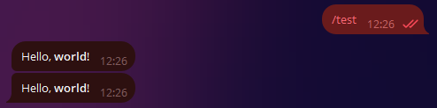
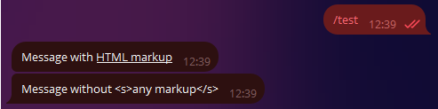
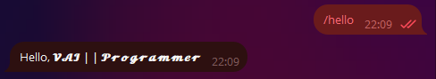
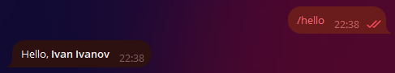
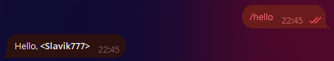
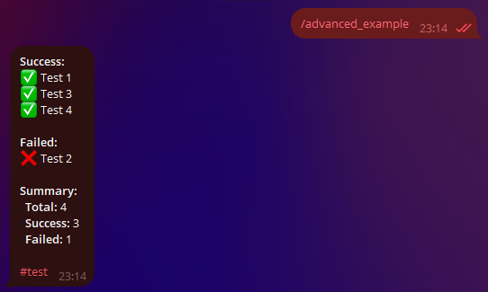
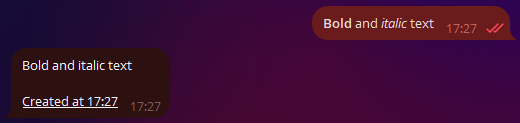
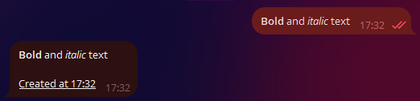
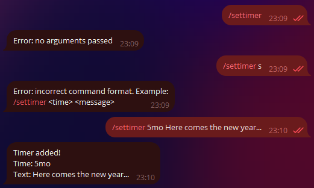

!!! warning "An important warning about translation!"
    Hello! This message is from the translator [VAI || Programmer](https://github.com/Vadim-Khristenko).
    Please keep in mind that this page is still being translated.

# Working with Messages

!!! info ""
    The version of aiogram used: 3.7.0

In this chapter, we will learn how to apply different types of formatting to messages 
and work with media files.

## Text {: id="text" }
Processing text messages is arguably one of the most important actions for most bots. 
Text can be used to express almost anything, and you want to present the information _beautifully_. 
Developers have three methods of text formatting at their disposal: 
HTML, Markdown, and MarkdownV2. The most advanced among them are HTML and MarkdownV2, 
“classic” Markdown supports fewer features and is no longer used in aiogram.

Before we look at the ways of working with text in aiogram, it's necessary to mention 
an important distinction between aiogram 3.x and 2.x: in "version two" by default, only 
text messages were processed, but in "version three," messages of any type are processed. 
To be more precise, here is how you now need to handle text messages exclusively:

```python
# before (with decorator)
@dp.message_handler()
async def func_name(...)

# before (with function-registrar)
dp.register_message_handler(func_name)

# now (with decorator)
from aiogram import F
@dp.message(F.text)
async def func_name(...)

# now (with function-registrar)
dp.message.register(func_name, F.text)
```

We will talk about the "magic filter" **F** in [another chapter](filters-and-middlewares.md).

### Formatted Output {: id="formatting-options" }

The choice of formatting when sending messages is determined by the `parse_mode` argument, for example:
```python
from aiogram import F
from aiogram.types import Message
from aiogram.filters import Command
from aiogram.enums import ParseMode

# If you don't specify the F.text filter,
# then the handler will even trigger on an image with the caption /test
@dp.message(F.text, Command("test"))
async def any_message(message: Message):
    await message.answer(
        "Hello, <b>world</b>!", 
        parse_mode=ParseMode.HTML
    )
    await message.answer(
        "Hello, *world*\!", 
        parse_mode=ParseMode.MARKDOWN_V2
    )
```



If a particular formatting is used throughout the bot, specifying the `parse_mode` argument each time can be quite cumbersome. 
Fortunately, in aiogram, you can set default bot parameters. To do this, create a `DefaultBotProperties` object 
and pass the required settings into it:

```python
from aiogram.client.default import DefaultBotProperties

bot = Bot(
    token="123:abcxyz",
    default=DefaultBotProperties(
        parse_mode=ParseMode.HTML
        # there are many other interesting settings here
    )
)
bot = Bot(token="123:abcxyz", parse_mode="HTML")

# somewhere in a function...
await message.answer("Message with <u>HTML markup</u>")
# to explicitly disable formatting in a specific request, 
# pass parse_mode=None
await message.answer(
    "Message without <s>any markup</s>", 
    parse_mode=None
)
```



### Input Escaping {: id="input-escaping" }

It's not uncommon for situations to arise where the final text of a bot's message is unknown in advance 
and is formed based on some external data: the user's name, their input, etc. 
Let’s write a handler for the `/hello` command that will greet the user by their full name 
(`first_name + last_name`), for example: “Hello, Ivan Ivanov”:

```python
from aiogram.filters import Command

@dp.message(Command("hello"))
async def cmd_hello(message: Message):
    await message.answer(
        f"Hello, <b>{message.from_user.full_name}</b>",
        parse_mode=ParseMode.HTML
    )
```

And it seems all good, the bot greets users:




But then comes a user with the name &lt;Slavik777&gt; and the bot remains silent! And the logs show the following:
`aiogram.exceptions.TelegramBadRequest: Telegram server says - Bad Request: can't parse entities: 
Unsupported start tag "Slavik777" at byte offset 7`

Oops, we have the HTML formatting mode set, and Telegram tries to parse &lt;Slavik777&gt; as an HTML tag. That’s not good. 
But there are several solutions to this problem. The first one: escape the passed values.

```python
from aiogram import html
from aiogram.filters import Command

@dp.message(Command("hello"))
async def cmd_hello(message: Message):
    await message.answer(
        f"Hello, {html.bold(html.quote(message.from_user.full_name))}",
        parse_mode=ParseMode.HTML
    )
```

The second one is a bit more complicated but more advanced: use a special tool that will 
collect the text and information on which parts of it should be formatted separately.

```python
from aiogram.filters import Command
from aiogram.utils.formatting import Text, Bold

@dp.message(Command("hello"))
async def cmd_hello(message: Message):
    content = Text(
        "Hello, ",
        Bold(message.from_user.full_name)
    )
    await message.answer(
        **content.as_kwargs()
    )
```

In the example above, the `**content.as_kwargs()` construction will return the arguments `text`, `entities`, `parse_mode`, and 
substitute them in the call to `answer()`.



The mentioned formatting tool is quite complex, 
[the official documentation](https://docs.aiogram.dev/en/latest/utils/formatting.html) demonstrates convenient display 
of complex constructs, for example:

```python
from aiogram.filters import Command
from aiogram.utils.formatting import (
    Bold, as_list, as_marked_section, as_key_value, HashTag
)

@dp.message(Command("advanced_example"))
async def cmd_advanced_example(message: Message):
    content = as_list(
        as_marked_section(
            Bold("Success:"),
            "Test 1",
            "Test 3",
            "Test 4",
            marker="✅ ",
        ),
        as_marked_section(
            Bold("Failed:"),
            "Test 2",
            marker="❌ ",
        ),
        as_marked_section(
            Bold("Summary:"),
            as_key_value("Total", 4),
            as_key_value("Success", 3),
            as_key_value("Failed", 1),
            marker="  ",
        ),
        HashTag("#test"),
        sep="\n\n",
    )
    await message.answer(**content.as_kwargs())
```



!!! info ""
    You can learn more about the different formatting methods and supported tags 
    [in the Bot API documentation](https://core.telegram.org/bots/api#formatting-options).


### Preserving Formatting {: id="keep-formatting" }

Let's imagine that a bot needs to receive formatted text from a user and add something of its own, such as a timestamp. We'll write a simple code snippet:

```python
# New import!
from datetime import datetime

@dp.message(F.text)
async def echo_with_time(message: Message):
    # Get the current time in the local PC timezone
    time_now = datetime.now().strftime('%H:%M')
    # Create underlined text
    added_text = html.underline(f"Created at {time_now}")
    # Send a new message with the added text
    await message.answer(f"{message.text}\n\n{added_text}", parse_mode="HTML")
```



Hmm, something went wrong. 
Why did the formatting of the original message get messed up? 
This happens because `message.text` returns plain text without any formatting. 
To get the text in the desired format, 
let's use alternative properties: `message.html_text` or `message.md_text`. 
For now, we'll use the first option. 
Let's replace `message.text` with `message.html_text` in the example above, 
and we'll get the correct result:



### Working with Entities {: id="message-entities" }

Telegram significantly simplifies the life of developers by preprocessing user messages 
on its side. For example, some entities, like e-mail, phone number, username, etc., can 
be extracted directly from the [Message](https://core.telegram.org/bots/api#message) object 
and the `entities` field, which contains an array of 
[MessageEntity](https://core.telegram.org/bots/api#messageentity) objects, rather than 
using [regular expressions](https://en.wikipedia.org/wiki/Regular_expression). 
As an example, let's write a handler that extracts a link, e-mail, 
and monospaced text from a message (one of each).

Here lies an important catch. **Telegram returns not the actual values, but their start position in the text and length**. 
Moreover, the text is counted in UTF-8 characters, while entities work with UTF-16. 
Because of this, if you simply take the position and length, 
your processed text will be misaligned if there are UTF-16 characters (e.g., emojis).

The example below demonstrates this best. 
In the screenshot, the first bot response is the result of naive parsing, 
while the second is the result of using the `extract_from()` method on the entity. 
The entire original text is passed to this method:

```python
@dp.message(F.text)
async def extract_data(message: Message):
    data = {
        "url": "<N/A>",
        "email": "<N/A>",
        "code": "<N/A>"
    }
    entities = message.entities or []
    for item in entities:
        if item.type in data.keys():
            # Incorrect
            # data[item.type] = message.text[item.offset : item.offset+item.length]
            # Correct
            data[item.type] = item.extract_from(message.text)
    await message.reply(
        "Here's what I found:\n"
        f"URL: {html.quote(data['url'])}\n"
        f"E-mail: {html.quote(data['email'])}\n"
        f"Code: {html.quote(data['code'])}"
    )
```


### Commands and Their Arguments {: id="commands-args" }

Telegram [provides](https://core.telegram.org/bots/features#inputs) 
users with many ways to input information. 
One of them is commands: keywords that start with a slash, such as `/new` or `/ban`. 
Sometimes, a bot can be designed to expect some _arguments_ after the command itself, 
like `/ban 2d` or `/settimer 20h This is delayed message`. 
The aiogram library includes a `Command()` filter, which makes developers' lives easier. 
Let's implement the last example in code:


```python
@dp.message(Command("settimer"))
async def cmd_settimer(
        message: Message,
        command: CommandObject
):
    # If no arguments are passed,
    # command.args will be None
    if command.args is None:
        await message.answer(
            "Error: no arguments passed"
        )
        return
    # Try to split the arguments into two parts by the first encountered space
    try:
        delay_time, text_to_send = command.args.split(" ", maxsplit=1)
    # If less than two parts are obtained, a ValueError will be raised
    except ValueError:
        await message.answer(
            "Error: incorrect command format. Example:\n"
            "/settimer <time> <message>"
        )
        return
    await message.answer(
        "Timer added!\n"
        f"Time: {delay_time}\n"
        f"Text: {text_to_send}"
    )
```

Let's try passing the command with different arguments (or without any) and check the reaction:


