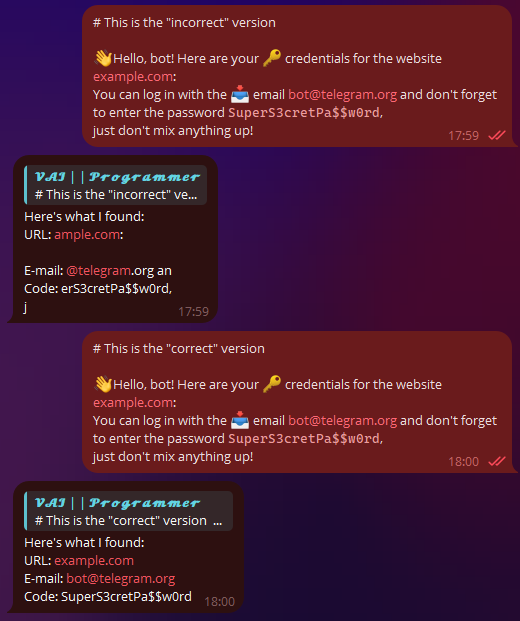
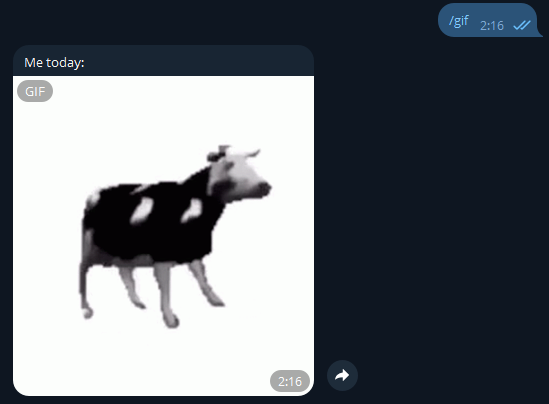

# Working with Messages

!!! info ""
    The version of aiogram used: 3.7.0

In this chapter, we will learn how to apply different types of formatting to messages 
and work with media files.

## Text {: id="text" }
Processing text messages is arguably one of the most important actions for most bots. 
Text can be used to express almost anything, and you want to present the information _beautifully_. 
Developers have three methods of text formatting at their disposal: 
HTML, Markdown, and MarkdownV2. The most advanced among them are HTML and MarkdownV2, 
“classic” Markdown supports fewer features and is no longer used in aiogram.

Before we look at the ways of working with text in aiogram, it's necessary to mention 
an important distinction between aiogram 3.x and 2.x: in "version two" by default, only 
text messages were processed, but in "version three," messages of any type are processed. 
To be more precise, here is how you now need to handle text messages exclusively:

```python
# before (with decorator)
@dp.message_handler()
async def func_name(...)

# before (with function-registrar)
dp.register_message_handler(func_name)

# now (with decorator)
from aiogram import F
@dp.message(F.text)
async def func_name(...)

# now (with function-registrar)
dp.message.register(func_name, F.text)
```

We will talk about the "magic filter" **F** in [another chapter](filters-and-middlewares.md).

### Formatted Output {: id="formatting-options" }

The choice of formatting when sending messages is determined by the `parse_mode` argument, for example:
```python
from aiogram import F
from aiogram.types import Message
from aiogram.filters import Command
from aiogram.enums import ParseMode

# If you don't specify the F.text filter,
# then the handler will even trigger on an image with the caption /test
@dp.message(F.text, Command("test"))
async def any_message(message: Message):
    await message.answer(
        "Hello, <b>world</b>!", 
        parse_mode=ParseMode.HTML
    )
    await message.answer(
        "Hello, *world*\!", 
        parse_mode=ParseMode.MARKDOWN_V2
    )
```


If a particular formatting is used throughout the bot, specifying the `parse_mode` argument each time can be quite cumbersome. 
Fortunately, in aiogram, you can set default bot parameters. To do this, create a `DefaultBotProperties` object 
and pass the required settings into it:

```python
from aiogram.client.default import DefaultBotProperties

bot = Bot(
    token="123:abcxyz",
    default=DefaultBotProperties(
        parse_mode=ParseMode.HTML
        # there are many other interesting settings here
    )
)
bot = Bot(token="123:abcxyz", parse_mode="HTML")

# somewhere in a function...
await message.answer("Message with <u>HTML markup</u>")
# to explicitly disable formatting in a specific request, 
# pass parse_mode=None
await message.answer(
    "Message without <s>any markup</s>", 
    parse_mode=None
)
```


### Input Escaping {: id="input-escaping" }

It's not uncommon for situations to arise where the final text of a bot's message is unknown in advance 
and is formed based on some external data: the user's name, their input, etc. 
Let’s write a handler for the `/hello` command that will greet the user by their full name 
(`first_name + last_name`), for example: “Hello, Ivan Ivanov”:

```python
from aiogram.filters import Command

@dp.message(Command("hello"))
async def cmd_hello(message: Message):
    await message.answer(
        f"Hello, <b>{message.from_user.full_name}</b>",
        parse_mode=ParseMode.HTML
    )
```

And it seems all good, the bot greets users:


But then comes a user with the name &lt;Slavik777&gt; and the bot remains silent! And the logs show the following:
`aiogram.exceptions.TelegramBadRequest: Telegram server says - Bad Request: can't parse entities: 
Unsupported start tag "Slavik777" at byte offset 7`

Oops, we have the HTML formatting mode set, and Telegram tries to parse &lt;Slavik777&gt; as an HTML tag. That’s not good. 
But there are several solutions to this problem. The first one: escape the passed values.

```python
from aiogram import html
from aiogram.filters import Command

@dp.message(Command("hello"))
async def cmd_hello(message: Message):
    await message.answer(
        f"Hello, {html.bold(html.quote(message.from_user.full_name))}",
        parse_mode=ParseMode.HTML
    )
```

The second one is a bit more complicated but more advanced: use a special tool that will 
collect the text and information on which parts of it should be formatted separately.

```python
from aiogram.filters import Command
from aiogram.utils.formatting import Text, Bold

@dp.message(Command("hello"))
async def cmd_hello(message: Message):
    content = Text(
        "Hello, ",
        Bold(message.from_user.full_name)
    )
    await message.answer(
        **content.as_kwargs()
    )
```

In the example above, the `**content.as_kwargs()` construction will return the arguments `text`, `entities`, `parse_mode`, and 
substitute them in the call to `answer()`.


The mentioned formatting tool is quite complex, 
[the official documentation](https://docs.aiogram.dev/en/latest/utils/formatting.html) demonstrates convenient display 
of complex constructs, for example:

```python
from aiogram.filters import Command
from aiogram.utils.formatting import (
    Bold, as_list, as_marked_section, as_key_value, HashTag
)

@dp.message(Command("advanced_example"))
async def cmd_advanced_example(message: Message):
    content = as_list(
        as_marked_section(
            Bold("Success:"),
            "Test 1",
            "Test 3",
            "Test 4",
            marker="✅ ",
        ),
        as_marked_section(
            Bold("Failed:"),
            "Test 2",
            marker="❌ ",
        ),
        as_marked_section(
            Bold("Summary:"),
            as_key_value("Total", 4),
            as_key_value("Success", 3),
            as_key_value("Failed", 1),
            marker="  ",
        ),
        HashTag("#test"),
        sep="\n\n",
    )
    await message.answer(**content.as_kwargs())
```


!!! info ""
    You can learn more about the different formatting methods and supported tags 
    [in the Bot API documentation](https://core.telegram.org/bots/api#formatting-options).


### Preserving Formatting {: id="keep-formatting" }

Let's imagine that a bot needs to receive formatted text from a user and add something of its own, such as a timestamp. We'll write a simple code snippet:

```python
# New import!
from datetime import datetime

@dp.message(F.text)
async def echo_with_time(message: Message):
    # Get the current time in the local PC timezone
    time_now = datetime.now().strftime('%H:%M')
    # Create underlined text
    added_text = html.underline(f"Created at {time_now}")
    # Send a new message with the added text
    await message.answer(f"{message.text}\n\n{added_text}", parse_mode="HTML")
```


Hmm, something went wrong. 
Why did the formatting of the original message get messed up? 
This happens because `message.text` returns plain text without any formatting. 
To get the text in the desired format, 
let's use alternative properties: `message.html_text` or `message.md_text`. 
For now, we'll use the first option. 
Let's replace `message.text` with `message.html_text` in the example above, 
and we'll get the correct result:


### Working with Entities {: id="message-entities" }

Telegram significantly simplifies the life of developers by preprocessing user messages 
on its side. For example, some entities, like e-mail, phone number, username, etc., can 
be extracted directly from the [Message](https://core.telegram.org/bots/api#message) object 
and the `entities` field, which contains an array of 
[MessageEntity](https://core.telegram.org/bots/api#messageentity) objects, rather than 
using [regular expressions](https://en.wikipedia.org/wiki/Regular_expression). 
As an example, let's write a handler that extracts a link, e-mail, 
and monospaced text from a message (one of each).

Here lies an important catch. **Telegram returns not the actual values, but their start position in the text and length**. 
Moreover, the text is counted in UTF-8 characters, while entities work with UTF-16. 
Because of this, if you simply take the position and length, 
your processed text will be misaligned if there are UTF-16 characters (e.g., emojis).

The example below demonstrates this best. 
In the screenshot, the first bot response is the result of naive parsing, 
while the second is the result of using the `extract_from()` method on the entity. 
The entire original text is passed to this method:

```python
@dp.message(F.text)
async def extract_data(message: Message):
    data = {
        "url": "<N/A>",
        "email": "<N/A>",
        "code": "<N/A>"
    }
    entities = message.entities or []
    for item in entities:
        if item.type in data.keys():
            # Incorrect
            # data[item.type] = message.text[item.offset : item.offset+item.length]
            # Correct
            data[item.type] = item.extract_from(message.text)
    await message.reply(
        "Here's what I found:\n"
        f"URL: {html.quote(data['url'])}\n"
        f"E-mail: {html.quote(data['email'])}\n"
        f"Code: {html.quote(data['code'])}"
    )
```



### Commands and Their Arguments {: id="commands-args" }

Telegram [provides](https://core.telegram.org/bots/features#inputs) 
users with many ways to input information. 
One of them is commands: keywords that start with a slash, such as `/new` or `/ban`. 
Sometimes, a bot can be designed to expect some _arguments_ after the command itself, 
like `/ban 2d` or `/settimer 20h This is delayed message`. 
The aiogram library includes a `Command()` filter, which makes developers' lives easier. 
Let's implement the last example in code:


```python
@dp.message(Command("settimer"))
async def cmd_settimer(
        message: Message,
        command: CommandObject
):
    # If no arguments are passed,
    # command.args will be None
    if command.args is None:
        await message.answer(
            "Error: no arguments passed"
        )
        return
    # Try to split the arguments into two parts by the first encountered space
    try:
        delay_time, text_to_send = command.args.split(" ", maxsplit=1)
    # If less than two parts are obtained, a ValueError will be raised
    except ValueError:
        await message.answer(
            "Error: incorrect command format. Example:\n"
            "/settimer <time> <message>"
        )
        return
    await message.answer(
        "Timer added!\n"
        f"Time: {delay_time}\n"
        f"Text: {text_to_send}"
    )
```

Let's try passing the command with different arguments (or without any) and check the reaction:


There may be a minor issue with commands in groups: 
Telegram automatically highlights commands that start with a slash, 
which can sometimes result in situations like this (thanks to my dear subscribers for helping create the screenshot):

> P.S. (From the Translator): I don't have subscribers available to help with creating the screenshot, so the users shown in the screenshot are part of the technical support team for one of my projects.


To avoid this, you can make the bot respond to commands with different prefixes. 
These will not be highlighted and will require manual input, 
so evaluate the usefulness of this approach yourself.

```python
@dp.message(Command("custom1", prefix="%"))
async def cmd_custom1(message: Message):
    await message.answer("I see the command!")


# You can specify multiple prefixes....vv...
@dp.message(Command("custom2", prefix="/!"))
async def cmd_custom2(message: Message):
    await message.answer("I see this one too!")
```


The issue with custom prefixes in groups is that non-admin bots with Privacy Mode enabled 
(by default) may not see such commands due to [server logic](https://core.telegram.org/bots/faq#what-messages-will-my-bot-get). 
The most common use case is group moderation bots that are already administrators.

### Deep Links {: id="deeplinks" }

There is one command in Telegram with a bit more functionality: `/start`. 
The trick is that you can create a link like `t.me/bot?start=xxx`, 
and when a user clicks on such a link, they will see a "Start" button. 
When clicked, the bot will receive a `/start xxx` message. 
In other words, the link contains an additional parameter that doesn’t require manual input.
This is called a deep link (not to be confused with a "deep pick") 
and can be used for a variety of purposes: shortcuts for activating different commands, 
referral systems, quick bot configuration, etc. Let’s look at two examples:

```python
import re
from aiogram import F
from aiogram.types import Message
from aiogram.filters import Command, CommandObject, CommandStart

@dp.message(Command("help"))
@dp.message(CommandStart(
    deep_link=True, magic=F.args == "help"
))
async def cmd_start_help(message: Message):
    await message.answer("This is a help message")


@dp.message(CommandStart(
    deep_link=True,
    magic=F.args.regexp(re.compile(r'book_(\d+)'))
))
async def cmd_start_book(
        message: Message,
        command: CommandObject
):
    book_number = command.args.split("_")[1]
    await message.answer(f"Sending book №{book_number}")
```


Note that deep links using `start` will send the user to a private chat with the bot. 
To choose a group and send the deep link there, replace `start` with `startgroup`. 
Aiogram also provides a convenient [function](https://github.com/aiogram/aiogram/blob/228a86afdc3c594dd9db9e82d8d6d445adb5ede1/aiogram/utils/deep_linking.py#L126-L158) 
to create deep links directly from your code.

!!! tip "More deep links, but not for bots"
    The Telegram documentation provides a detailed description of various deep links for client applications: 
    [https://core.telegram.org/api/links](https://core.telegram.org/api/links)

### Link Previews {: id="link-previews" }

Usually, when sending a text message with links, 
Telegram tries to find and show a preview of the first link in the order. 
You can customize this behavior by passing a `LinkPreviewOptions` object to the `send_message()` method's `link_preview_options` argument:

```python
# New import
from aiogram.types import LinkPreviewOptions

@dp.message(Command("links"))
async def cmd_links(message: Message):
    links_text = (
        "https://nplus1.ru/news/2024/05/23/voyager-1-science-data"
        "\n"
        "https://t.me/telegram"
    )
    # Link preview disabled
    options_1 = LinkPreviewOptions(is_disabled=True)
    await message.answer(
        f"No link previews\n{links_text}",
        link_preview_options=options_1
    )

    # -------------------- #

    # Small preview
    # To use prefer_small_media, you must also specify the URL
    options_2 = LinkPreviewOptions(
        url="https://nplus1.ru/news/2024/05/23/voyager-1-science-data",
        prefer_small_media=True
    )
    await message.answer(
        f"Small preview\n{links_text}",
        link_preview_options=options_2
    )

    # -------------------- #

    # Large preview
    # To use prefer_large_media, you must also specify the URL
    options_3 = LinkPreviewOptions(
        url="https://nplus1.ru/news/2024/05/23/voyager-1-science-data",
        prefer_large_media=True
    )
    await message.answer(
        f"Large preview\n{links_text}",
        link_preview_options=options_3
    )

    # -------------------- #

    # You can combine: small preview and positioning above the text
    options_4 = LinkPreviewOptions(
        url="https://nplus1.ru/news/2024/05/23/voyager-1-science-data",
        prefer_small_media=True,
        show_above_text=True
    )
    await message.answer(
        f"Small preview above text\n{links_text}",
        link_preview_options=options_4
    )

    # -------------------- #

    # You can choose which link to use for the preview
    options_5 = LinkPreviewOptions(
        url="https://t.me/telegram"
    )
    await message.answer(
        f"Preview not for the first link\n{links_text}",
        link_preview_options=options_5
    )
```

Result:


Some preview parameters can also be specified by default in `DefaultBotProperties`, 
which was discussed at the beginning of the chapter.

## Media Files {: id="media" }

### Uploading Files {: id="uploading-media" }

In addition to regular text messages, Telegram allows the exchange of various types of media files: photos, videos, 
GIFs, locations, stickers, etc. Most media files have `file_id` and `file_unique_id` properties. 
The first one can be used to resend the same file multiple times instantly since the file is already stored on Telegram's servers. 
This is the most preferred method.  
For example, the following code will make the bot instantly reply to the user with the same GIF that was sent:

```python
@dp.message(F.animation)
async def echo_gif(message: Message):
    await message.reply_animation(message.animation.file_id)
```

!!! warning "Always use the correct file_id!"
    The bot should **only** use `file_id` that it directly received, 
    for instance, from a user in a private chat or by "seeing" the media file in a group/channel. If you try to use a `file_id` from another bot, it _might work_, but after some time, you will receive an error **wrong url/file_id specified**. Therefore, use only your own `file_id`!

Unlike `file_id`, the `file_unique_id` cannot be used for resending or downloading the media file, 
but it is the same for all bots for a specific media. 
`file_unique_id` is usually needed when multiple bots need to know that their own `file_id` corresponds to the same file.

If the file does not yet exist on the Telegram server, the bot can upload it in three different ways: 
as a file in the file system, by a URL, and directly as a byte array. 
To speed up sending and generally to be more considerate of the messenger's servers, 
it's more efficient to upload files to Telegram once and then use the `file_id` that will be available after the first media upload.

In aiogram 3.x, there are 3 classes for sending files and media - `FSInputFile`, 
`BufferedInputFile`, `URLInputFile`. You can learn more about them in the [documentation](https://docs.aiogram.dev/en/dev-3.x/api/upload_file.html).

Let's look at a simple example of sending images in all different ways:
```python
from aiogram.types import FSInputFile, URLInputFile, BufferedInputFile

@dp.message(Command('images'))
async def upload_photo(message: Message):
    # We will store the file_ids of the sent files here to use them later
    file_ids = []

    # To demonstrate BufferedInputFile, we use the "classic" 
    # file opening method with `open()`. However, this method
    # is best suited for sending bytes from memory after performing
    # some manipulations, such as editing with Pillow
    with open("buffer_emulation.jpg", "rb") as image_from_buffer:
        result = await message.answer_photo(
            BufferedInputFile(
                image_from_buffer.read(),
                filename="image from buffer.jpg"
            ),
            caption="Image from buffer"
        )
        file_ids.append(result.photo[-1].file_id)

    # Sending a file from the file system
    image_from_pc = FSInputFile("image_from_pc.jpg")
    result = await message.answer_photo(
        image_from_pc,
        caption="Image from file on PC"
    )
    file_ids.append(result.photo[-1].file_id)

    # Sending a file via URL
    image_from_url = URLInputFile("https://picsum.photos/seed/groosha/400/300")
    result = await message.answer_photo(
        image_from_url,
        caption="Image from URL"
    )
    file_ids.append(result.photo[-1].file_id)
    await message.answer("Sent files:\n"+"\n".join(file_ids))
```

The caption for photos, videos, and GIFs can be placed above the media:

```python
@dp.message(Command("gif"))
async def send_gif(message: Message):
    await message.answer_animation(
        animation="<gif file_id>",
        caption="Me today:",
        show_caption_above_media=True
    )
```



### Downloading Files {: id="downloading-media" }

In addition to reusing for sending, the bot can download media to your computer/server. 
The `Bot` object has a `download()` method for this purpose. 
In the examples below, files are downloaded directly to the file system, 
but you can also save them to a BytesIO object in memory to pass them on to another application (e.g., Pillow).

```python
@dp.message(F.photo)
async def download_photo(message: Message, bot: Bot):
    await bot.download(
        message.photo[-1],
        destination=f"/tmp/{message.photo[-1].file_id}.jpg"
    )


@dp.message(F.sticker)
async def download_sticker(message: Message, bot: Bot):
    await bot.download(
        message.sticker,
        # adjust paths for Windows
        destination=f"/tmp/{message.sticker.file_id}.webp"
    )
```

Why did we use `message.photo[-1]` instead of `message.photo`? 
Photos in Telegram messages come in several copies; 
it’s the same image with different sizes. So, by taking the last element (index -1), 
we are working with the maximum available size of the photo.

!!! info "Downloading Large Files"
    Bots using the Telegram Bot API can download files up to [20 megabytes](https://core.telegram.org/bots/api#getfile). 
    If you plan to download/upload larger files, consider using libraries that interact with the 
    Telegram Client API rather than the Telegram Bot API, such as [Telethon](https://docs.telethon.dev/en/latest/index.html) 
    or [Pyrogram](https://docs.pyrogram.org/).
    Few people know, but the Client API can be used not only by regular accounts but also by 
    [bots](https://docs.telethon.dev/en/latest/concepts/botapi-vs-mtproto.html).
    
    Starting with Bot API version 5.0, you can use a 
    [local Bot API server](https://core.telegram.org/bots/api#using-a-local-bot-api-server) to work with larger files.

### Albums {: id="albums" }

What we call "albums" (media groups) in Telegram are actually separate messages with media that share a common `media_group_id` 
and are visually "stitched together" on clients. Starting from version 3.1, 
aiogram includes an [album builder](https://docs.aiogram.dev/en/latest/utils/media_group.html), which we'll now look at. 
But first, let's mention a few features of media groups:

* You cannot attach an inline keyboard or send a reply keyboard with them. Not in any way. Absolutely no way.
* Each media file in the album can have its own caption. If only one media has a caption, it will be displayed as a common caption for the entire album.
* Photos can be mixed with videos in the same album, but files (Document) and music (Audio) cannot be mixed with anything else, only with media of the same type.
* An album can have no more than 10 (ten) media files.

Now let's see how to do this in aiogram:

```python
from aiogram.filters import Command
from aiogram.types import FSInputFile, Message
from aiogram.utils.media_group import MediaGroupBuilder

@dp.message(Command("album"))
async def cmd_album(message: Message):
    album_builder = MediaGroupBuilder(
        caption="General caption for the future album"
    )
    album_builder.add(
        type="photo",
        media=FSInputFile("image_from_pc.jpg")
        # caption="Caption for a specific media"
    )
    # If we immediately know the type, instead of the general add,
    # we can directly call add_<type>
    album_builder.add_photo(
        # For links or file_id, just specify the value directly
        media="https://picsum.photos/seed/groosha/400/300"
    )
    album_builder.add_photo(
        media="<your file_id>"
    )
    await message.answer_media_group(
        # Don't forget to call build()
        media=album_builder.build()
    )
```

Result:


However, downloading albums is much worse... As mentioned above, 
albums are just grouped separate messages, 
which means that they also arrive to the bot in different updates. 
There is probably no 100% reliable way to receive the entire album in one piece, 
but you can try to do this with minimal losses. 
This is usually done through middleware, 
and my own implementation of receiving media groups can be found [at this link](https://github.com/MasterGroosha/telegram-feedback-bot-topics/blob/master/bot/middlewares/albums_collector.py).

## Service Messages {: id="service" }

Messages in Telegram are divided into text, media files, and service messages. 
It's time to talk about the latter.


Despite their unusual appearance and limited interaction, 
these are still messages with their own IDs and even owners. 
It is worth noting that the range of applications for service messages has changed over the years, 
and now your bot is unlikely to work with them, or only to delete them.

Let's not delve too deeply into the details and consider one specific example: 
sending a welcome message to a newly joined member. 
Such a service message will have a content_type equal to "new_chat_members", 
but in general, it is a Message object with a populated field of the same name.

```python
@dp.message(F.new_chat_members)
async def somebody_added(message: Message):
    for user in message.new_chat_members:
        # The full_name property takes both the first and last name
        # (in the screenshot above, the users have no last names)
        await message.reply(f"Hello, {user.full_name}")
```


It's important to remember that `message.new_chat_members` is a list because one user can add multiple members at once. Also, do not confuse the fields `message.from_user` and `message.new_chat_members`. The first is the subject, i.e., the one who performed the action. The second is the objects of the action. For example, if you see a message like "Anna added Boris and Victor", then `message.from_user` is information about Anna, and the `message.new_chat_members` list contains information about Boris and Victor.

!!! warning "Do not rely entirely on service messages!"
    Service messages about additions (new_chat_members) and exits (left_chat_member) have an
    unpleasant peculiarity: they are unreliable, meaning they may not be created at all.
    For instance, the new_chat_members message stops being created at around ~10k members in a group,
    while left_chat_member stops at 50 (but while writing this chapter, I encountered a situation
    where left_chat_member did not appear in a group of 9 members. And half an hour later,
    it appeared in the same group when another person left).

    With the release of Bot API 5.0, developers have a much more reliable way to see member entries/exits
    in groups of any size, **as well as in channels**. But we will talk about this
    [another time](special-updates.md).