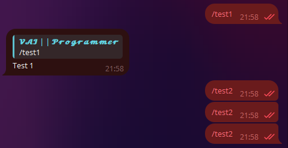
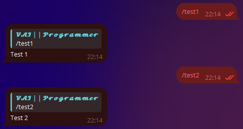
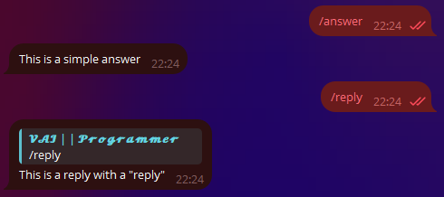
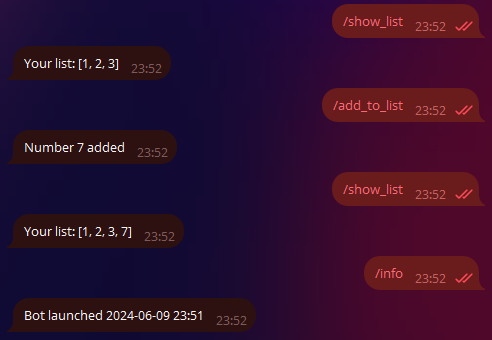

# Getting Started with aiogram

!!! info ""
    The version of aiogram used: 3.7.0

!!! warning "Some details are intentionally simplified!"
    The author of this book is convinced that along with theory, there should be practice. 
    To simplify the replication of the code provided below, it was necessary to use approaches 
    suitable only for local development and learning.

    Thus, for example, in all or almost all chapters, the bot's token will be indicated 
    directly in the source texts. This is a **bad** approach because it can lead to the token being disclosed 
    if you forget to remove it before uploading the code to a public repository (e.g., GitHub).

    Or, sometimes, data storage structures located exclusively in memory (dictionaries, lists...) will be used. 
    In reality, such objects are undesirable, as stopping the bot will lead to the irreversible loss of data.

    Also, polling is chosen as the mechanism for receiving updates from Telegram 
    because it is guaranteed to work in the vast majority of environments and suits almost all developers.

    **It is important to remember that the author's goal is to explain specifically how to work with the Telegram Bot API
    using aiogram, not to teach all of Computer Science in its entirety.**

## Terminology {: id="glossary" }

To communicate using the same concepts, let's introduce some terms to avoid confusion moving forward:

* DM — direct messages, in the context of a bot this is a one-on-one conversation with a user, not a group/channel.
* Chat — a general term for DMs, groups, supergroups, and channels.
* Update — any event from [this list](https://core.telegram.org/bots/api#update): 
messages, edited messages, callbacks, inline queries, payments, adding bots to groups, etc.
* Handler — an asynchronous function that receives the next update from the dispatcher/router 
and processes it.
* Dispatcher — an object that handles receiving updates from Telegram and subsequently chooses a handler 
to process the received update.
* Router — similar to the dispatcher, but responsible for a subset of handlers. 
**It can be said that the dispatcher is the root router**.
* Filter — an expression that usually returns True or False and affects whether a handler will be called or not.
* Middleware — a layer that is inserted into the processing of updates.

## Installation {: id="installation" }

First, let's create a directory for the bot, set up a virtual environment (venv) there, and
install the [aiogram](https://github.com/aiogram/aiogram) library.  
Let's check that Python version 3.9 is installed (if you know that you have version 3.9 or higher, you can skip this section):

```plain
[groosha@main lesson_01]$ python3.9
Python 3.9.9 (main, Jan 11 2022, 16:35:07) 
[GCC 11.1.0] on linux
Type "help", "copyright", "credits" or "license" for more information.
>>> exit()
[groosha@main lesson_01]$ 
```

Now let's create a `requirements.txt` file, in which we will specify the version of aiogram we are using. 
We will also need the pydantic-settings library for configuration files.
!!! important "About aiogram versions"
    This chapter uses aiogram **3.x**. Before you start, 
    I recommend checking the [release channel](https://t.me/aiogram_live) of the library to see if there is a newer version available. 
    Any newer version starting with the number 3 will do, as aiogram 2.x will not be considered anymore and is deemed outdated.

```plain
[groosha@main 01_quickstart]$ python3.11 -m venv venv
[groosha@main 01_quickstart]$ echo "aiogram<4.0" > requirements.txt
[groosha@main 01_quickstart]$ echo "pydantic-settings" >> requirements.txt
[groosha@main 01_quickstart]$ source venv/bin/activate
(venv) [groosha@main 01_quickstart]$ pip install -r requirements.txt 
# ...here a bunch of lines about installation...
Successfully installed ...here a long list...
[groosha@main 01_quickstart]$
```

Note the "venv" prefix in the terminal. It indicates that we are inside a virtual environment named "venv".
Let's verify that inside venv the command `python` still points to the same Python 3.11:  
```plain
(venv) [groosha@main 01_quickstart]$ python
Python 3.11.9 (main, Jan 11 2024, 16:35:07) 
[GCC 11.1.0] on linux
Type "help", "copyright", "credits" or "license" for more information.
>>> exit()
(venv) [groosha@main 01_quickstart]$ deactivate 
[groosha@main 01_quickstart]$ 
```

Using the last `deactivate` command, we exited venv so that it doesn't interfere with us now.

!!! info ""
    If you use PyCharm for writing bots, I also recommend installing the third-party 
    [Pydantic](https://plugins.jetbrains.com/plugin/12861-pydantic) plugin to support code autocompletion 
    in Telegram objects.

## First Bot {: id="hello-world" }

Let's create a `bot.py` file with a basic bot template using aiogram:
```python title="bot.py"
import asyncio
import logging
from aiogram import Bot, Dispatcher, types
from aiogram.filters.command import Command

# Enable logging to avoid missing important messages
logging.basicConfig(level=logging.INFO)
# Bot object
bot = Bot(token="12345678:AaBbCcDdEeFfGgHh")
# Dispatcher
dp = Dispatcher()

# Handler for the /start command
@dp.message(Command("start"))
async def cmd_start(message: types.Message):
    await message.answer("Hello!")

# Start polling for new updates
async def main():
    await dp.start_polling(bot)

if __name__ == "__main__":
    asyncio.run(main())
```

The first thing to note is that aiogram is an asynchronous library, so your handlers must also be asynchronous, 
and you need to put the **await** keyword before API method calls, as these calls return [coroutines](https://docs.python.org/3/library/asyncio-task.html#coroutines).

!!! info "Asynchronous programming in Python"
    Don't neglect the official documentation!  
    A great tutorial on asyncio is available [on the Python website](https://docs.python.org/3/library/asyncio-task.html)

If you have previously worked with another library for Telegram, for example, pyTelegramBotAPI, 
then the concept of handlers (event processors) will immediately become clear to you. 
The difference is that in aiogram, handlers are managed by the dispatcher. The dispatcher registers handler functions, 
further limiting the list of events that call them through filters. After receiving the next update (event from Telegram), 
the dispatcher will select the appropriate processing function that matches all the filters, 
for example, "processing messages that are images, in a chat with ID x and with a caption length of y". 
If two functions have logically identical filters, the one that was registered first will be called.

To register a function as a message handler, you need to do one of two things:  
1. Attach a [decorator](https://devpractice.ru/python-lesson-19-decorators/) to it, as in the example above. 
We will get acquainted with various types of decorators later.  
2. Directly call the registration method on the dispatcher or router.

Let's consider the following code:

```python
# Handler for the /test1 command
@dp.message(Command("test1"))
async def cmd_test1(message: types.Message):
    await message.reply("Test 1")

# Handler for the /test2 command
async def cmd_test2(message: types.Message):
    await message.reply("Test 2")
```

Let's start the bot with it:  


The `cmd_test2` handler won't work because the dispatcher doesn't know about it. 
Let's fix this error and register the function separately:
```python
# Handler for the /test2 command
async def cmd_test2(message: types.Message):
    await message.reply("Test 2")

# Somewhere else, for example, in the main() function:
dp.message.register(cmd_test2, Command("test2"))
```

Let's run the bot again:  


## Syntactic Sugar {: id="sugar" }

To make the code cleaner and more readable, 
aiogram extends the capabilities of standard Telegram objects. 
For example, instead of `bot.send_message(...)`, 
you can write `message.answer(...)` or `message.reply(...)`. 
In the latter two cases, there's no need to specify `chat_id`, 
as it's assumed to be the same as in the original message.  
The difference between `answer` and `reply` is simple: 
the first method just sends a message to the same chat, 
while the second makes a "reply" to the message from `message`:
```python
@dp.message(Command("answer"))
async def cmd_answer(message: types.Message):
    await message.answer("This is a simple answer")


@dp.message(Command("reply"))
async def cmd_reply(message: types.Message):
    await message.reply('This is a reply with a "reply"')
```



Moreover, for most message types, 
there are helper methods like "answer_{type}" or "reply_{type}", for example:
```python
@dp.message(Command("dice"))
async def cmd_dice(message: types.Message):
    await message.answer_dice(emoji="🎲")
```

!!! info "what does 'message: types.Message' mean?"
    Python is an interpreted language with [strong but dynamic typing](https://www.bairesdev.com/blog/static-vs-dynamic-typing/),
    which means it lacks built-in type checking like in C++ or Java. However, starting with version 3.5,
    the language introduced support for [type hints](https://docs.python.org/3/library/typing.html), thanks to which
    various checkers and IDEs like PyCharm analyze the types of used values and suggest
    to the programmer if they are passing something incorrect. In this case, the hint `types.Message` informs
    PyCharm that the variable `message` is of type `Message`, described in the `types` module of the
    aiogram library (see imports at the beginning of the code). This allows the IDE to suggest attributes and functions on the fly.

When the `/dice` command is called, the bot will send a dice to the same chat. 
Of course, if it needs to be sent to some other chat, you would have to call `await bot.send_dice(...)` the old-fashioned way. 
However, the `bot` object (an instance of the Bot class) might not be available in the scope of a specific function. 
In aiogram 3.x, the bot object to which an update is sent is implicitly passed into the handler and can be accessed as the `bot` argument. 
Let's say you want to send a dice not to the same chat but to a channel with the ID -100123456789 in response to the `/dice` command. 
Let's rewrite the previous function:

```python
# don't forget to import
from aiogram.enums.dice_emoji import DiceEmoji

@dp.message(Command("dice"))
async def cmd_dice(message: types.Message, bot: Bot):
    await bot.send_dice(-100123456789, emoji=DiceEmoji.DICE)
```

## Passing Extra Parameters {: id="pass-extras" }

Sometimes when launching a bot, you may need to pass one or several additional values. 
This could be some variable, a configuration object, a list of something, a timestamp, or anything else. 
To do this, it is sufficient to pass these data as named (kwargs) arguments into the dispatcher, or assign values as 
if you were working with a dictionary.

This possibility is best suited for passing objects that must exist in a single instance and not change 
during the bot's operation (i.e., be read-only). If you anticipate that the value should change over time, remember that 
this will only work with [mutable objects](https://mathspp.com/blog/pydonts/pass-by-value-reference-and-assignment). 
To get the values in the handlers, simply specify them as arguments. 
Let's consider an example:

```python
# Somewhere else
# For example, at the entry point of the application
from datetime import datetime

# bot = ...
dp = Dispatcher()
dp["started_at"] = datetime.now().strftime("%Y-%m-%d %H:%M")
await dp.start_polling(bot, mylist=[1, 2, 3])


@dp.message(Command("add_to_list"))
async def cmd_add_to_list(message: types.Message, mylist: list[int]):
    mylist.append(7)
    await message.answer("Number 7 added")


@dp.message(Command("show_list"))
async def cmd_show_list(message: types.Message, mylist: list[int]):
    await message.answer(f"Your list: {mylist}")

    
@dp.message(Command("info"))
async def cmd_info(message: types.Message, started_at: str):
    await message.answer(f"Bot launched {started_at}")
```

Now the variable `started_at` and the list `mylist` can be read and written in different handlers. And if you need to pass 
values unique to each update (for example, a DBMS session object), 
then check out [middlewares](filters-and-middlewares.md#middlewares).



## Configuration Files q2q

In order not to store the token directly in the code (what if you want to upload your bot to a public repository?), 
you can move such data to a separate configuration file. There is [a good and reasonable opinion](https://configu.com/blog/dotenv-managing-environment-variables-in-node-python-php-and-more/), 
that for production it is enough to use environment variables, however, within the framework of this book, we will use separate `.env` files, 
to simplify our lives a bit and save readers time on deploying a demo project.

So, let's create a separate file `config_reader.py` next to `bot.py` with the following content

```python title="config_reader.py"
from pydantic_settings import BaseSettings, SettingsConfigDict
from pydantic import SecretStr


class Settings(BaseSettings):
    # It is preferable to use SecretStr instead of str 
    # for confidential data, such as the bot token
    bot_token: SecretStr

    # Starting with the second version of pydantic, the settings of the settings class are set
    # through model_config
    # In this case, a .env file will be used, which will be read
    # with UTF-8 encoding
    model_config = SettingsConfigDict(env_file='.env', env_file_encoding='utf-8')


# Upon importing the file, a config object will be immediately created 
# and validated, 
# which can then be imported from different places
config = Settings()
```

Now let's make some edits to our `bot.py`:

```python title="bot.py"
# imports
from config_reader import config

# For entries of type Secret* you need to 
# call the get_secret_value() method, 
# to get the real content instead of '*******'
bot = Bot(token=config.bot_token.get_secret_value())
```

Finally, we will create a `.env` file (with a dot at the beginning), 
where we will describe the bot token:

```title=".env"
BOT_TOKEN = 0000000000:AaBbCcDdEeFfGgHhIiJjKkLlMmNn
```

If everything is done correctly, then when starting, python-dotenv will load the variables from the `.env` file, 
pydantic will validate them and the bot object will be successfully created with the required token.

With this, we conclude our introduction to the library, and in the following chapters, 
we will look at other "features" of aiogram and the Telegram Bot API.
