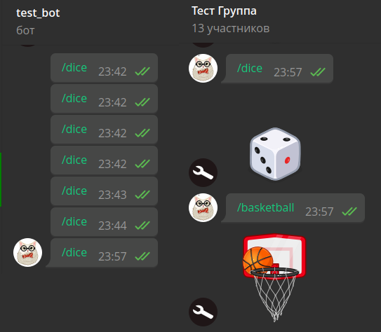

# 过滤器和中间件

!!! info ""

    使用的 aiogram 版本： 3.1.1

现在是时候了解一下在 aiogram 3.x 中如何组织过滤器和中变量，并熟悉一下框架的 "lambda 表达式杀手" - 魔法过滤。

## 过滤器 {: id="filters" }

### 为什么需要过滤器？ {: id="why-filters" }

如果您已经编写了第一个机器人，那么恭喜您：您已经使用了过滤器，只是内置的过滤器，而不是您自己的过滤器。是的，是的， `Command("start")` 就是一个过滤器。它们的作用是确保购物车的下一次更新能到达正确的处理程序，即到达它（更新）所期望的位置。

让我们举一个最简单的例子来了解过滤器的重要性。假设我们有 ID 为 111 的用户 Alice 和 ID 为 777 的用户 Bob。有一个机器人，在回复任何短信时，都会用一些激励性的短语让我们的两个人高兴，而让其他人大跌眼镜：

```python
from random import choice

@router.message(F.text)
async def my_text_handler(message: Message):
    phrases = [
        "嗨！你看起来气色不错：)",
        "你好，今天将是美好的一天！",
        "你好））微笑：)"
    ]
    if message.from_user.id in (111, 777):
        await message.answer(choice(phrases))
    else:
        await message.answer("我不是在和你说话！")
```

然后，我们决定要给每个男孩一个更个性化的问候语，为此，我们将处理程序分成三个部分：给爱丽丝的、给鲍勃的和给其他人的：

```python
@router.message(F.text)
async def greet_alice(message: Message):
    # print("爱丽丝的处理程序")
    phrases = [
        "你好，{name}。你今天是个辣妹！",
        "你是最聪明的，{name}",
    ]
    if message.from_user.id == 111:
        await message.answer(
            choice(phrases).format(name="爱丽丝")
        )

@router.message(F.text)
async def greet_bob(message: Message):
    phrases = [
        "你好，{name}。你是最强的！",
        "你太棒了，{name}！",
    ]
    if message.from_user.id == 777:
        await message.answer(
            choice(phrases).format(name="鲍勃")
        )

@router.message(F.text)
async def stranger_go_away(message: Message):
    if message.from_user.id not in (111, 777):
        await message.answer("我不是在和你说话！")
```

在这种情况下，Alice 会收到信息并感到高兴。但其他人将一无所获，因为代码将始终落入 `greet_alice()` 函数，并且不会通过 `if message.from_user.id == 111` 条件。只要取消对 `print()` 调用的注释，就可以轻松确保这一点。

但为什么会这样呢？答案很简单：任何文本信息都将首先进入 `greet_alice()` 函数的 `F.text` 检查，该检查将返回 `True` ，更新将进入该函数，并在未通过内部 `if` 条件的情况下退出，然后消失得无影无踪。

为了避免此类错误，可以使用过滤器。事实上，正确的检查应该是 `文本信息和用户 ID 111`。这样，当机器人向id为 777 的 Bob 写邮件时，过滤器将返回 `False`，路由器将检查下一个处理程序，此时两个过滤器都将返回 `True`，更新将被丢弃到处理程序中。以上内容乍听起来可能很复杂，但在本章结束时，你就会明白如何正确组织这样的检查。

### 按类过滤 {: id="filters-as-classes" }

与 aiogram 2.x 不同的是，不再有针对特定聊天类型（私人、群组、超级群组或频道）的过滤器类 `ChatTypeFilter`。让我们自己写一个吧。让用户有机会通过字符串或列表指定所需的类型。当我们同时对几种类型（例如群组和超级群组）感兴趣时，后者会很有用。

我们进入应用程序的入口，即文件 `bot.py` 看起来很熟悉：

```python title="bot.py"
import asyncio

from aiogram import Bot, Dispatcher


async def main():
    bot = Bot(token="TOKEN")
    dp = Dispatcher()

    # 启动机器人，跳过所有累积的收件箱
    # 是的，即使进行了轮询，也可以调用该方法。
    await bot.delete_webhook(drop_pending_updates=True)
    await dp.start_polling(bot)


if __name__ == "__main__":
    asyncio.run(main())

```

我们将在其旁边创建一个目录 `filters` ，并在其中创建一个文件 `chat_type.py` ：

```python title="filters/chat_type.py" hl_lines="7 8 11"
from typing import Union

from aiogram.filters import BaseFilter
from aiogram.types import Message


class ChatTypeFilter(BaseFilter):  # [1]
    def __init__(self, chat_type: Union[str, list]): # [2]
        self.chat_type = chat_type

    async def __call__(self, message: Message) -> bool:  # [3]
        if isinstance(self.chat_type, str):
            return message.chat.type == self.chat_type
        else:
            return message.chat.type in self.chat_type
```

请注意标注的线条：

1. 我们的过滤器继承自基类 `BaseFilter`
2. 在类的构造函数中，你可以指定未来的过滤器参数。在本例中，我们声明了一个参数 `chat_type` ，它可以是字符串 ( str ) 或列表 ( list )。
3. 所有操作都在 `__call__()` [方法](https://docs.python.org/3/reference/datamodel.html?highlight=__call__#object.__call__)中进行，当 `ChatTypeFilter()` 类的实例作为函数被调用时，该方法就会被触发。方法内部并无特别之处：我们检查传递对象的类型，并调用相应的检查。我们的目标是让过滤器返回一个布尔值，因为只有过滤器都返回 `True` 的处理程序才会被执行。

现在，让我们编写一对处理程序，通过命令 `/dice` 和 `/basketball` 发送相应类型的骰子，但只发送给组。创建一个文件 `handlers/group_games.py` 并编写一些基本代码：

```python title="handlers/group_games.py" hl_lines="3 6 11 12 19 20"
from aiogram import Router
from aiogram.enums.dice_emoji import DiceEmoji
from aiogram.types import Message
from aiogram.filters import Command

from filters.chat_type import ChatTypeFilter

router = Router()


@router.message(
    ChatTypeFilter(chat_type=["group", "supergroup"]),
    Command(commands=["dice"]),
)
async def cmd_dice_in_group(message: Message):
    await message.answer_dice(emoji=DiceEmoji.DICE)


@router.message(
    ChatTypeFilter(chat_type=["group", "supergroup"]),
    Command(commands=["basketball"]),
)
async def cmd_basketball_in_group(message: Message):
    await message.answer_dice(emoji=DiceEmoji.BASKETBALL)
```

好吧，让我们一探究竟。 

首先，我们导入了内置过滤器 `Command` 和新编写的 `ChatTypeFilter` 。

其次，我们将过滤器作为位置参数传递给装饰器，并指定所需的聊天类型作为参数。

第三，在 aiogram 2.x 中，您习惯于以 `commands=...` 的形式过滤命令，但在 **aiogram 3** 中，情况不再是这样，使用内置过滤器的正确方法是像使用自己的过滤器一样，通过导入和调用相应的类来使用它们。这正是我们在第二个装饰器中看到的调用 `Command(commands="somecommand")` 或简短地说： `Command("somecommand")` 。

剩下的工作就是将处理程序文件导入入口点，并将新路由器连接到调度器（新行高亮显示）：

```python title="bot.py" hl_lines="5 12"
import asyncio

from aiogram import Bot, Dispatcher

from handlers import group_games


async def main():
    bot = Bot(token="TOKEN")
    dp = Dispatcher()

    dp.include_router(group_games.router)

    # 启动机器人并跳过所有累积的传入消息
    # 是的，即使进行了轮询，也可以调用该方法。
    await bot.delete_webhook(drop_pending_updates=True)
    await dp.start_polling(bot)


if __name__ == "__main__":
    asyncio.run(main())
```

让我们检查一下：



这似乎没问题，但如果我们的处理程序不是 2 个，而是 10 个呢？我们必须为每个处理程序指定过滤器，而且不能忘了任何地方。幸运的是，过滤器可以直接连接到路由器！在这种情况下，当更新到达该路由器时，将只执行一次检查。如果您在过滤器中执行不同的 `繁重` 任务（如访问 Bot API），这一点会很有用；否则，您很容易就会遇到 `洪水猛兽`。

这就是处理程序文件的最终版本：

```python title="handlers/group_games.py"
from aiogram import Router
from aiogram.enums.dice_emoji import DiceEmoji
from aiogram.filters import Command
from aiogram.types import Message

from filters.chat_type import ChatTypeFilter

router = Router()
router.message.filter(
    ChatTypeFilter(chat_type=["group", "supergroup"])
)


@router.message(Command("dice"))
async def cmd_dice_in_group(message: Message):
    await message.answer_dice(emoji=DiceEmoji.DICE)


@router.message(Command("basketball"))
async def cmd_basketball_in_group(message: Message):
    await message.answer_dice(emoji=DiceEmoji.BASKETBALL)
```

!!! info ""

    一般来说，过滤聊天类型的方法略有不同。尽管我们有四种聊天类型（PM、群组、超级群组、频道），但 `message` 类型的更新不能来自频道，
    因为它们有自己的 `channel_post` 更新。而当我们过滤群组时，只要不是私人群组，通常就无所谓是普通群组还是超级群组。

    因此，过滤器本身可以简化为一个条件 `ChatTypeFilter(is_group=True/False)` ，只需检查是否为 LS 即可。具体实现方法由读者自行决定。

除了 `True/False` 之外，过滤器还可以向通过过滤器的处理程序传递一些信息。当我们不想在处理程序中处理消息，因为我们已经在过滤器中处理过了，这时过滤器就会派上用场。为了更清楚起见，让我们编写一个过滤器，如果消息中包含用户名，它将跳过该消息，同时将找到的值 `推送` 给处理程序。

在过滤器目录下创建一个新文件 `find_usernames.py` ：

```python title="filters/find_usernames.py" hl_lines="24 26"
from typing import Union, Dict, Any

from aiogram.filters import BaseFilter
from aiogram.types import Message


class HasUsernamesFilter(BaseFilter):
    async def __call__(self, message: Message) -> Union[bool, Dict[str, Any]]:
        # 如果根本没有实体，则 None 将被返回，
        # 在这种情况下，我们认为它是一个空列表
        entities = message.entities or []

        # 检查任何用户名，并从文本中提取出来
        # extract_from() 方法。欲了解更多详情，请参阅章节
        # 关于处理消息
        found_usernames = [
            item.extract_from(message.text) for item in entities
            if item.type == "mention"
        ]

        # 如果存在用户名，我们会将其 "推送" 到处理程序中
        # 没有 "usernames"
        if len(found_usernames) > 0:
            return {"usernames": found_usernames}
        # 如果没有找到用户名，则返回 False
        return False
```

并创建一个带有句柄的新文件：

```python title="handlers/usernames.py" hl_lines="6 13 17 21"
from typing import List

from aiogram import Router, F
from aiogram.types import Message

from filters.find_usernames import HasUsernamesFilter

router = Router()


@router.message(
    F.text,
    HasUsernamesFilter()
)
async def message_with_usernames(
        message: Message,
        usernames: List[str]
):
    await message.reply(
        f'谢谢你！我一定会订阅 '
        f'{", ".join(usernames)}'
    )
```

如果至少找到一个用户名， `HasUsernamesFilter` 过滤器返回的将不仅仅是 `True` ，而是一个字典，其中包含在 `usernames` 键下提取的用户名。因此，你可以在处理函数中添加一个名称完全相同的参数，该处理函数是该过滤器的铰链。这样就可以了！现在无需再次解析整条信息，也无需再次提取用户名列表了：


### 魔法过滤 {: id="magic-filters" }

在熟悉了上一节中的 `ChatTypeFilter` 之后，有人可能会感叹："既然可以使用 `lambda： lambda m: m.chat.type in ("group", "supergroup") ，为什么还要这么复杂呢？" 你说得没错！的确，在某些简单的情况下，当您只需要检查对象字段的值时，创建一个带有过滤器的单独文件，然后再导入它就没有什么意义了。

Alex 是 aiogram 的创始人和主要开发者，他编写了一个 [magic-filter]((https://github.com/aiogram/magic-filter/)) 库，用于实现对象属性值的动态检索（一种最大值上的 `getattr` ）。此外，它已经附带在 aiogram 3.x 中。如果您已经安装了 aiogram 3.x，那么您就已经安装了 **magic-filter**。

!!! info ""

    Magic-filter 库在 [PyPi](https://pypi.org/project/magic-filter/) 中也可用，可以在其他项目中与 aiogram 分开使用。在 aiogram 中使用该库时，您将拥有一个附加功能，本章稍后将讨论该功能

关于 "神奇过滤器" 的功能，aiogram [文档](https://docs.aiogram.dev/en/dev-3.x/dispatcher/filters/magic_filters.html)中有详细介绍，这里我们将重点介绍其中的要点。

让我们回忆一下什么是消息的 "内容提示"。Bot API 中不存在这样的概念，但在 pyTelegramBotAPI 和 aiogram 中存在。这个概念很简单：如果[消息对象](https://core.telegram.org/bots/api#message)中的 `photo` 字段为非空（即不等于 Python 中的 `None` ），则表示该消息包含一张图片，因此我们假定其内容提示为 `photo` 。自定义的 `content_types="photo"` 过滤器将只捕获此类消息，从而使开发人员不必在处理程序中检查该属性。

现在，我们可以很容易地想象一个 lambda 表达式，它听起来像 "`传递变量'm'的属性'photo'必须不等于 None`"，看起来像 `lambda m: m.photo is not None` ，或者简化一点，像 Python 中的 `lambda m: m.photo` 。而 `m` 本身就是我们要过滤的对象。例如，一个类型为 `Message` 的对象

`Magic-filter` 也提供了类似的功能。为此，我们需要从 aiogram 中导入类 `MagicFilter` ，但不是以全名导入，而是以一个字母的别名 `F` 导入：

```python
from aiogram import F

# 这里 F - 使用 message
@router.message(F.photo)
async def photo_msg(message: Message):
    await message.answer("这绝对是某种图像！")
```

新的 `F.photo` 选项取代了旧的 `ContentTypesFilter(content_types="photo")` 选项。很方便！现在，有了这些神圣的知识，我们就可以用魔法轻松取代 `ChatTypeFilter` 过滤器了： `router.message.filter(F.chat.type.in_({"group", "supergroup"}))`.
此外，即使是检查内容的错别字，也可以被视为一种神奇的过滤器：
`F.content_type.in_({'text', 'sticker', 'photo'})` 或 `F.photo | F.text | F.sticker`。

值得注意的是，过滤器不仅可以挂在 `消息` 处理上，也可以挂在任何其他类型的更新上：callback、inline request、(my_)chat_members 等。

让我们来看看 **aiogram 3.x** 中非常 "独特" 的魔法过滤器功能。这是关于 `as_(<some text>)` 方法，它允许你将过滤器的结果作为处理程序参数。举个简短的例子来说明一下：在包含照片的邮件中，这些图片会以数组的形式出现，而数组通常会按照质量的递增顺序进行排序。因此，可以在处理程序中一次性获取最大尺寸的照片对象：

```python
from aiogram.types import Message, PhotoSize

@router.message(F.photo[-1].as_("largest_photo"))
async def forward_from_channel_handler(message: Message, largest_photo: PhotoSize) -> None:
    print(largest_photo.width, largest_photo.height)
```

这个例子更为复杂。如果消息是从匿名组管理员或某个频道转发的，那么 `Message` 对象将有一个非空的 `forward_from_chat` 字段，其中包含一个 `Chat` 类型的对象。下面的示例只有在 `forward_from_chat` 字段为非空且 `Chat` 对象中的 `type` 字段为 `channel` 时才会起作用（换句话说，我们切断了来自匿名管理员的转发，只响应来自频道的转发）：

```python
from aiogram import F
from aiogram.types import Message, Chat

@router.message(F.forward_from_chat[F.type == "channel"].as_("channel"))
async def forwarded_from_channel(message: Message, channel: Chat):
    await message.answer(f"This channel's ID is {channel.id}")
```

更复杂的例子使用 `magic-filter` 可以检查列表项是否符合某些属性：

```python
from aiogram.enums import MessageEntityType

@router.message(F.entities[:].type == MessageEntityType.EMAIL)
async def all_emails(message: Message):
    await message.answer("All entities are emails")


@router.message(F.entities[...].type == MessageEntityType.EMAIL)
async def any_emails(message: Message):
    await message.answer("At least one email!")
```

### 魔法数据 {: id="magic-data" }

最后，让我们稍微谈谈 [MagicData](https://docs.aiogram.dev/en/latest/dispatcher/filters/magic_data.html)。这个过滤器可以让你的过滤器更上一层楼，对通过 middlewares 或调度器/轮询/webhook 传递的值进行操作。比方说，你有一个很受欢迎的机器人，现在需要做一些维护工作：备份数据库、清理日志等。但与此同时，您也不想关闭机器人，以免失去新的受众：让机器人回应用户，说 "稍等一下"。

一种可能的解决方案是制作一个特殊的路由器，如果传递给机器人的 maintenance_mode 布尔值等于 `True` ，该路由器就会拦截消息、callback 等。下面提供了一个简单的单文件示例来说明这一逻辑：

```python
import asyncio
import logging
import sys

from aiogram import Bot, Dispatcher, Router, F
from aiogram.filters import MagicData, CommandStart
from aiogram.types import Message, CallbackQuery
from aiogram.utils.keyboard import InlineKeyboardBuilder

# 为维护模式创建路由器，并为其类型设置过滤器
maintenance_router = Router()
maintenance_router.message.filter(MagicData(F.maintenance_mode.is_(True)))
maintenance_router.callback_query.filter(MagicData(F.maintenance_mode.is_(True)))

regular_router = Router()

# 该路由器的处理程序将拦截所有消息和回调，
# 设置 maintenance_mode 为 True
@maintenance_router.message()
async def any_message(message: Message):
    await message.answer("机器人处于维护模式。请稍等。")


@maintenance_router.callback_query()
async def any_callback(callback: CallbackQuery):
    await callback.answer(
        text="机器人处于维护模式。请稍等。",
        show_alert=True
    )

# 该路由器的处理程序在维护模式之外使用，
# 即当 maintenance_mode 为 False 或根本未指定时
@regular_router.message(CommandStart())
async def cmd_start(message: Message):
    builder = InlineKeyboardBuilder()
    builder.button(text="点击我", callback_data="anything")
    await message.answer(
        text="一些带有按钮的文本",
        reply_markup=builder.as_markup()
    )


@regular_router.callback_query(F.data == "anything")
async def callback_anything(callback: CallbackQuery):
    await callback.answer(
        text="这是某种例行行动",
        show_alert=True
    )


async def main() -> None:
    bot = Bot('1234567890:AaBbCcDdEeFfGrOoShAHhIiJjKkLlMmNnOo')
    # 在现实生活中，维护模式的值为
    # 将从第三方来源（如配置或通过应用程序接口）获取
    # 请记住，因为 bool 类型是不可变的、
    # 在时间线中更改它不会影响任何事情。
    dp = Dispatcher(maintenance_mode=True)
    # 维护路由器应该是第一个
    dp.include_routers(maintenance_router, regular_router)
    await dp.start_polling(bot)


if __name__ == "__main__":
    logging.basicConfig(level=logging.INFO, stream=sys.stdout)
    asyncio.run(main())
```

!!! tip "一切都要适度"

    Magic-filter 提供了一个相当强大的过滤工具，有时还能让你以一种紧凑的方式描述复杂的逻辑，但它并不是万能的，也不是一个通用的工具。如果你不能马上写出一个漂亮的魔术过滤器，也不必担心，只要做一个类过滤器就可以了。没有人会因此而批评你。


## 中间件 {: id="middlewares" }

### 为什么需要中间件？ {: id="why-middlewares" }

想象一下，您为了某种目的（听音乐、喝鸡尾酒、认识新朋友）来到一家夜总会。入口处有一名保安。他可以简单地让你进去，可以检查你的护照并决定你是否进入，可以给你一个纸质手镯来区分真正的客人和不速之客，他甚至可以拒绝让你进去，把你送回家。

用 Aiogram 术语来说，你是一个更新，夜总会是一组处理程序，而门口的保安是一个中级保安。后者的任务是在处理更新时楔入一些逻辑。回到上面的例子，中层变量内部可以做些什么呢？

* 来记录事件；
* 将某些对象（例如会话池中的数据库会话）传递给处理程序；
* 代替处理更新，而无需将其提交给处理程序；
* 悄悄跳过更新，就像它们从未发生过一样；
* ......其他任何东西！

### 中间件的结构和类型 {: id="middlewares-structure" }

让我们再次参考 aiogram 3.x [文档](https://docs.aiogram.dev/en/dev-3.x/dispatcher/middlewares.html#basics)的不同部分，看看下面的图片：


事实证明，中间件有两种类型：外部（外部）和内部（内部或简称“中间件”）。有什么不同？外部在过滤器开始检查之前执行，内部在过滤器开始检查之后执行。实际上，这意味着通过外部中间件传递的消息/回调/内联请求可能不会在任何处理程序中结束，但如果它在内部中间件中结束，那么 100% 将会有某种处理程序。

!!! info "更新类型中间件"

    值得注意的是，"更新" 是 Telegram 中所有类型事件的通用类型。在 Aiogram 的处理过程中，有两个重要功能与之相关：

    • 更新时总是调用内部中间件（即在这种情况下，外部中间件和内部中间件没有区别）。
    • 更新中的 middlewares 只能挂在调度器（根路由器）上。

考虑最简单的中庸之道：

```python linenums="1"
from typing import Callable, Dict, Any, Awaitable
from aiogram import BaseMiddleware
from aiogram.types import TelegramObject

class SomeMiddleware(BaseMiddleware):
    async def __call__(
        self,
        handler: Callable[[TelegramObject, Dict[str, Any]], Awaitable[Any]],
        event: TelegramObject,
        data: Dict[str, Any]
    ) -> Any:
        print("Before handler")
        result = await handler(event, data)
        print("After handler")
        return result
```

每个基于类（我们不考虑[其他变体](https://docs.aiogram.dev/en/dev-3.x/dispatcher/middlewares.html#function-based)）构建的 middlevar 都必须实现一个包含三个参数的 __call__() 方法：

1. **handler** - 将被执行的处理程序对象。这只对内部中间件有意义，因为外部中间件还不知道更新将进入哪个处理程序。
2. **event** - 我们要处理的 Telegram 对象类型。通常是 Update、Message、CallbackQuery 或 InlineQuery（但不仅限于此）。如果您确切知道要处理的对象类型，请随意编写，例如，用 `Message` 代替 `TelegramObject` 。
3. **data** - 与当前更新相关的数据：FSM、过滤器传递的附加字段、标志（稍后介绍）等。在同一个 `data` 中，我们可以放置一些自己从 midwares 中获取的数据，这些数据将作为参数提供给处理程序（就像在过滤器中一样）。

功能主体则更加有趣。

* 在第 13 行之前写入的任何内容都将在控制权传递给下游处理程序（可能是另一个中间监视器或处理程序本身）之前执行。
* 在第 13 行之后写入的任何内容都将在下面的处理程序退出后执行。
* 如果要继续处理，必须调用 `await handler(event, data)` 。如果想 **放弃** 更新，就不要调用它。
* 如果不需要从处理程序中获取数据，则将 `return await handler(event, data)` 作为函数的最后一行。如果不返回 `await handler(event, data)` （隐式 return None ），更新将被视为 "放弃"。

我们熟悉的所有对象（ `Message` 、 `CallbackQuery` 等）都是更新对象（ `Update` ），因此对于 `Message` 来说， `Update` 的中变数将首先执行，然后再执行 `Message` 本身。让我们保留上例中的 `print()` ，看看如果我们为 `Update` 和 `Message` 类型各注册一个外中变量和内中变量，中变量将如何执行。

如果消息 ( `Message` ) 最终被某个句柄处理：

1. `[Update Outer] Before handler`
2. `[Update Inner] Before handler`
3. `[Message Outer] Before handler`
4. `[Message Inner] Before handler`
5. `[Message Inner] After handler`
6. `[Message Outer] After handler`
7. `[Update Inner] After handler`
8. `[Update Outer] After handler`

如果信息没有找到正确的处理程序：

1. `[Update Outer] Before handler`
2. `[Update Inner] Before handler`
3. `[Message Outer] Before handler`
4. `[Message Outer] After handler`
5. `[Update Inner] After handler`
6. `[Update Outer] After handler`

!!! question "禁止机器人中的用户"

    在 Telegram 机器人群组中，经常会有人提出同样的问题："如何禁止机器人中的某个用户，使其无法向机器人写信？" 最有可能做到这一点的地方是 `Update` 上的外部中间件，因为它是处理用户请求的最早阶段。此外，aiogram 内置的中间件之一会在 `data` 中放入一个字典，其中包含用户信息（键为 `event_from_user` ）。然后，您就可以从中获取用户 ID，将其与 `阻止列表` 中的某些用户进行比较，然后执行 `return` 以阻止链上的进一步处理。

### 中间件例子 {: id="middlewares-examples" }

让我们来看几个的例子。

#### 将参数传递给中间件 {: id="middleware-pass-arguments" }

我们使用 middleware 类，因此它们有一个构造函数。这样，我们就可以通过外部控制来定制内部代码的行为。例如，通过配置文件。让我们编写一个无用但能说明问题的 "减慢 "中变量，它将在指定秒数内减慢处理传入信息的速度：

```python hl_lines="7 8 18"
import asyncio
from typing import Any, Callable, Dict, Awaitable
from aiogram import BaseMiddleware
from aiogram.types import TelegramObject

class SlowpokeMiddleware(BaseMiddleware):
    def __init__(self, sleep_sec: int):
        self.sleep_sec = sleep_sec

    async def __call__(
            self,
            handler: Callable[[TelegramObject, Dict[str, Any]], Awaitable[Any]],
            event: TelegramObject,
            data: Dict[str, Any],
    ) -> Any:
        # 等待指定的秒数，然后将控制权进一步向下传递
        # (它可以是一个处理程序或下一个中间件)
        await asyncio.sleep(self.sleep_sec)
        result = await handler(event, data)
        # 如果您在处理程序中返回，则该值将转到结果
        print(f"Handler was delayed by {self.sleep_sec} seconds")
        return result
```

现在，让我们把它放在两个不同值的路由器上：

```python
from aiogram import Router
from <...> import SlowpokeMiddleware

# 在别的地方
router1 = Router()
router2 = Router()

router1.message.middleware(SlowpokeMiddleware(sleep_sec=5))
router2.message.middleware(SlowpokeMiddleware(sleep_sec=10))
```

#### 中间件存储数据 {: id="middleware-store-data" }

正如我们之前所发现的，在处理下一次更新时，middleware 可以访问 `data` 字典，其中包含各种有用的对象：机器人、更新作者（event_from_user）等。但我们也可以在这个字典中填入任何我们想要的内容。此外，后面调用的 middleware 可以看到前面调用的 middleware 放了什么。

让我们考虑以下情况：第一个 middleware 通过用户的 Telegram ID 获取某个内部用户 ID（例如，从所谓的第三方服务获取），第二个 middleware 使用这个内部 ID 计算用户的 "快乐月"（内部 ID 除以 12 的余数）。所有这些都会被放入一个处理程序，让调用命令的人高兴或悲伤。听起来很复杂，但你现在就会明白。让我们从 middleware 开始：

```python hl_lines="20 21 32 33 36 37"
from random import randint
from typing import Any, Callable, Dict, Awaitable
from datetime import datetime
from aiogram import BaseMiddleware
from aiogram.types import TelegramObject

# 从某些第三方服务检索用户内部 ID 的中间件
class UserInternalIdMiddleware(BaseMiddleware):
    # 当然，我们的例子中没有任何服务，
    # 但这完全是随机的：
    def get_internal_id(self, user_id: int) -> int:
        return randint(100_000_000, 900_000_000) + user_id

    async def __call__(
            self,
            handler: Callable[[TelegramObject, Dict[str, Any]], Awaitable[Any]],
            event: TelegramObject,
            data: Dict[str, Any],
    ) -> Any:
        user = data["event_from_user"]
        data["internal_id"] = self.get_internal_id(user.id)
        return await handler(event, data)

# 中间件，它计算用户的“快乐月”
class HappyMonthMiddleware(BaseMiddleware):
    async def __call__(
            self,
            handler: Callable[[TelegramObject, Dict[str, Any]], Awaitable[Any]],
            event: TelegramObject,
            data: Dict[str, Any],
    ) -> Any:
        # 获取上一个 middleware 的值
        internal_id: int = data["internal_id"]
        current_month: int = datetime.now().month
        is_happy_month: bool = (internal_id % 12) == current_month
        # 将 True 或 False 放入数据中以在处理程序中拾取它
        data["is_happy_month"] = is_happy_month
        return await handler(event, data)
```

现在我们来写一个处理程序，把它放在路由器中，然后把路由器连接到调度器上。让我们把第一个中间件作为外层挂在调度器上，因为（根据设想）这个内层 id 随时随地都需要。第二个中间件将作为内部件挂在特定的路由器上，因为只有在路由器中才需要计算 "快乐的月份"。

```python hl_lines="4 5"
@router.message(Command("happymonth"))
async def cmd_happymonth(
        message: Message, 
        internal_id: int, 
        is_happy_month: bool
):
    phrases = [f"您在我们服务中的ID: {internal_id}"]
    if is_happy_month:
        phrases.append("现在是你快乐的一个月！")
    else:
        phrases.append("这个月要小心....")
    await message.answer(". ".join(phrases))

# 别的地方：
async def main():
    dp = Dispatcher()
    # <...>
    dp.update.outer_middleware(UserInternalIdMiddleware())
    router.message.middleware(HappyMonthMiddleware())
```

以下是 11 月份（第 11 个月）的结果：


#### 周末没有callbacks! {: id="no-callbacks-on-weekend" }

假设某家工厂有一个 Telegram 机器人，每天早上工厂工人都必须按一个内联按钮来确认他们的存在和能力。工厂的运行时间是 5/2，我们希望不考虑周六和周日的点击。由于按下按钮会产生复杂的逻辑（向 ACS 发送数据），因此我们只需在周末 "放弃 "更新，并显示一个错误框。可以完整复制并运行以下示例：

```python
import asyncio
import logging
import sys
from datetime import datetime
from typing import Any, Callable, Dict, Awaitable

from aiogram import Bot, Dispatcher, Router, BaseMiddleware, F
from aiogram.filters import Command
from aiogram.types import Message, CallbackQuery, TelegramObject
from aiogram.utils.keyboard import InlineKeyboardBuilder

router = Router()

# Это будет outer-мидлварь на любые колбэки
class WeekendCallbackMiddleware(BaseMiddleware):
    def is_weekend(self) -> bool:
        # 5 - суббота, 6 - воскресенье
        return datetime.utcnow().weekday() in (5, 6)

    async def __call__(
            self,
            handler: Callable[[TelegramObject, Dict[str, Any]], Awaitable[Any]],
            event: TelegramObject,
            data: Dict[str, Any]
    ) -> Any:
        # Можно подстраховаться и игнорировать мидлварь,
        # если она установлена по ошибке НЕ на колбэки
        if not isinstance(event, CallbackQuery):
            # тут как-нибудь залогировать
            return await handler(event, data)

        # Если сегодня не суббота и не воскресенье,
        # то продолжаем обработку.
        if not self.is_weekend():
            return await handler(event, data)
        # В противном случае отвечаем на колбэк самостоятельно
        # и прекращаем дальнейшую обработку
        await event.answer(
            "Какая работа? Завод остановлен до понедельника!",
            show_alert=True
        )
        return


@router.message(Command("checkin"))
async def cmd_checkin(message: Message):
    builder = InlineKeyboardBuilder()
    builder.button(text="Я на работе!", callback_data="checkin")
    await message.answer(
        text="Нажимайте эту кнопку только по будним дням!",
        reply_markup=builder.as_markup()
    )


@router.callback_query(F.data == "checkin")
async def callback_checkin(callback: CallbackQuery):
    # Тут много сложного кода
    await callback.answer(
        text="Спасибо, что подтвердили своё присутствие!",
        show_alert=True
    )


async def main() -> None:
    bot = Bot('1234567890:AaBbCcDdEeFfGrOoShAHhIiJjKkLlMmNnOo')
    dp = Dispatcher()
    dp.callback_query.outer_middleware(WeekendCallbackMiddleware())
    dp.include_router(router)
    await dp.start_polling(bot)


if __name__ == "__main__":
    logging.basicConfig(level=logging.INFO, stream=sys.stdout)
    asyncio.run(main())
```

现在，如果你稍微改变一下时间，就会发现机器人在工作日会正常响应，但在周末就会显示错误。

### 标记 {: id="flags" }

aiogram 3.x 的另一个有趣功能是标记。基本上，它们是处理程序的某种 [标记](https://docs.aiogram.dev/en/dev-3.x/dispatcher/flags.html)，不仅可以在 middleware 中读取。借助标记，您可以在不进入处理程序内部结构的情况下对其进行标记，这样您就可以在中间件中进行一些操作，例如小跑。

让我们来看看文档中稍作修改的代码。假设您的机器人有很多处理程序，它们都在发送媒体文件或准备文本以便进一步发送。如果这些操作要执行很长时间，那么使用 sendChatAction 方法显示打印或发送照片的状态是一种很好的做法。默认情况下，此类事件的发送时间只有 5 秒，但如果信息提前发送，则会自动过期。aiogram 有一个辅助类 [ChatActionSender](https://core.telegram.org/bots/api#sendchataction) ，它允许发送所选状态，直到信息发送完毕。

我们也不想在每个处理程序中都塞入 `ChatActionSender` 工作，而是让 middleware 与那些设置了状态值的 `long_operation` 标志的处理程序（例如 `typing` , `choose_sticker` ... ）一起工作。下面是中间变量本身：

```python
from aiogram.dispatcher.flags import get_flag
from aiogram.utils.chat_action import ChatActionSender

class ChatActionMiddleware(BaseMiddleware):
    async def __call__(
        self,
        handler: Callable[[Message, Dict[str, Any]], Awaitable[Any]],
        event: Message,
        data: Dict[str, Any]
    ) -> Any:
        long_operation_type = get_flag(data, "long_operation")

        # Если такого флага на хэндлере нет
        if not long_operation_type:
            return await handler(event, data)

        # Если флаг есть
        async with ChatActionSender(
                action=long_operation_type, 
                chat_id=event.chat.id
        ):
            return await handler(event, data)
```

因此，要读取该标志，必须在某处指定该标志。变体： `@dp.message(<这是你的过滤器>, flags={"long_operation": "upload_video_note"})`


!!! info ""

    在我的赌场机器人中就可以看到节流 middleware 的例子。

