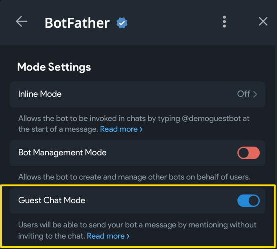

# Гостевой режим  {: id="guest-mode-start" }

!!! info ""
    Используемая версия aiogram: 3.28.0.  
    Это черновой вариант главы, написанный по «горячим следам» после выхода обновления 
    Bot API v10.0

## Введение {: id="intro" }

Гостевой режим позволяет ботам отправлять сообщения в тех чатах, где они не являются участниками. Алгоритм их работы следующий:

* Пользователь вызывает бота сообщением вида `@bot ТЕКСТ_ЗАПРОСА`.
* Бот получает непосредственно сообщение, с которым его вызвали и, если сообщение пользователя 
является ответом (reply) на какое-то другое сообщение, то ещё и то самое другое сообщение (т.е. в `message` будет ещё и `.reply_to_message`).
* Бот может ответить ровно один раз и только в течение небольшого периода времени.


Визуально и архитектурно гостевой режим и инлайн-режим являются родственниками. Архитектурно Guest Mode 
выглядит как инлайн-режим с одним вариантом выбора, а сообщение отправляется от имени самого бота.

Может возникнуть вопрос: когда использовать тот или иной режим. Официальная документация даёт 
[несколько примеров](https://core.telegram.org/bots/features#use-cases-guest-mode-vs-inline-mode), попробую пересказать их своими словами. 
Инлайн-режим удобен, когда человек хочет подготовить какое-то сообщение при помощи бота, 
например, найти картинку, видео, ссылку, не покидая контекст чата в Telegram. Пример: вызвать бота `@pic`, 
чтобы быстро найти изображение и отправить его от своего имени.

Гостевой режим подходит в случае, когда нужно дать задачу боту из любого места, не добавляя его в группу или прямо в ЛС с другим ботом. 
Пример: известное "@grok is this true?" из X/Twitter. Разница в том, какой уровень участия 
человека в процессе, и насколько синхронный этот процесс. Инлайн-режим подразумевает, 
что человек вводит все данные, рассматривает варианты и отправляет нужный в чат. 
Гостевой режим – это "fire and forget", т.е. пнул бота и общаешься дальше где угодно, 
пока бот выполняет задачу. Посмотрите на скриншот выше, чтобы увидеть сходства и различия.

Важно понимать: гостевой режим не даёт призванному боту доступа к сообщениям, кроме одного-двух (сообщения, 
с которым бота вызвали и того сообщения, которым призвали бота). Гостевой бот также не вступает автоматически в группу, 
однако в отличие от инлайн-бота, бот в гостевом режиме получает информацию о чате, в котором его вызвали (айди, название и т.д.). 
Также есть проблема с удалением сообщений: бот не может удалить своё сообщение, отправленное из guest mode, 
потому что при отправке возвращается `inline_message_id`, который не принимается на вход `deleteMessage()` в API, 
а человек, который вызывает гостевого бота в группе, может не являться администратором. 
Единственный вариант – отправлять вместе с сообщением кнопку, по нажатию которой редактировать сообщение 
до «пустого» (точка или пробел), но само сообщение всё равно останется.


Перейдём к примерам, которых сегодня будет два: один совсем простой для понимания процесса, а другой посложнее 
с некоторыми AI-фишками. Но сначала надо боту включить поддержку гостевого режима: откройте веб-апп у `@BotFather` 
(именно веб-приложение!), затем выберите из списка своего бота, откройте `Bot Settings` и включите `Guest Chat Mode`:




## Простой пример {: id="simple-example" }

В простом примере реализуем самую базовую логику: на любой вызов бота в гостевом режиме, тот будет отвечать 
какой-нибудь «сомневающейся» фразой. Этого более чем достаточно для понимания сути и лёгкого воспроизведения.

_В блоке ниже вы можете переключаться между режимом «только хэндлер» и «пример целиком»._


=== "Только хэндлер"
    ```python
    RESPONSES = [
        "Не знаю.",
        "Не уверен.",
        "Может быть.",
        "Трудно сказать.",
        "Возможно.",
    ]

    @dp.guest_message(F.text)  # [1]
    async def any_message(
            message: Message,
    ):
        await message.answer_guest_query(     # [2]
            result=InlineQueryResultArticle(  # [3]
                id="1",
                title="Любой текст, всё равно никто не увидит",
                input_message_content=InputTextMessageContent(
                    message_text=random.choice(RESPONSES),
                ),
            )
        )
    ```
    

=== "Пример целиком"
    ```python title="simple_example.py"
    --8<-- "code/10_guest_mode/simple_example.py"
    ```

Цифрами в блоке «только хэндлер» обозначены:

1. Для сообщений в гостевом режиме используется отдельный обработчик `guest_message`, поскольку 
это отдельный апдейт от Telegram. Фильтры при этом точно такие же, как и у `message`.
2. Для ответа вызывайте специальный метод `answer_guest_query()`, попытка вызвать `answer()` или 
`reply()` приведёт к ошибке.
3. В качестве единственного аргумента `result` функции `answer_guest_query()` укажите один 
объект типа [InlineResultQuery](https://core.telegram.org/bots/api#inlinequeryresult) 
(в инлайн-режиме передаётся список, а здесь – единственное значение). Поля `id` и `title` заполнять нужно, 
4. но их значения не играют никакой роли, ни пользователь, ни вы их не увидите нигде.

Если вы используете `uv`, то процесс запуска максимально простой:

```bash
uv add "aiogram>=3.28.0"
BOT_TOKEN=1234567890:AaBbCcDdEeFfGrOoShAHhIiJjKkLlMmNnOo uv run simple_example.py
```

Результат – на скриншоте ниже:


## Продвинутый пример {: id="advanced-example" }

Следующим на очереди сделаем аналог "@grok is this true" из X/Twitter, но на минималках: без поиска в Интернете, 
без вызова различных инструментов, просто за счёт внутренних знаний какой-нибудь LLM-модели на 
[OpenRouter](https://openrouter.ai). Для повторения следующего кода вам потребуется собственный аккаунт 
на OpenRouter и созданный там же API-ключ. Если у вас нет возможности выпустить такой ключ, 
то хотя бы посмотрите пример до конца, чтобы в будущем быстрее приступить к работе с AI.


!!! warning "Код в разработке"
    В настоящий момент этот раздел дописывается. Пожалуйста, приходите чуть позже.