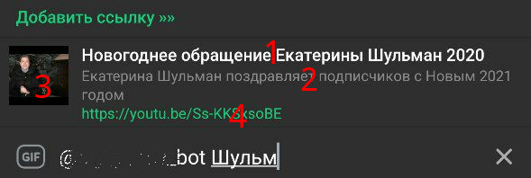

# Инлайн-режим

## Введение

В предыдущих главах бот и человек общались каждый сам за себя, однако в Telegram существует специальный режим, 
позволяющий пользователю отправить информацию от своего имени, но с помощью бота. Это называется **инлайн-режим** 
(Inline mode). Как это выглядит в реальной жизни:


Как видно на скриншоте выше, итоговое сообщение отправлено от имени пользователя, но предварительный список 
был предоставлен ботом [@imdb](https://t.me/imdb). Подробное описание инлайн-режима с точки зрения пользователя можно найти 
[на официальном сайте](https://core.telegram.org/bots/inline), а в этой главе мы напишем собственного 
простого инлайн-бота для упрощения поиска и отправки ссылок на любимые YouTube-видео. 

## Формат инлайн-запросов и ответов

Когда пользователь вызывает бота в инлайн-режиме, введя его юзернейм в поле ввода, бот получает апдейт с типом 
[InlineQuery](https://core.telegram.org/bots/api#inlinequery), из которого нам важно поле `from` (`from_user` в aiogram), 
содержащее тип [User](https://core.telegram.org/bots/api#user) с информацией о юзере, вызвавшем бота, а также поле 
`query`, т.е. текст запроса (может быть пустым). К сожалению, в настоящий момент нет возможности узнать, в каком чате 
был вызван инлайн-бот, вероятно, это сделано специально для повышения приватности пользователей, т.к. бота необязательно 
добавлять в группу или канал, чтобы использовать его в инлайн-режиме.

Для ответа на запрос необходимо вызвать метод [answerInlineQuery](https://core.telegram.org/bots/api#answerinlinequery), 
куда следует передать массив объектов-результатов, и дополнительно различные флаги, о которых поговорим чуть позже. Типов 
объектов-результатов аж целых [двадцать](https://core.telegram.org/bots/api#inlinequeryresult), однако многие из них являются 
вариациями друг друга. Так, например, [InlineQueryResultPhoto](https://core.telegram.org/bots/api#inlinequeryresultphoto) 
содержит ссылку (URL) на изображение, а 
[InlineQueryResultCachedPhoto](https://core.telegram.org/bots/api#inlinequeryresultcachedphoto) — `file_id` уже загруженного 
в Telegram изображения. Более того, рекомендуется использовать объекты одного типа в инлайн-ответе, поскольку клиентские 
приложения некорректно отображают (или не отображают вовсе) смешанный контент.

!!! warning ""
    **Обратите внимание**: в инлайн-режиме нельзя загружать новые медиафайлы в Telegram, только 
    использовать уже имеющиеся в облаке, либо указывать URL из Интернета.


Одним из наиболее часто используемых типов объектов-результатов является 
[InlineQueryResultArticle](https://core.telegram.org/bots/api#inlinequeryresultarticle) — просто текст. Рассмотрим 
основные элементы такого объекта внимательнее:



Цифрами на рисунке выше обозначены: 1 — заголовок объекта; 2 — описание; 3 — предпросмотр; 4 — ссылка, по которой 
перейдёт пользователь если нажмёт на (3). Всё, кроме (1) необязательно, но позволяет визуально разнообразить 
выдаваемые результаты. Но что отправится в чат, если нажать не на предпросмотр, а на то, что справа от него? Для этого 
существует тип [InputMessageContent](https://core.telegram.org/bots/api#inputmessagecontent), представленный четырьмя 
подтипами: Текст, Геолокация, Достопримечательность (Venue) и Контакт. В самом простом случае, пользователь видит такой 
список ссылок, нажимает на один из элементов и получает текст, указанный в 
[InputTextMessageContent](https://core.telegram.org/bots/api#inputtextmessagecontent).  

Сложно? Но и это ещё не всё! InputMessageContent можно использовать и с другими типами инлайн-объектов, например, 
выдавать пользователю в ответ стикеры, а при нажатии отправлять ссылку на весь стикерпак. Или описание фильма при 
нажатии на обложку в инлайн-режиме. Экспериментируйте!

## Пишем бота

От теории — к практике. Опишем суть будущего бота: пользователь в диалоге с ботом добавляет (или обновляет) ссылку на видео с YouTube и указывает собственное описание. 
Далее в любом другом чате он вызывает бота в инлайн-режиме, выбирает в списке одно из сохранённых ранее видео и отправляет 
его. Дополнительно можно ввести текст, по наличию которого результаты будут отфильтрованы. Разумеется, у каждого юзера 
должен быть свой собственный набор сохранённых ссылок.

!!! warning "Предупреждение об используемых технологиях"
    Поскольку главная цель этой главы — рассказать об инлайн-режиме, то сопуствующие детали, такие как реализация 
    работы с базой данных и хранилищем FSM, будут сознательно упрощены и/или не упомянуты в тексте. 
    Так, например, в качестве FSM будет использован MemoryStorage, а в роли СУБД подойдёт и SQLite. 
    В реальности рекомендуется использовать персистентное хранилище FSM (напр. Redis) и более продвинутую СУБД 
    (напр. PostgreSQL), а также отдельный поисковый движок (ElasticSearch, Sonic...).

### Хранение данных

Исходя из приведённого выше «техзадания», сделаем вывод, что каждое сохранённое видео можно описать тремя обязательными 
сущностями: Telegram ID пользователя, [идентификатор YouTube-видео](https://youtu.be/gocwRvLhDf8) (извлекается из URL) и 
пользовательское описание. Первые два элемента образуют первичный ключ, что даёт ограничение уникальности для каждой 
пары «Telegram_ID + YouTube_ID». Описание таблицы в БД выглядит следующим образом:

```sql
CREATE TABLE IF NOT EXISTS "youtube" (
	"user_id"	INTEGER NOT NULL,
	"youtube_hash"	TEXT NOT NULL,
	"description"	TEXT NOT NULL,
	PRIMARY KEY("user_id","youtube_hash")
);
```

Ранее мы договорились, что не будем особо рассматривать работу с БД, и сконцетрируемся на особенностях инлайн-режима, 
однако две функции всё же стоит рассмотреть для дальнейшего понимания. Первая — добавление ссылки с описанием в базу 
данных. Здесь можно применить один трюк, называемый "UPSERT", т.е. Insert or Update. Дело в том, что, сформировав 
SQL-запрос специальным образом, можно при вставке данных (Insert) в случае нарушения уникальности не выбрасывать ошибку, 
а неявно обновлять затронутую строку (Update). Посмотрите на следующий кусок кода. В нём мы пытаемся 
добавить новую строку в базу данных, однако если указанная пара «Telegram_ID + YouTube_ID» 
уже существует, то вместо вставки обновляется описание (`description`):

```python
def insert_or_update(user_id: int, youtube_hash: str, description: str):
    statement = "INSERT INTO youtube (user_id, youtube_hash, description) " \
                "VALUES (:user_id, :youtube_hash, :description) " \
                "ON CONFLICT(user_id, youtube_hash) " \
                "DO UPDATE SET description = :description"
    cursor.execute(statement, {
        "user_id": user_id,
        "youtube_hash": youtube_hash,
        "description": description
    })
    cursor.connection.commit()
```

Вторая важная функция — получение списка ссылок. Поскольку пользователь может захотеть отфильтровать выдачу, 
появляется второй необязательный аргумент `search_query`. При его наличии в конец SQL-запроса будет добавлен 
поиск подстроки с ключевым словом `LIKE`. Вспомним, что в реальных условиях такой подход вряд ли сгодится из-за низкой 
эффективности и точности поиска, но для демонстрации будет достаточно:

```python
def get_links(user_id: int, search_query: str = None):
    statement = "SELECT youtube_hash, description from youtube WHERE user_id = ?"
    if search_query:
        statement += f" AND description LIKE ?"
        result = cursor.execute(statement, (user_id, f"%{search_query}%"))
    else:
        result = cursor.execute(statement, (user_id,))
    return result.fetchall()
```

### Switch-кнопки

Просмотр и удаление ссылок в личке с ботом делается элементарно, а добавление организуется с помощью простейшего 
конечного автомата (подробнее о механизме FSM можно узнать в [предыдущей главе](fsm.md)). Здесь стоит обратить внимание 
на последний шаг, когда идёт непосредственно добавление записи и подтверждение юзеру: 

```python
async def description_added(message: types.Message, state: FSMContext):
    # Получение информации из FSM
    user_data = await state.get_data()
    # Вставка данных в БД
    dbworker.insert_or_update(message.from_user.id, user_data["yt_hash"], message.text)
    # Создание клавиатуры со switch-кнопками и отправка сообщения
    switch_keyboard = types.InlineKeyboardMarkup()
    switch_keyboard.add(types.InlineKeyboardButton(
        text="Попробовать", 
        switch_inline_query=""))
    switch_keyboard.add(types.InlineKeyboardButton(
        text="Попробовать здесь", 
        switch_inline_query_current_chat=""))
    await message.answer(
        "Ссылка и описание успешно добавлены в инлайн-режим и "
        "станут доступны в течение пары минут!\n"
        "Полный список сохранённых ссылок: /links",
        reply_markup=switch_keyboard)
    await state.finish()
```

Ранее в [главе про кнопки](buttons.md) мы познакомились с двумя типами инлайн-кнопок: URL и Callback. Для инлайн-режима 
полезен третий тип: Switch. В коде выше объявлены две кнопки, одна с пустым параметром `switch_inline_query`, другая — с 
пустым `switch_inline_query_current_chat`. Первая предлагает выбрать чат, а затем подставляет в поле ввода юзернейм бота 
для активации инлайн-режима, вторая делает то же самое, но в текущем чате (в нашем случае — в личке с ботом). Если 
параметры сделать непустыми и указать какой-либо текст, то он будет добавлен к юзернейму бота, например:  
`switch_inline_query="text"` -> `@bot text` в поле ввода в другом чате. Так, например, работает бот [@like](https://t.me/like), 
позволяющий сразу отправить свежесозданный пост куда-нибудь.

### Обработка инлайн-запроса

Перейдём непосредственно к обработке запроса от юзера к боту в инлайн-режиме. В некоторых случаях удобно делать отдельный 
хэндлер на пустой запрос (когда длина текста в поле `query` объекта 
[InlineQuery](https://core.telegram.org/bots/api#inlinequery) равно нулю) и показывать какой-нибудь «общий» ответ или 
приглашение перейти к боту, однако в нашем случае любой, даже пустой запрос, требует обращения к БД, поэтому объединим 
оба случая в одном хэндлере. Рассмотрим первый вариант: у пользователя нет сохранённых ссылок или он ввёл запрос, 
по которому ничего не нашлось. Смотрим код: 

```python
async def inline_handler(query: types.InlineQuery):
    # Получение ссылок пользователя с опциональной фильтрацией (None, если текста нет)
    user_links = dbworker.get_links(query.from_user.id, query.query or None)
    if len(user_links) == 0:
        # Выбор текста для подписи над результатами
        switch_text = "У вас нет сохранённых ссылок. Добавить »»" \
            if len(query.query) == 0 \
            else "Не найдено ссылок по данному запросу. Добавить »»"
        return await query.answer(
            [], cache_time=60, is_personal=True,
            switch_pm_parameter="add", switch_pm_text=switch_text)
```

Остановимся подробнее на этом отрывке кода. На изображении выше, где рассматривали объект InlineQueryResultArticle, сверху 
можно было заметить строку "Добавить ссылку »»", это т.н. «swtich-объект», позволяющий перейти непосредственно в личку 
с ботом, передав сразу команду `/start` с дополнительным параметром, в нашем случае это `add`, т.е. бот получит 
сообщение с текстом `/start add` и сможет соответствующим образом отреагировать. А в самом низу кода мы вызываем метод 
`answerInlineQuery`, с пустым массивом объектов-результатов, описанием switch-объекта, а также ещё двумя параметрами: 
`cache_time` и `is_personal`. Первый отвечает за время кэширования результатов на серверах Telegram (в секундах) 
и по умолчанию имеет значение 300 (5 минут). Это значит, что если пользователь в течение указанного периода вызовет 
инлайн-бота с одним и тем же запросом (или даже пустым), то Telegram не будет перенаправлять его боту, а сразу ответит 
значением из кэша. Второй параметр, `is_personal`, делает кэширование уникальным для каждого пользователя, персонифицируя 
результаты. 

!!! abstract ""
    Автор этих строк однажды забыл указать флаг `is_personal` в его боте [@my_id_bot](https://t.me/my_id_bot), 
    выставил кэш на 86400 секунд (1 сутки) и выслушал много возмущений от пользователей, отправлявших его ID вместо их 
    собственных. Учитесь на чужих ошибках, не на своих.

Теперь рассмотрим второй случай: по запросу пользователя нашлись какие-то ссылки. Сформируем массив объектов-результатов 
типа InlineQueryResultArticle:

```python
user_links = dbworker.get_links(query.from_user.id, query.query or None)
# В случае успеха переменная выше содержит массив результатов, каждый 
# из который сам является массивом и содержит YouTube-хэш и описание

articles = [types.InlineQueryResultArticle(
        id=item[0],
        title=item[1],
        # В общем случае, описание (description) может быть произвольным
        description=f"https://youtu.be/{item[0]}",
        url=f"https://youtu.be/{item[0]}",
        hide_url=False,
        thumb_url=f"https://img.youtube.com/vi/{item[0]}/1.jpg",
        input_message_content=types.InputTextMessageContent(
            message_text=f"<b>{quote_html(item[1])}</b>\nhttps://youtu.be/{item[0]}",
            parse_mode="HTML"
        )
    ) for item in user_links]
```

По некоторым полям мы прошлись [выше](#-_1), рассмотрим остальные: `id` — уникальный идентификатор объекта-результата, 
причём эта уникальность должна быть для всей пачки ответов, включая дополнительно подгруженные (об этом ниже), в нашем 
случае очень удобно использовать хэш YouTube-видео, `hide_url` — флаг, определяющий видимость ссылки (`url`) 
в выдаче, `thumb_url` — ссылка на изображение для предпросмотра, если не указано, то Telegram покажет заглушку, дополнительно 
можно указать высоту (`thumb_height`) и ширину (`thumb_width`) превью. А вот за содержимое конечного сообщения отвечает 
аргумент `input_message_content`, которому назначен объект `InputTextMessageContent`. Обратите внимание на обрамление 
описания в вызов `quote_html()` для экранирования возможных нехороших символов, ломающих разметку.

Итого полный текст инлайн-обработчика будет выглядеть следующим образом:

```python
async def inline_handler(query: types.InlineQuery):
    user_links = dbworker.get_links(query.from_user.id, query.query or None)
    if len(user_links) == 0:
        switch_text = "У вас нет сохранённых ссылок. Добавить »»" \
            if len(query.query) == 0 \
            else "Не найдено ссылок по данному запросу. Добавить »»"
        return await query.answer(
            [], cache_time=60, is_personal=True,
            switch_pm_parameter="add", switch_pm_text=switch_text)
    articles = [types.InlineQueryResultArticle(
        id=item[0],
        title=item[1],
        description=f"https://youtu.be/{item[0]}",
        url=f"https://youtu.be/{item[0]}",
        hide_url=False,
        thumb_url=f"https://img.youtube.com/vi/{item[0]}/1.jpg",
        input_message_content=types.InputTextMessageContent(
            message_text=f"<b>{quote_html(item[1])}</b>\nhttps://youtu.be/{item[0]}",
            parse_mode="HTML"
        )
    ) for item in user_links]
    await query.answer(articles, cache_time=60, is_personal=True,
                       switch_pm_text="Добавить ссылку »»", switch_pm_parameter="add")
```

!!! tip ""
    А вы знали, что, имея YouTube-хэш, можно легко получить различные превью к видео? Если нет, то добро пожаловать 
    в этот чудесный пост на [StackOverflow](https://stackoverflow.com/questions/2068344/how-do-i-get-a-youtube-video-thumbnail-from-the-youtube-api).


### Switch туда и обратно

Как мы уже выяснили чуть выше, `switch_pm_parameter` подставляется как start-параметр с переходом в личку с ботом 
(на языке Bot API это называется [Deep Linking](https://core.telegram.org/bots#deep-linking)). А у нашего бота 
на команду `/add` навешан трёхэтапный процесс добавления ссылки (в этом тексте не рассматривается, см. исходники к главе). 
Пускай тот же процесс вызывается ещё и по Deep-линку `/start add`, для этого зарегистрируем первый этап добавления ссылки 
по двум разным триггерам:

```python
dp.register_message_handler(cmd_add_link, commands="add", state="*")
dp.register_message_handler(cmd_add_link, CommandStart(deep_link="add"), state="*")
```

А как вы помните, на последнем этапе добавления пользователю отправляются две [switch-кнопки](#switch-). И здесь кроется 
одна любопытная фича Telegram: если юзер перешёл в личку с ботом по `switch_pm`-параметру, а затем получит сообщение 
со `switch_inline_query`-кнопкой, то он автоматически вернётся обратно, минуя выбор чата, как при обычном нажатии. Причём 
это работает даже если сообщение с кнопкой отправлено не сразу, а как в нашем примере, через пару шагов по FSM.

На этом с ботом всё, исходные тексты к главе смотрите в репозитории, доступным по нажатию на кнопку в правом верхнем углу. 
Но прежде, чем закончить с инлайн-режимом, надо рассмотреть ещё пару интересных особенностей...

## Дополнительные материалы

### Подгрузка результатов

Согласно документации Bot API, в одном вызове [answerInlineQuery](https://core.telegram.org/bots/api#answerinlinequery) 
можно отправить не более 50 элементов. Но что если нужно больше? На этот случай пригодится параметр `next_offset`. Его 
указывает сам бот, и это же значение прийдёт в следующем инлайн-запросе, когда пользователь пролистает всю текущую пачку. 
Для примера напишем простой генератор чисел, возвращающий пачки по 50 элементов, но с максимальным значением 195:

```python
def get_fake_results(start_num: int, size: int = 50):
    overall_items = 195
    # Если результатов больше нет, отправляем пустой список
    if start_num >= overall_items:
        return []
    # Отправка неполной пачки (последней)
    elif start_num + size >= overall_items:
        return list(range(start_num, overall_items+1))
    else:
        return list(range(start_num, start_num+size))
```

Теперь давайте перепишем наш инлайн-хэндлер таким образом, чтобы при приближении к концу текущего списка запрашивать 
продолжение. Для этого в начале проверяем поле `offset` и ставим его равным единице, если оно пустое. Далее генерируем 
фейковый список результатов. Если на выходе ровно 50 объектов, то в ответе указываем `next_offset` равный текущему 
значению + 50. Если объектов меньше, то его делаем пустой строкой, чтобы Telegram больше не присылал запросы боту.

```python
async def inline_handler(query: types.InlineQuery):
    # Высчитываем offset как число
    query_offset = int(query.offset) if query.offset else 1
    results = [types.InlineQueryResultArticle(
        id=str(item_num),
        title=f"Объект №{item_num}",
        input_message_content=types.InputTextMessageContent(
            message_text=f"Объект №{item_num}"
        )
    ) for item_num in get_fake_results(query_offset)]
    if len(results) < 50:
        # Результатов больше не будет, next_offset пустой
        await query.answer(results, is_personal=True, next_offset="")
    else:
        # Ожидаем следующую пачку
        await query.answer(results, is_personal=True, next_offset=str(query_offset+50))
```

По мере листания инлайн-результатов, бот будет получать запросы и возвращать всё новые и новые результаты, пока не дойдёт 
до 195-го элемента, дальше запросы прекратятся.

### Сбор статистики

Мало кто знает, но Telegram позволяет собирать простенькую статистику по использованию бота в инлайн-режиме. Для начала 
требуется включить соответствующую настройку у @BotFather: `/mybots` - (выбрать бота) - Bot Settings - Inline Feedback:


Числа на кнопках означают _вероятность_ получения события [ChosenInlineResult](https://core.telegram.org/bots/api#choseninlineresult) 
при выборе пользователем какого-либо объекта в инлайн-режиме. Так, например, если выставлено значение **10%**, то при 
каждом выборе объекта существует вероятность в десять процентов получить событие ChosenInlineResult в боте. Выставлять 
значение 100% Telegram не рекомендует из-за удвоения нагрузки на бота. Таким образом, для сколько-нибудь серьёзной аналитики 
подобная фича не подходит, но в умелых руках и за большой период времени может дать общее представление о наиболее 
полезных инлайн-результатах. Пример хэндлера на подобные события:

```python
@dp.chosen_inline_handler()
async def chosen_handler(chosen_result: types.ChosenInlineResult):
    logging.info(f"Chosen query: {chosen_result.query}"
                 f"from user: {chosen_result.from_user.id}")
```