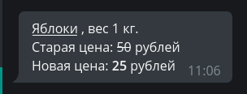

#2. Работа с сообщениями

В этом уроке мы разберёмся, как обрабатывать текстовые сообщения и медиафайлы, рассмотрим различные варианты форматирования 
текстов. 

## Текст
Обработка текстовых сообщений — это, пожалуй, одно из важнейших действий у большинства ботов. Текстом можно выразить 
практически что угодно и при этом подавать информацию хочется _красиво_. В распоряжении у разработчика имеется три способа 
разметки текста: HTML, Markdown и MarkdownV2. Наиболее продвинутыми из них считаются HTML и MarkdownV2, «классический» 
маркдаун оставлен для обеспечения обратной совместимости и поддерживает меньше возможностей.

За выбор форматирования при отправке сообщений отвечает аргумент `parse_mode`, например:
```python
from aiogram import types

# где-то в функции...
await message.answer("Hello, <b>world</b>!", parse_mode=types.ParseMode.HTML)
# Вместо Enum-а можно задать parse_mode в виде обычной строки:
await message.answer("Hello, *world*\!", parse_mode="MarkdownV2")
```


Если в боте повсеместно используется определённое форматирование, то каждый раз указывать аргумент `parse_mode` довольно 
накладно. К счастью, в aiogram можно передать необходимый тип прямо в объект **Bot**, а если в каком-то конкретном случае 
нужно обойтись без этих ваших разметок, то просто укажите `parse_mode=""` (пустая строка):


```python
bot = Bot(token="123:abcxyz", parse_mode=types.ParseMode.HTML)

# где-то в функции...
await message.answer("Сообщение с <u>HTML-разметкой</u>")
await message.answer("Сообщение без <s>какой-либо разметки</s>", parse_mode="")
```


Aiogram позволяет извлекать текст как простое содержимое (plain text), как HTML и как Markdown. Сравнить можно на скриншоте 
ниже. Это удобно использовать, например, если вы хотите вернуть отправителю его текст с небольшими изменениями:
```python
@dp.message_handler()
async def any_text_message(message: types.Message):
    await message.answer(message.text)
    await message.answer(message.md_text)
    await message.answer(message.html_text)
    # Дополняем исходный текст:
    await message.answer(
        f"<u>Ваш текст</u>:\n\n{message.html_text}", parse_mode="HTML"
    )
```



todo: скрытые ссылки

