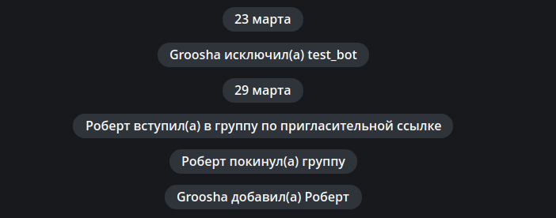

# Медиафайлы

!!! info ""
    Используемая версия aiogram: 3.30.0

В этой главе мы разберёмся, как работать с медиафайлами: отправлять их разными способами, скачивать, собирать в 
альбомы, а заодно рассмотрим служебные сообщения.

## Отправка файлов {: id="uploading-media" }

Помимо обычных текстовых сообщений Telegram позволяет обмениваться медиафайлами различных типов: фото, видео, гифки, 
геолокации, стикеры и т.д. У большинства медиафайлов есть свойства `file_id` и `file_unique_id`. Первый можно использовать 
для повторной отправки одного и того же файла много раз, причём отправка будет мгновенной, т.к. сам файл уже лежит 
на серверах Telegram. Это самый предпочтительный способ.  
К примеру, следующий код заставит бота моментально ответить пользователю той же гифкой, что была прислана: 

```python
@dp.message(F.animation)
async def echo_gif(message: Message):
    await message.reply_animation(message.animation.file_id)
```

!!! warning "Всегда используйте правильные file_id!"
    Бот должен использовать для отправки **только** те `file_id`, которые получил напрямую сам, 
    например, в личке от пользователя или «увидев» медиафайл в группе/канале. При этом, 
    если попытаться использовать `file_id` от другого бота, то это _может сработать_, но 
    через какое-то время вы получите ошибку **wrong url/file_id specified**. Поэтому — 
    только свои `file_id`!

В отличие от `file_id`, идентификатор `file_unique_id` нельзя использовать для повторной отправки 
или скачивания медиафайла, но зато он одинаковый у всех ботов для конкретного медиа. 
Нужен `file_unique_id` обычно тогда, когда нескольким ботам требуется знать, что их собственные `file_id` относятся 
к одному и тому же файлу.

Если файл ещё не существует на сервере Telegram, бот может загрузить его тремя различными 
способами: как файл в файловой системе, по ссылке и напрямую набор байтов. 
Для ускорения отправки и в целом для более бережного отношения к серверам мессенджера,
загрузку (upload) файлов Telegram правильнее производить один раз, а в дальнейшем использовать `file_id`, 
который будет доступен после первой загрузки медиа. 

В aiogram 3.x присутствуют 3 класса для отправки файлов и медиа - `FSInputFile`, `BufferedInputFile`, 
`URLInputFile`, с ними можно ознакомиться 
в [документации](https://docs.aiogram.dev/en/dev-3.x/api/upload_file.html).

Рассмотрим простой пример отправки изображений всеми различными способами:
```python
from aiogram.types import FSInputFile, URLInputFile, BufferedInputFile

@dp.message(Command('images'))
async def upload_photo(message: Message):
    # Сюда будем помещать file_id отправленных файлов, чтобы потом ими воспользоваться
    file_ids = []

    # Чтобы продемонстрировать BufferedInputFile, воспользуемся "классическим"
    # открытием файла через `open()`. Но, вообще говоря, этот способ
    # лучше всего подходит для отправки байтов из оперативной памяти
    # после проведения каких-либо манипуляций, например, редактированием через Pillow
    with open("buffer_emulation.jpg", "rb") as image_from_buffer:
        result = await message.answer_photo(
            BufferedInputFile(
                image_from_buffer.read(),
                filename="image from buffer.jpg"
            ),
            caption="Изображение из буфера"
        )
        file_ids.append(result.photo[-1].file_id)

    # Отправка файла из файловой системы
    image_from_pc = FSInputFile("image_from_pc.jpg")
    result = await message.answer_photo(
        image_from_pc,
        caption="Изображение из файла на компьютере"
    )
    file_ids.append(result.photo[-1].file_id)

    # Отправка файла по ссылке
    image_from_url = URLInputFile("https://picsum.photos/seed/groosha/400/300")
    result = await message.answer_photo(
        image_from_url,
        caption="Изображение по ссылке"
    )
    file_ids.append(result.photo[-1].file_id)
    await message.answer("Отправленные файлы:\n"+"\n".join(file_ids))
```

Подпись у фото, видео и GIF можно перенести наверх: 

```python
@dp.message(Command("gif"))
async def send_gif(message: Message):
    await message.answer_animation(
        animation="<file_id гифки>",
        caption="Я сегодня:",
        show_caption_above_media=True
    )
```


## Скачивание файлов {: id="downloading-media" }

Помимо переиспользования для отправки, бот может скачать медиа к себе на компьютер/сервер. Для этого у объекта типа `Bot` 
есть метод `download()`. В примерах ниже файлы скачиваются сразу в файловую систему, но никто не мешает 
вместо этого сохранить в объект BytesIO в памяти, чтобы передать в какое-то приложение дальше 
(например, pillow). 

```python
@dp.message(F.photo)
async def download_photo(message: Message, bot: Bot):
    await bot.download(
        message.photo[-1],
        destination=f"/tmp/{message.photo[-1].file_id}.jpg"
    )


@dp.message(F.sticker)
async def download_sticker(message: Message, bot: Bot):
    await bot.download(
        message.sticker,
        # для Windows пути надо подправить
        destination=f"/tmp/{message.sticker.file_id}.webp"
    )
```

В случае с изображениями мы использовали не `message.photo`, а `message.photo[-1]`, почему? 
Фотографии в Telegram в сообщении приходят сразу в нескольких экземплярах; это одно и то же 
изображение с разным размером. Соответственно, если мы берём последний элемент (индекс -1), 
то работаем с максимально доступным размером фото.

!!! info "Скачивание больших файлов"
    Боты, использующие Telegram Bot API, могут скачивать файлы размером не более [20 мегабайт](https://core.telegram.org/bots/api#getfile). 
    Если вы планируете скачивать/заливать большие файлы, лучше рассмотрите библиотеки, взаимодействующие с 
    Telegram Client API, а не с Telegram Bot API, например, [Telethon](https://docs.telethon.dev/en/stable/index.html) 
    или [Pyrogram](https://docs.pyrogram.org/).  
    Немногие знают, но Client API могут использовать не только обычные аккаунты, но ещё и 
    [боты](https://docs.telethon.dev/en/stable/concepts/botapi-vs-mtproto.html).
    
    А начиная с Bot API версии 5.0, можно использовать 
    [собственный сервер Bot API](https://core.telegram.org/bots/api#using-a-local-bot-api-server) для работы с 
    большими файлами.

## Альбомы {: id="albums" }

То, что мы называем «альбомами» (медиагруппами) в Telegram, на самом деле отдельные сообщения с медиа, у которых есть общий 
`media_group_id` и которые визуально «склеиваются» на клиентах. Начиная с версии 3.1, в aiogram есть 
[«сборщик» альбомов](https://docs.aiogram.dev/en/latest/utils/media_group.html), работу с которым мы сейчас рассмотрим. 
Но прежде стоит упомянуть несколько особенностей медиагрупп:

* К ним нельзя прицепить инлайн-клавиатуру или отправить реплай-клавиатуру вместе с ними. Никак. Вообще никак.
* У каждого медиафайла в альбоме может быть своя подпись (caption). Если подпись есть только у одного медиа, 
то она будет выводиться как общая подпись ко всему альбому.
* Фотографии можно отправлять вперемешку с видео в одном альбоме, файлы (Document) и музыку (Audio) нельзя ни с чем 
смешивать, только с медиа того же типа.
* В альбоме может быть не больше 10 (десяти) медиафайлов.

Теперь посмотрим, как это сделать в aiogram:

```python
from aiogram.filters import Command
from aiogram.types import FSInputFile, Message
from aiogram.utils.media_group import MediaGroupBuilder

@dp.message(Command("album"))
async def cmd_album(message: Message):
    album_builder = MediaGroupBuilder(
        caption="Общая подпись для будущего альбома"
    )
    album_builder.add(
        type="photo",
        media=FSInputFile("image_from_pc.jpg")
        # caption="Подпись к конкретному медиа"

    )
    # Если мы сразу знаем тип, то вместо общего add
    # можно сразу вызывать add_<тип>
    album_builder.add_photo(
        # Для ссылок или file_id достаточно сразу указать значение
        media="https://picsum.photos/seed/groosha/400/300"
    )
    album_builder.add_photo(
        media="<ваш file_id>"
    )
    await message.answer_media_group(
        # Не забудьте вызвать build()
        media=album_builder.build()
    )
```

Результат: 


А вот со скачиванием альбомов всё сильно хуже... Как уже было сказано выше, альбомы — это просто сгруппированные 
отдельные сообщения, а это значит, что боту они прилетают тоже в разных апдейтах. Вряд ли существует 100% надёжный 
способ принять весь альбом одним куском, но можно попытаться сделать это с минимальными потерями. Обычно это делается 
через мидлвари, мою собственную реализацию приёма медиагрупп можно найти 
[по этой ссылке](https://github.com/MasterGroosha/telegram-feedback-bot-topics/blob/8b620bbaf6bf2989f4bfe495e050a27f59fe113c/bot/middlewares/albums_collector.py) 
(остальной код в том репозитории лучше не смотреть, он безнадёжно устарел).

## Сервисные (служебные) сообщения {: id="service" }

Сообщения в Telegram делятся на текстовые, медиафайлы и служебные (они же — сервисные). 
Настало время поговорить о последних.



Несмотря на то, что они выглядят необычно и взаимодействие с ними ограничено, это всё ещё 
сообщения, у которых есть свои айдишники и даже владелец. Стоит отметить, что спектр применения 
сервисных сообщений с годами менялся и сейчас, скорее всего, ваш бот с ними работать не будет, 
либо только удалять.

Не будем сильно углубляться в детали и рассмотрим один конкретный пример: отправка 
приветственного сообщения вошедшему участнику. У такого служебного сообщения будет content_type 
равный "new_chat_members", но вообще это объект Message, у которого заполнено одноимённое поле. 

```python
@dp.message(F.new_chat_members)
async def somebody_added(message: Message):
    for user in message.new_chat_members:
        # проперти full_name берёт сразу имя И фамилию 
        # (на скриншоте выше у юзеров нет фамилии)
        await message.reply(f"Привет, {user.full_name}")
```


Важно помнить, что `message.new_chat_members` является списком, потому что один пользователь может 
добавить сразу нескольких участников. Также не надо путать поля `message.from_user` и 
`message.new_chat_members`. Первое — это субъект, т.е. тот, кто совершил действие. Второе — 
это объекты действия. Т.е. если вы видите сообщение вида «Анна добавила Бориса и Виктора», то 
`message.from_user` — это информация об Анне, а список `message.new_chat_members` содержит 
информацию о Борисе с Виктором.

!!! warning "Не стоит целиком полагаться на сервисные сообщения!"
    У служебных сообщений о добавлении (new_chat_members) и выходе (left_chat_member) есть
    одна неприятная особенность: они ненадёжны, т.е. они могут не создаваться вообще.  
    К примеру, сообщение о new_chat_members перестаёт создаваться при ~10k участников в группе, 
    а left_chat_member уже при 50 (но при написании этой главы я столкнулся с тем, что в одной 
    из групп left_chat_member не появился и при 9 участниках. А через полчаса там же появился 
    при выходе другого человека).

    С выходом Bot API 5.0 у разработчиков появился гораздо более надёжный способ видеть входы/выходы 
    участников в группах любого размера, **а также в каналах**. Но об этом поговорим 
    [в другой раз](special-updates.md).

На этом всё. До следующих глав!  
<s><small>Ставьте лайки, подписывайтесь, прожимайте колокольчик</small></s>
