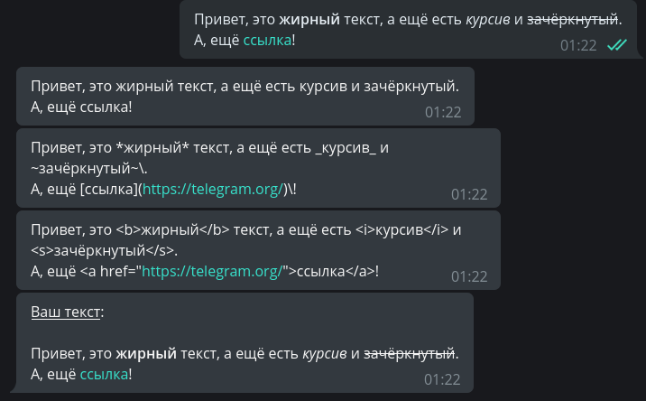
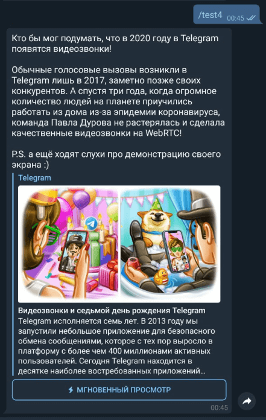

# Работа с сообщениями

В этой главе мы разберёмся, как применять различные типы форматирования к сообщениям и работать с медиафайлами. 

## Текст
Обработка текстовых сообщений — это, пожалуй, одно из важнейших действий у большинства ботов. Текстом можно выразить 
практически что угодно и при этом подавать информацию хочется _красиво_. В распоряжении у разработчика имеется три способа 
разметки текста: HTML, Markdown и MarkdownV2. Наиболее продвинутыми из них считаются HTML и MarkdownV2, «классический» 
маркдаун оставлен для обеспечения обратной совместимости и поддерживает меньше возможностей.

За выбор форматирования при отправке сообщений отвечает аргумент `parse_mode`, например:
```python
from aiogram import types

# где-то в функции...
await message.answer("Hello, <b>world</b>!", parse_mode=types.ParseMode.HTML)
# Вместо Enum-а можно задать parse_mode в виде обычной строки:
await message.answer("Hello, *world*\!", parse_mode="MarkdownV2")
```


Если в боте повсеместно используется определённое форматирование, то каждый раз указывать аргумент `parse_mode` довольно 
накладно. К счастью, в aiogram можно передать необходимый тип прямо в объект **Bot**, а если в каком-то конкретном случае 
нужно обойтись без этих ваших разметок, то просто укажите `parse_mode=""` (пустая строка):


```python
bot = Bot(token="123:abcxyz", parse_mode=types.ParseMode.HTML)

# где-то в функции...
await message.answer("Сообщение с <u>HTML-разметкой</u>")
await message.answer("Сообщение без <s>какой-либо разметки</s>", parse_mode="")
```


Существует и более «программный» или даже «динамический» способ формирования сообщения.
Для этого нужно импортировать модуль markdown из aiogram.utils, который, несмотря на название, поддерживает и HTML тоже.
Далее вызовите функцию `text()`, в которую передайте произвольное число таких же вызовов функции `text()`.
Тип форматирования определяется названием функции, а буква "h" в начале означает HTML, т.е. функция `hbold()` обрамляет 
переданный ей текст как жирный в HTML-разметке (`<b>текст</b>`). Аргумент `sep` определяет разделитель между кусками текста.  
В общем, смотрите на код и скриншот ниже. Стоит ли использовать такой способ создания текста — решать вам:
```python
import aiogram.utils.markdown as fmt

# где-то в функции...
await message.answer(
        fmt.text(
            fmt.text(fmt.hunderline("Яблоки"), ", вес 1 кг."),
            fmt.text("Старая цена:", fmt.hstrikethrough(50), "рублей"),
            fmt.text("Новая цена:", fmt.hbold(25), "рублей"),
            sep="\n"
        ), parse_mode="HTML"
    )
```


Помимо отправки с форматированием, Aiogram позволяет извлекать входящий текст как простое содержимое (plain text), 
как HTML и как Markdown. Сравнить можно на скриншоте ниже. 
Это удобно использовать, например, если вы хотите вернуть отправителю его сообщение с небольшими изменениями:
```python
@dp.message_handler()
async def any_text_message(message: types.Message):
    await message.answer(message.text)
    await message.answer(message.md_text)
    await message.answer(message.html_text)
    # Дополняем исходный текст:
    await message.answer(
        f"<u>Ваш текст</u>:\n\n{message.html_text}", parse_mode="HTML"
    )
```



Всё бы ничего, но с использованием форматирования есть проблема: не в меру хитрые пользователи могут использовать спец. 
символы в именах или сообщениях, ломая бота. Впрочем, в aiogram существуют методы экранирования таких символов: 
`escape_md()` и `quote_html()`. Либо можно использовать упомянутые выше методы (h)bold, (h)italic и прочие:
```python
@dp.message_handler()
async def any_text_message2(message: types.Message):
    await message.answer(f"Привет, <b>{fmt.quote_html(message.text)}</b>", parse_mode=types.ParseMode.HTML)
    # А можно и так:
    await message.answer(fmt.text("Привет,", fmt.hbold(message.text)), parse_mode=types.ParseMode.HTML)
```


!!! info ""
    Подробнее о различных способах форматирования и поддерживаемых тегах можно узнать 
    [в документации Bot API](https://core.telegram.org/bots/api#formatting-options).

## Медиафайлы

Помимо обычных текстовых сообщений Telegram позволяет обмениваться медиафайлами различных типов: фото, видео, гифки, 
геолокации, стикеры и т.д. У большинства медиафайлов есть свойства `file_id` и `file_unique_id`. Первый можно использовать 
для повторной отправки одного и того же медиафайла много раз, причём отправка будет мгновенной, т.к. сам файл уже лежит 
на серверах Telegram. Это самый предпочтительный способ.  
К примеру, следующий код заставит бота моментально ответить пользователю той же гифкой, что была прислана: 

```python
@dp.message_handler(content_types=[types.ContentType.ANIMATION])
async def echo_document(message: types.Message):
    await message.reply_animation(message.animation.file_id)
```

`file_id` уникален для каждого бота, т.е. переиспользовать чужой идентификатор нельзя. Однако в Bot API есть ещё 
`file_unique_id`. Его нельзя использовать для повторной отправки или скачивания медиафайла, но зато он одинаковый у всех 
ботов. Нужен `file_unique_id` обычно тогда, когда нескольким ботам требуется знать, что их собственные `file_id` односятся 
к одному и тому же файлу.

Кстати, про скачивание: aiogram предлагает удобный вспомогательный метод `download()` для загрузки небольших файлов на сервер, 
где запущен бот: 
```python
@dp.message_handler(content_types=[types.ContentType.DOCUMENT])
async def download_doc(message: types.Message):
    # Скачивание в каталог с ботом с созданием подкаталогов по типу файла
    await message.document.download()


# Типы содержимого тоже можно указывать по-разному.
@dp.message_handler(content_types=["photo"])
async def download_photo(message: types.Message):
    # Убедитесь, что каталог /tmp/somedir существует!
    await message.photo[-1].download(destination="/tmp/somedir/")
```

!!! info "Работа с изображениями"
    Обратите внимание на конструкцию `message.photo[-1]`. Когда пользователь присылает боту изображение, Telegram присылает 
    не один объект, а целый массив с разными размерами одного и того же изображения, отсортированными по возрастанию. 
    В общем случае нас будет интересовать изображение наибольшего размера, стоящее последним (индекс «минус один»).

!!! info "Скачивание больших файлов"
    Боты, использующие Telegram Bot API, могут скачивать файлы размером не более [20 мегабайт](https://core.telegram.org/bots/api#getfile). 
    Если вы планируете скачивать/заливать большие файлы, лучше рассмотрите библиотеки, взаимодействующие с 
    Telegram Client API, а не с Telegram Bot API, например, [Telethon](https://docs.telethon.dev/en/latest/index.html). 
    Немногие знают, но Client API могут использовать не только обычные аккаунты, но ещё и 
    [боты](https://docs.telethon.dev/en/latest/concepts/botapi-vs-mtproto.html).
    
    А начиная с Bot API версии 5.0, можно использовать 
    [собственный сервер Bot API](https://core.telegram.org/bots/api#using-a-local-bot-api-server) для работы с 
    большими файлами.
    


## Бонус
Бывают ситуации, когда хочется отправить длинное сообщение с картинкой, но лимит на подписи к медиафайлам составляет 
всего 1024 символа против 4096 у обычного текстового, а вставлять внизу ссылку на медиа — выглядит некрасиво. Более того, 
когда Telegram делает предпросмотр ссылок, он берёт первую из них и считывает метатеги, в результате сообщение может 
отправиться не с тем превью, которое хочется увидеть.  
Для решения этой проблемы ещё много лет назад придумали подход со «скрытыми ссылками» в HTML-разметке. Суть в том, что 
можно поместить ссылку в [пробел нулевой ширины](http://www.fileformat.info/info/unicode/char/200b/index.htm) и вставить 
всю эту конструкцию в начало сообщения. Для наблюдателя в сообщении никаких ссылок нет, а сервер Telegram всё видит и честно 
добавляет предпросмотр.  
Разработчики aiogram для этого даже сделали специальный вспомогательный метод `hide_link()`:
```python
import aiogram.utils.markdown as fmt

@dp.message_handler(commands="test4")
async def with_hidden_link(message: types.Message):
    await message.answer(
        f"{fmt.hide_link('https://telegram.org/blog/video-calls/ru')}Кто бы мог подумать, что "
        f"в 2020 году в Telegram появятся видеозвонки!\n\nОбычные голосовые вызовы "
        f"возникли в Telegram лишь в 2017, заметно позже своих конкурентов. А спустя три года, "
        f"когда огромное количество людей на планете приучились работать из дома из-за эпидемии "
        f"коронавируса, команда Павла Дурова не растерялась и сделала качественные "
        f"видеозвонки на WebRTC!\n\nP.S. а ещё ходят слухи про демонстрацию своего экрана :)",
        parse_mode=types.ParseMode.HTML)
```



На этом всё. До следующих глав!  
<s><small>Ставьте лайки, подписывайтесь, прожимайте колокольчик</small></s>