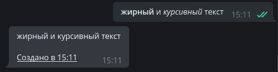
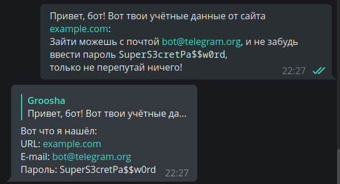
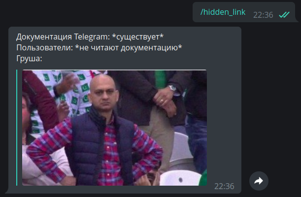

# Работа с сообщениями

!!! info ""
    Используемая версия aiogram: 3.1.1

В этой главе мы разберёмся, как применять различные типы форматирования к сообщениям и работать с медиафайлами.

## Текст {: id="text" }
Обработка текстовых сообщений — это, пожалуй, одно из важнейших действий у большинства ботов. Текстом можно выразить 
практически что угодно и при этом подавать информацию хочется _красиво_. В распоряжении у разработчика имеется три способа 
разметки текста: HTML, Markdown и MarkdownV2. Наиболее продвинутыми из них считаются HTML и MarkdownV2, «классический» 
Markdown поддерживает меньше возможностей и более не используется в aiogram.

Прежде, чем мы рассмотрим способы работы с текстом в aiogram, необходимо упомянуть 
важное отличие aiogram 3.x от 2.x: в «двойке» по умолчанию обрабатывались только 
текстовые сообщения, а в «тройке» — любого типа. Если точнее, вот как теперь надо 
принимать исключительно текстовые сообщения:

```python
# было (декоратором)
@dp.message_handler()
async def func_name(...)

# было (функцией-регистратором)
dp.register_message_handler(func_name)

# стало (декоратором)
from aiogram import F
@dp.message(F.text)
async def func_name(...)

# стало (функцией-регистратором)
dp.message.register(func_name, F.text)
```

Про «магический фильтр» **F** мы поговорим в [другой главе](filters-and-middlewares.md).

### Форматированный вывод {: id="formatting-options" }

За выбор форматирования при отправке сообщений отвечает аргумент `parse_mode`, например:
```python
from aiogram import F
from aiogram.types import Message
from aiogram.filters import Command
from aiogram.enums import ParseMode

# Если не указать фильтр F.text, 
# то хэндлер сработает даже на картинку с подписью /test
@dp.message(F.text, Command("test"))
async def any_message(message: Message):
    await message.answer(
        "Hello, <b>world</b>!", 
        parse_mode=ParseMode.HTML
    )
    await message.answer(
        "Hello, *world*\!", 
        parse_mode=ParseMode.MARKDOWN_V2
    )
```


Если в боте повсеместно используется определённое форматирование, то каждый раз указывать аргумент `parse_mode` довольно 
накладно. К счастью, в aiogram можно передать необходимый тип прямо в объект **Bot**, а если в каком-то конкретном случае 
нужно обойтись без этих ваших разметок, то просто укажите `parse_mode=None`:


```python
bot = Bot(token="123:abcxyz", parse_mode="HTML")

# где-то в функции...
await message.answer("Сообщение с <u>HTML-разметкой</u>")
await message.answer(
    "Сообщение без <s>какой-либо разметки</s>", 
    parse_mode=None
)
```


### Экранирование ввода {: id="input-escaping" }

Нередко бывают ситуации, когда окончательный текст сообщения бота заранее неизвестен 
и формируется исходя из каких-то внешних данных: имя пользователя, его ввод и т.д. 
Напишем хэндлер на команду `/hello`, который будет приветствовать пользователя по его полному имени
(`first_name + last_name`), например: «Hello, Иван Иванов»:

```python
from aiogram.filters import Command

@dp.message(Command("hello"))
async def cmd_hello(message: Message):
    await message.answer(
        f"Hello, <b>{message.from_user.full_name}</b>",
        parse_mode=ParseMode.HTML
    )
```

И вроде всё хорошо, бот приветствует пользователей:


Но тут приходит юзер с именем &lt;Cлавик777&gt; и бот молчит! А в логах видно следующее:
`aiogram.exceptions.TelegramBadRequest: Telegram server says - Bad Request: can't parse entities: 
Unsupported start tag "Славик777" at byte offset 7`

Упс, у нас стоит режим форматирования HTML, и Telegram пытается распарсить &lt;Cлавик777&gt; как HTML-тег. Непорядок. 
Но у этой проблемы есть несколько решений. Первое: экранировать передаваемые значения.

```python
from aiogram import html
from aiogram.filters import Command

@dp.message(Command("hello"))
async def cmd_hello(message: Message):
    await message.answer(
        f"Hello, {html.bold(html.quote(message.from_user.full_name))}",
        parse_mode=ParseMode.HTML
    )
```

Второе чуть сложнее, но более продвинутое: воспользоваться специальным инструментом, который будет 
собирать отдельно текст и отдельно информацию о том, какие его куски должны быть отформатированы.

```python
from aiogram.filters import Command
from aiogram.utils.formatting import Text, Bold

@dp.message(Command("hello"))
async def cmd_hello(message: Message):
    content = Text(
        "Hello, ",
        Bold(message.from_user.full_name)
    )
    await message.answer(
        **content.as_kwargs()
    )
```

В примере выше конструкция `**content.as_kwargs()` вернёт аргументы `text`, `entities`, `parse_mode` и 
подставит их в вызов `answer()`.


Упомянутый инструмент форматирования довольно комплексный, 
[официальная документация](https://docs.aiogram.dev/en/latest/utils/formatting.html) демонстрирует удобное отображение 
сложных конструкций, например:

```python
from aiogram.filters import Command
from aiogram.utils.formatting import (
    Bold, as_list, as_marked_section, as_key_value, HashTag
)

@dp.message(Command("advanced_example"))
async def cmd_advanced_example(message: Message):
    content = as_list(
        as_marked_section(
            Bold("Success:"),
            "Test 1",
            "Test 3",
            "Test 4",
            marker="✅ ",
        ),
        as_marked_section(
            Bold("Failed:"),
            "Test 2",
            marker="❌ ",
        ),
        as_marked_section(
            Bold("Summary:"),
            as_key_value("Total", 4),
            as_key_value("Success", 3),
            as_key_value("Failed", 1),
            marker="  ",
        ),
        HashTag("#test"),
        sep="\n\n",
    )
    await message.answer(**content.as_kwargs())
```


!!! info ""
    Подробнее о различных способах форматирования и поддерживаемых тегах можно узнать 
    [в документации Bot API](https://core.telegram.org/bots/api#formatting-options).

### Сохранение форматирования {: id="keep-formatting" }

Представим, что бот должен получить форматированный текст от пользователя и добавить туда что-то 
своё, например, отметку времени. Напишем простой код:

```python
# новый импорт!
from datetime import datetime

@dp.message(F.text)
async def echo_with_time(message: Message):
    # Получаем текущее время в часовом поясе ПК
    time_now = datetime.now().strftime('%H:%M')
    # Создаём подчёркнутый текст
    added_text = html.underline(f"Создано в {time_now}")
    # Отправляем новое сообщение с добавленным текстом
    await message.answer(f"{message.text}\n\n{added_text}", parse_mode="HTML")
```



Мда, что-то пошло не так, почему сбилось форматирование исходного сообщения? 
Это происходит из-за того, что `message.text` возвращает просто текст, без каких-либо оформлений. 
Чтобы получить текст в нужном форматировании, воспользуемся альтернативными свойствами: 
`message.html_text` или `message.md_text`. Сейчас нам нужен первый вариант. Заменяем в примере 
выше `message.text` на `message.html_text` и получаем корректный результат:


### Работа с entities {: id="message-entities" }

Telegram сильно упрощает жизнь разработчикам, выполняя предобработку сообщений пользователей на своей стороне. 
Например, некоторые сущности, типа e-mail, номера телефона, юзернейма и др. можно не доставать 
[регулярными выражениями](https://ru.wikipedia.org/wiki/Регулярные_выражения), а извлечь 
напрямую из объекта [Message](https://core.telegram.org/bots/api#message) и поля 
`entities`, содержащего массив объектов типа 
[MessageEntity](https://core.telegram.org/bots/api#messageentity). В качестве примера напишем 
хэндлер, который извлекает ссылку, e-mail и моноширинный текст из сообщения (по одной штуке).  
Здесь кроется важный подвох. **Telegram возвращает не сами значения, а их начало в тексте и длину**. 
Более того, текст считается в символах UTF-8, а entities работают с UTF-16, из-за этого, если просто взять 
позицию и длину, то при наличии UTF-16 символов (например, эмодзи) ваш обработанный текст просто съедет. 

Лучше всего это демонстрирует пример ниже. На скриншоте первый ответ бота есть результат парсинга «в лоб», 
а второй — результат применения аиограмного метода `extract_from()` над entity. На вход ему передаётся весь исходный текст:

```python
@dp.message(F.text)
async def extract_data(message: Message):
    data = {
        "url": "<N/A>",
        "email": "<N/A>",
        "code": "<N/A>"
    }
    entities = message.entities or []
    for item in entities:
        if item.type in data.keys():
            # Неправильно
            # data[item.type] = message.text[item.offset : item.offset+item.length]
            # Правильно
            data[item.type] = item.extract_from(message.text)
    await message.reply(
        "Вот что я нашёл:\n"
        f"URL: {html.quote(data['url'])}\n"
        f"E-mail: {html.quote(data['email'])}\n"
        f"Пароль: {html.quote(data['code'])}"
    )
```



### Команды и их аргументы {: id="commands-args" }

Telegram [предоставляет](https://core.telegram.org/bots/features#inputs) пользователям множество способов ввода 
информации. Одним из них являются команды: ключевые слова, начинающиеся со слэша, например, `/new` или `/ban`. 
Иногда бот может быть спроектирован так, чтобы ожидать после самой команды какие-то _аргументы_, вроде `/ban 2d` или 
`/settimer 20h This is delayed message`. В составе aiogram есть фильтр `Command()`, упрощающий жизнь разработчика. 
Реализуем последний пример в коде:

```python
@dp.message(Command("settimer"))
async def cmd_settimer(
        message: Message,
        command: CommandObject
):
    # Если не переданы никакие аргументы, то
    # command.args будет None
    if command.args is None:
        await message.answer(
            "Ошибка: не переданы аргументы"
        )
        return
    # Пробуем разделить аргументы на две части по первому встречному пробелу
    try:
        delay_time, text_to_send = command.args.split(" ", maxsplit=1)
    # Если получилось меньше двух частей, вылетит ValueError
    except ValueError:
        await message.answer(
            "Ошибка: неправильный формат команды. Пример:\n"
            "/settimer <time> <message>"
        )
        return
    await message.answer(
        "Таймер добавлен!\n"
        f"Время: {delay_time}\n"
        f"Текст: {text_to_send}"
    )
```

Попробуем передать команду с разными аргументами (или вообще без них) и проверить реакцию:


С командами может возникнуть небольшая проблема в группах: Telegram автоматически подсвечивает команды, начинающиеся 
со слэша, из-за чего порой случается вот такое (спасибо моим дорогим подписчикам за помощь в создании скриншота):


Чтобы этого избежать, можно заставить бота реагировать на команды с другими префиксами. Они не будут подсвечиваться и 
потребуют полностью ручной ввод, так что сами оценивайте пользу такого подхода.

```python
@dp.message(Command("custom1", prefix="%"))
async def cmd_custom1(message: Message):
    await message.answer("Вижу команду!")


# Можно указать несколько префиксов....vv...
@dp.message(Command("custom2", prefix="/!"))
async def cmd_custom2(message: Message):
    await message.answer("И эту тоже вижу!")
```


Проблема кастомных префиксов в группах только в том, что боты не-админы со включенным Privacy Mode (по умолчанию) могут 
не увидеть такие команды из-за [особенностей](https://core.telegram.org/bots/faq#what-messages-will-my-bot-get) 
логики сервера. Самый частый use-case — боты-модераторы групп, которые уже являются администраторами.

### Диплинки {: id="deeplinks" }

Существует одна команда в Telegram, у которой есть чуть больше возможностей. Это `/start`. Дело в том, что можно 
сформировать ссылку вида `t.me/bot?start=xxx` и пре переходе по такой ссылке пользователю покажут кнопку «Начать», при 
нажатии которой бот получит сообщение `/start xxx`. Т.е. в ссылке зашивается некий дополнительный параметр, не требующий 
ручного ввода. Это называется диплинк (не путать с дикпиком) и может использоваться для кучи разных вещей: шорткаты для 
активации различных команд, реферальная система, быстрая конфигурация бота и т.д. Напишем два примера:

```python
import re
from aiogram import F
from aiogram.types import Message
from aiogram.filters import Command, CommandObject, CommandStart

@dp.message(Command("help"))
@dp.message(CommandStart(
    deep_link=True, magic=F.args == "help"
))
async def cmd_start_help(message: Message):
    await message.answer("Это сообщение со справкой")


@dp.message(CommandStart(
    deep_link=True,
    magic=F.args.regexp(re.compile(r'book_(\d+)'))
))
async def cmd_start_book(
        message: Message,
        command: CommandObject
):
    book_number = command.args.split("_")[1]
    await message.answer(f"Sending book №{book_number}")
```


Учтите, что диплинки через `start` отправляют пользователя в личку с ботом. Чтобы выбрать группу и отправить диплинк туда, 
замените `start` на `startgroup`. Также у aiogram существует удобная 
[функция](https://github.com/aiogram/aiogram/blob/228a86afdc3c594dd9db9e82d8d6d445adb5ede1/aiogram/utils/deep_linking.py#L126-L158) 
для создания диплинков прямо из вашего кода.

!!! tip "Больше диплинков, но не для ботов"
    В документации Telegram есть подробное описание всевозможных диплинков для клиентских приложений: 
    [https://core.telegram.org/api/links](https://core.telegram.org/api/links)


## Медиафайлы {: id="media" }

### Отправка файлов {: id="uploading-media" }

Помимо обычных текстовых сообщений Telegram позволяет обмениваться медиафайлами различных типов: фото, видео, гифки, 
геолокации, стикеры и т.д. У большинства медиафайлов есть свойства `file_id` и `file_unique_id`. Первый можно использовать 
для повторной отправки одного и того же файла много раз, причём отправка будет мгновенной, т.к. сам файл уже лежит 
на серверах Telegram. Это самый предпочтительный способ.  
К примеру, следующий код заставит бота моментально ответить пользователю той же гифкой, что была прислана: 

```python
@dp.message(F.animation)
async def echo_gif(message: Message):
    await message.reply_animation(message.animation.file_id)
```

!!! warning "Всегда используйте правильные file_id!"
    Бот должен использовать для отправки **только** те `file_id`, которые получил напрямую сам, 
    например, в личке от пользователя или «увидев» медиафайл в группе/канале. При этом, 
    если попытаться использовать `file_id` от другого бота, то это _может сработать_, но 
    через какое-то время вы получите ошибку **wrong url/file_id specified**. Поэтому — 
    только свои `file_id`!

В отличие от `file_id`, идентификатор `file_unique_id` нельзя использовать для повторной отправки 
или скачивания медиафайла, но зато он одинаковый у всех ботов для конкретного медиа. 
Нужен `file_unique_id` обычно тогда, когда нескольким ботам требуется знать, что их собственные `file_id` односятся 
к одному и тому же файлу.

Если файл ещё не существует на сервере Telegram, бот может загрузить его тремя различными 
способами: как файл в файловой системе, по ссылке и напрямую набор байтов. 
Для ускорения отправки и в целом для более бережного отношения к серверам мессенджера,
загрузку (upload) файлов Telegram правильнее производить один раз, а в дальнейшем использовать `file_id`, 
который будет доступен после первой загрузки медиа. 

В aiogram 3.x присутствуют 3 класса для отправки изображений - `FSInputFile`, `BufferedInputFile`, 
`URLInputFile`, с ними можно ознакомиться 
в [документации](https://docs.aiogram.dev/en/dev-3.x/api/upload_file.html).

Рассмотрим простой пример отправки изображений всеми различными способами:
```python
from aiogram.types import FSInputFile, URLInputFile, BufferedInputFile

@dp.message(Command('images'))
async def upload_photo(message: Message):
    # Сюда будем помещать file_id отправленных файлов, чтобы потом ими воспользоваться
    file_ids = []

    # Чтобы продемонстрировать BufferedInputFile, воспользуемся "классическим"
    # открытием файла через `open()`. Но, вообще говоря, этот способ
    # лучше всего подходит для отправки байтов из оперативной памяти
    # после проведения каких-либо манипуляций, например, редактированием через Pillow
    with open("buffer_emulation.jpg", "rb") as image_from_buffer:
        result = await message.answer_photo(
            BufferedInputFile(
                image_from_buffer.read(),
                filename="image from buffer.jpg"
            ),
            caption="Изображение из буфера"
        )
        file_ids.append(result.photo[-1].file_id)

    # Отправка файла из файловой системы
    image_from_pc = FSInputFile("image_from_pc.jpg")
    result = await message.answer_photo(
        image_from_pc,
        caption="Изображение из файла на компьютере"
    )
    file_ids.append(result.photo[-1].file_id)

    # Отправка файла по ссылке
    image_from_url = URLInputFile("https://picsum.photos/seed/groosha/400/300")
    result = await message.answer_photo(
        image_from_url,
        caption="Изображение по ссылке"
    )
    file_ids.append(result.photo[-1].file_id)
    await message.answer("Отправленные файлы:\n"+"\n".join(file_ids))
```

### Скачивание файлов {: id="downloading-media" }

Помимо переиспользования для отправки, бот может скачать медиа к себе на компьютер/сервер. Для этого у объекта типа `Bot` 
есть метод `download()`. В примерах ниже файлы скачиваются сразу в файловую систему, но никто не мешает 
вместо этого сохранить в объект BytesIO в памяти, чтобы передать в какое-то приложение дальше 
(например, pillow). 

```python
@dp.message(F.photo)
async def download_photo(message: Message, bot: Bot):
    await bot.download(
        message.photo[-1],
        destination=f"/tmp/{message.photo[-1].file_id}.jpg"
    )


@dp.message(F.sticker)
async def download_sticker(message: Message, bot: Bot):
    await bot.download(
        message.sticker,
        # для Windows пути надо подправить
        destination=f"/tmp/{message.sticker.file_id}.webp"
    )
```

В случае с изображениями мы использовали не `message.photo`, а `message.photo[-1]`, почему? 
Фотографии в Telegram в сообщении приходят сразу в нескольких экземплярах; это одно и то же 
изображение с разным размером. Соответственно, если мы берём последний элемент (индекс -1), 
то работаем с максимально доступным размером фото.

!!! info "Скачивание больших файлов"
    Боты, использующие Telegram Bot API, могут скачивать файлы размером не более [20 мегабайт](https://core.telegram.org/bots/api#getfile). 
    Если вы планируете скачивать/заливать большие файлы, лучше рассмотрите библиотеки, взаимодействующие с 
    Telegram Client API, а не с Telegram Bot API, например, [Telethon](https://docs.telethon.dev/en/latest/index.html) 
    или [Pyrogram](https://docs.pyrogram.org/).  
    Немногие знают, но Client API могут использовать не только обычные аккаунты, но ещё и 
    [боты](https://docs.telethon.dev/en/latest/concepts/botapi-vs-mtproto.html).
    
    А начиная с Bot API версии 5.0, можно использовать 
    [собственный сервер Bot API](https://core.telegram.org/bots/api#using-a-local-bot-api-server) для работы с 
    большими файлами.

### Альбомы {: id="albums" }

То, что мы называем «альбомами» (медиагруппами) в Telegram, на самом деле отдельные сообщения с медиа, у которых есть общий 
`media_group_id` и которые визуально «склеиваются» на клиентах. Начиная с версии 3.1, в aiogram есть 
[«сборщик» альбомов](https://docs.aiogram.dev/en/latest/utils/media_group.html), работу с которым мы сейчас рассмотрим. 
Но прежде стоит упомянуть несколько особенностей медиагрупп:

* К ним нельзя прицепить инлайн-клавиатуру или отправить реплай-клавиатуру вместе с ними. Никак. Вообще никак.
* У каждого медиафайла в альбоме может быть своя подпись (caption). Если подпись есть только у одного медиа, 
то она будет выводиться как общая подпись ко всему альбому.
* Фотографии можно отправлять вперемешку с видео в одном альбоме, файлы (Document) и музыку (Audio) нельзя ни с чем 
смешивать, только с медиа того же типа.
* В альбоме может быть не больше 10 (десяти) медиафайлов.

Теперь посмотрим, как это сделать в aiogram:

```python
from aiogram.filters import Command
from aiogram.types import FSInputFile, Message
from aiogram.utils.media_group import MediaGroupBuilder

@dp.message(Command("album"))
async def cmd_album(message: Message):
    album_builder = MediaGroupBuilder(
        caption="Общая подпись для будущего альбома"
    )
    album_builder.add(
        type="photo",
        media=FSInputFile("image_from_pc.jpg")
        # caption="Подпись к конкретному медиа"

    )
    # Если мы сразу знаем тип, то вместо общего add
    # можно сразу вызывать add_<тип>
    album_builder.add_photo(
        # Для ссылок или file_id достаточно сразу указать значение
        media="https://picsum.photos/seed/groosha/400/300"
    )
    album_builder.add_photo(
        media="<ваш file_id>"
    )
    await message.answer_media_group(
        # Не забудьте вызвать build()
        media=album_builder.build()
    )
```

Результат: 


А вот со скачиванием альбомов всё сильно хуже... Как уже было сказано выше, альбомы — это просто сгруппированные 
отдельные сообщения, а это значит, что боту они прилетают тоже в разных апдейтах. Вряд ли существует 100% надёжный 
способ принять весь альбом одним куском, но можно попытаться сделать это с минимальными потерями. Обычно это делается 
через мидлвари, мою собственную реализацию приёма медиагрупп можно найти 
[по этой ссылке](https://github.com/MasterGroosha/telegram-feedback-bot-topics/blob/master/bot/middlewares/albums_collector.py).

## Сервисные (служебные) сообщения {: id="service" }

Сообщения в Telegram делятся на текстовые, медиафайлы и служебные (они же — сервисные). 
Настало время поговорить о последних.


Несмотря на то, что они выглядят необычно и взаимодействие с ними ограничено, это всё ещё 
сообщения, у которых есть свои айдишники и даже владелец. Стоит отметить, что спектр применения 
сервисных сообщений с годами менялся и сейчас, скорее всего, ваш бот с ними работать не будет, 
либо только удалять.

Не будем сильно углубляться в детали и рассмотрим один конкретный пример: отправка 
приветственного сообщения вошедшему участнику. У такого служебного сообщения будет content_type 
равный "new_chat_members", но вообще это объект Message, у которого заполнено одноимённое поле. 

```python
@dp.message(F.new_chat_members)
async def somebody_added(message: Message):
    for user in message.new_chat_members:
        # проперти full_name берёт сразу имя И фамилию 
        # (на скриншоте выше у юзеров нет фамилии)
        await message.reply(f"Привет, {user.full_name}")
```


Важно помнить, что `message.new_chat_members` является списком, потому что один пользователь может 
добавить сразу нескольких участников. Также не надо путать поля `message.from_user` и 
`message.new_chat_members`. Первое — это субъект, т.е. тот, кто совершил действие. Второе — 
это объекты действия. Т.е. если вы видите сообщение вида «Анна добавила Бориса и Виктора», то 
`message.from_user` — это информация об Анне, а список `message.new_chat_members` содержит 
информацию о Борисе с Виктором.

!!! warning "Не стоит целиком полагаться на сервисные сообщения!"
    У служебных сообщений о добавлении (new_chat_members) и выходе (left_chat_member) есть
    одна неприятная особенность: они ненадёжны, т.е. они могут не создаваться вообще.  
    К примеру, сообщение о new_chat_members перестаёт создаваться при ~10k участников в группе, 
    а left_chat_member уже при 50 (но при написании этой главы я столкнулся с тем, что в одной 
    из групп left_chat_member не появился и при 9 участниках. А через полчаса там же появился 
    при выходе другого человека).

    С выходом Bot API 5.0 у разработчиков появился гораздо более надёжный способ видеть входы/выходы 
    участников в группах любого размера, **а также в каналах**. Но об этом поговорим 
    [в другой раз](special-updates.md).

## Бонус: прячем ссылку в тексте {: id="bonus" }

Бывают ситуации, когда хочется отправить длинное сообщение с картинкой, но лимит на подписи к медиафайлам составляет 
всего 1024 символа против 4096 у обычного текстового, а вставлять внизу ссылку на медиа — выглядит некрасиво. Более того, 
когда Telegram делает предпросмотр ссылок, он берёт первую из них и считывает метатеги, в результате сообщение может 
отправиться не с тем превью, которое хочется увидеть.  
Для решения этой проблемы ещё много лет назад придумали подход со «скрытыми ссылками» в HTML-разметке. Суть в том, что 
можно поместить ссылку в [пробел нулевой ширины](http://www.fileformat.info/info/unicode/char/200b/index.htm) и вставить 
всю эту конструкцию в начало сообщения. Для наблюдателя в сообщении никаких ссылок нет, а сервер Telegram всё видит и честно 
добавляет предпросмотр.  
Разработчики aiogram для этого даже сделали специальный вспомогательный метод `hide_link()`:
```python
# новый импорт!
from aiogram.utils.markdown import hide_link

@dp.message(Command("hidden_link"))
async def cmd_hidden_link(message: Message):
    await message.answer(
        f"{hide_link('https://telegra.ph/file/562a512448876923e28c3.png')}"
        f"Документация Telegram: *существует*\n"
        f"Пользователи: *не читают документацию*\n"
        f"Груша:"
    )
```



На этом всё. До следующих глав!  
<s><small>Ставьте лайки, подписывайтесь, прожимайте колокольчик</small></s>