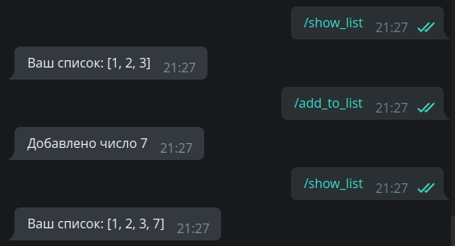

# Знакомство с aiogram

!!! info ""
    Используемая версия aiogram: 3.0

!!! warning "Некоторые детали сознательно упрощены!"
    Автор этой книги убеждён, что помимо теории должна быть и практика. Чтобы максимально упростить повторение 
    приведённого далее кода, пришлось пойти на использование подходов, пригодных только для локальной разработки 
    и обучения.

    Так, например, во всех или почти во всех главах токен бота будет указываться прямо в исходных текстах. 
    Это **плохой** подход, поскольку может привести к раскрытию токена, если вы забудете его удалить перед заливкой 
    кода в публичный репозиторий (например, GitHub).

    Или иногда в качестве хранилищ данных будут использоваться структуры, расположенные исключительно в 
    оперативной памяти (словари, списки...). В действительности такие объекты нежелательны, поскольку остановка 
    бота приведёт безвозвратной потере данных.

    Также механизмом получения апдейтов от Telegram выбран поллинг, поскольку он гарантированно работает 
    в подавляющем большинстве окружений и подходит практически всем разработчикам. 

    **Важно помнить, что автор ставит перед собой цель объяснить именно работу с Telegram Bot API при помощи 
    aiogram, а не вообще весь Computer Science во всём его многообразии.**

## Терминология {: id="glossary" }

Чтобы разговаривать в одних и тех же понятиях, введём некоторые термины, дабы в дальнейшем не путаться:

* ЛС — личные сообщения, в контексте бота это диалог один-на-один с пользователем, а не группа/канал.
* Чат — общее название для ЛС, групп, супергрупп и каналов.
* Апдейт — любое событие из [этого списка](https://core.telegram.org/bots/api#update): 
сообщение, редактирование сообщения, колбэк, инлайн-запрос, платёж, добавление бота в группу и т.д. 
* Хэндлер — асинхронная функция, которая получает от диспетчера/роутера очередной апдейт 
и обрабатывает его.
* Диспетчер — объект, занимающийся получением апдейтов от Telegram с последующим выбором хэндлера 
для обработки принятого апдейта.
* Роутер — аналогично диспетчеру, но отвечает за подмножество множества хэндлеров. 
**Можно сказать, что диспетчер — это корневой роутер**.
* Фильтр — выражение, которое обычно возвращает True или False и влияет на то, будет вызван хэндлер или нет.
* Мидлварь — прослойка, которая вклинивается в обработку апдейтов. 

## Установка {: id="installation" }

Для начала давайте создадим каталог для бота, организуем там virtual environment (далее venv) и
установим библиотеку [aiogram](https://github.com/aiogram/aiogram).  
Проверим, что установлен Python версии 3.9 (если вы знаете, что установлен 3.9 и выше, можете пропустить этот раздел):

```plain
[groosha@main lesson_01]$ python3.9
Python 3.9.9 (main, Jan 11 2022, 16:35:07) 
[GCC 11.1.0] on linux
Type "help", "copyright", "credits" or "license" for more information.
>>> exit()
[groosha@main lesson_01]$ 
```

Теперь создадим файл `requirements.txt`, в котором укажем используемую нами версию aiogram. Также нам понадобится 
библиотека python-dotenv для файлов конфигурации.
!!! important "О версиях aiogram"
    В этой главе используется aiogram **3.x**, перед началом работы рекомендую заглянуть в 
    [канал релизов](https://t.me/aiogram_live) библиотеки и проверить наличие более новой версии. Подойдёт любая 
    более новая, начинающаяся с цифры 3, поскольку aiogram 2.x более рассматриваться не будет и считается устаревшим.

```plain
[groosha@main 01_quickstart]$ python3.9 -m venv venv
[groosha@main 01_quickstart]$ echo "aiogram==3.0" > requirements.txt
[groosha@main 01_quickstart]$ echo "python-dotenv==1.0.0" >> requirements.txt
[groosha@main 01_quickstart]$ source venv/bin/activate
(venv) [groosha@main 01_quickstart]$ pip install -r requirements.txt 
# ...здесь куча строк про установку...
Successfully installed ...тут длинный список...
[groosha@main 01_quickstart]$
```

Обратите внимание на префикс "venv" в терминале. Он указывает, что мы находимся в виртуальном окружении с именем "venv".
Проверим, что внутри venv вызов команды `python` указывает на всё тот же Python 3.9:  
```plain
(venv) [groosha@main 01_quickstart]$ python
Python 3.9.9 (main, Jan 11 2022, 16:35:07) 
[GCC 11.1.0] on linux
Type "help", "copyright", "credits" or "license" for more information.
>>> exit()
(venv) [groosha@main 01_quickstart]$ deactivate 
[groosha@main 01_quickstart]$ 
```

Последней командой `deactivate` мы вышли из venv, чтобы он нам не мешал. 

!!! info ""
    Если для написания ботов вы используете PyCharm, рекомендую также установить сторонний плагин 
    [Pydantic](https://plugins.jetbrains.com/plugin/12861-pydantic) для поддержки автодополнения кода 
    в телеграмных объектах.

## Первый бот {: id="hello-world" }

Давайте создадим файл `bot.py` с базовым шаблоном бота на aiogram:
```python title="bot.py"
import asyncio
import logging
from aiogram import Bot, Dispatcher, types
from aiogram.filters.command import Command

# Включаем логирование, чтобы не пропустить важные сообщения
logging.basicConfig(level=logging.INFO)
# Объект бота
bot = Bot(token="12345678:AaBbCcDdEeFfGgHh")
# Диспетчер
dp = Dispatcher()

# Хэндлер на команду /start
@dp.message(Command("start"))
async def cmd_start(message: types.Message):
    await message.answer("Hello!")

# Запуск процесса поллинга новых апдейтов
async def main():
    await dp.start_polling(bot)

if __name__ == "__main__":
    asyncio.run(main())
```

Первое, на что нужно обратить внимание: aiogram — асинхронная библиотека, поэтому ваши хэндлеры тоже должны быть асинхронными, 
а перед вызовами методов API нужно ставить ключевое слово **await**, т.к. эти вызовы возвращают [корутины](https://docs.python.org/3/library/asyncio-task.html#coroutines).

!!! info "Асинхронное программирование в Python"
    Не стоит пренебрегать официальной документацией!  
    Прекрасный туториал по asyncio доступен [на сайте Python](https://docs.python.org/3/library/asyncio-task.html).

Если вы в прошлом работали с какой-то другой библиотекой для Telegram, например, pyTelegramBotAPI, то концепция
хэндлеров (обработчиков событий) вам сразу станет понятна, разница лишь в том, что в aiogram хэндлерами управляет диспетчер.  
Диспетчер регистрирует функции-обработчики, дополнительно ограничивая перечень вызывающих их событий через фильтры. 
После получения очередного апдейта (события от Telegram), диспетчер выберет нужную функцию обработки, подходящую по всем 
фильтрам, например, «обработка сообщений, являющихся изображениями, в чате с ID икс и с длиной подписи игрек». Если две 
функции имеют одинаковые по логике фильтры, то будет вызвана та, что зарегистрирована раньше.

Чтобы зарегистрировать функцию как обработчик сообщений, нужно сделать одно из двух действий:  
1. Навесить на неё [декоратор](https://devpractice.ru/python-lesson-19-decorators/), как в примере выше. 
С различными типами декораторов мы познакомимся позднее.  
2. Напрямую вызвать метод регистрации у диспетчера или роутера.

Рассмотрим следующий код: 
```python
# Хэндлер на команду /test1
@dp.message(Command("test1"))
async def cmd_test1(message: types.Message):
    await message.reply("Test 1")

# Хэндлер на команду /test2
async def cmd_test2(message: types.Message):
    await message.reply("Test 2")
```

Давайте запустим с ним бота:  


Хэндлер `cmd_test2` не сработает, т.к. диспетчер о нём не знает. Исправим эту ошибку 
и отдельно зарегистрируем функцию:
```python
# Хэндлер на команду /test2
async def cmd_test2(message: types.Message):
    await message.reply("Test 2")

# Где-то в другом месте, например, в функции main():
dp.message.register(cmd_test2, Command("test2"))
```

Снова запустим бота:  


## Синтаксический сахар {: id="sugar" }

Для того чтобы сделать код чище и читабельнее, aiogram расширяет возможности стандартных объектов Telegram.
Например, вместо `bot.send_message(...)` можно написать `message.answer(...)` или `message.reply(...)`. В последних
двух случаях не нужно подставлять `chat_id`, подразумевается, что он такой же, как и в исходном сообщении.  
Разница между `answer` и `reply` простая: первый метод просто отправляет сообщение в тот же чат, второй делает "ответ" на 
сообщение из `message`:
```python
@dp.message(Command("answer"))
async def cmd_answer(message: types.Message):
    await message.answer("Это простой ответ")


@dp.message(Command("reply"))
async def cmd_reply(message: types.Message):
    await message.reply('Это ответ с "ответом"')
```


Более того, для большинства типов сообщений есть вспомогательные методы вида 
"answer_{type}" или "reply_{type}", например:
```python
@dp.message(Command("dice"))
async def cmd_dice(message: types.Message):
    await message.answer_dice(emoji="🎲")
```

!!! info "что значит 'message: types.Message' ?"
    Python является интерпретируемым языком с [сильной, но динамической типизацией](https://habr.com/ru/post/161205/),
    поэтому встроенная проверка типов, как, например, в C++ или Java, отсутствует. Однако начиная с версии 3.5 
    в языке появилась поддержка [подсказок типов](https://docs.python.org/3/library/typing.html), благодаря которой
    различные чекеры и IDE вроде PyCharm анализируют типы используемых значений и подсказывают
    программисту, если он передаёт что-то не то. В данном случае подсказка `types.Message` соообщает
    PyCharm-у, что переменная `message` имеет тип `Message`, описанный в модуле `types` библиотеки
    aiogram (см. импорты в начале кода). Благодаря этому IDE может на лету подсказывать атрибуты и функции.

При вызове команды `/dice` бот отправит в тот же чат игральный кубик. Разумеется, если его надо отправить в какой-то
другой чат, то придётся по-старинке вызывать `await bot.send_dice(...)`. Но объект `bot` (экземпляр класса Bot) может быть 
недоступен в области видимости конкретной функции. В aiogram 3.x объект бота, которому пришёл апдейт, неявно 
прокидывается в хэндлер и его можно достать как аргумент `bot`. Предположим, вы хотите по команде `/dice` 
отправлять кубик не в тот же чат, а в канал с ID -100123456789. Перепишем предыдущую функцию:

```python
# не забудьте про импорт
from aiogram.enums.dice_emoji import DiceEmoji

@dp.message(Command("dice"))
async def cmd_dice(message: types.Message, bot: Bot):
    await bot.send_dice(-100123456789, emoji=DiceEmoji.DICE)
```

## Передача доп. параметров {: id="pass-extras" }

Иногда при запуске бота может потребоваться передать одно или несколько дополнительных значений. Это может быть 
объект конфигурации, список администраторов группы, отметка времени и что угодно ещё. Для этого достаточно передать 
параметры как дополнительные именованные (!) аргументы функции `start_polling(...)` (для вебхуков есть аналогичный 
способ). В хэндлерах для получения этих значений достаточно указать их как те же аргументы. Более того, изменение таких 
объектов в одних хэндлерах влияют на их содержимое в других. Рассмотрим на примере:

```python
@dp.message(Command("add_to_list"))
async def cmd_add_to_list(message: types.Message, mylist: list[int]):
    mylist.append(7)
    await message.answer("Добавлено число 7")


@dp.message(Command("show_list"))
async def cmd_show_list(message: types.Message, mylist: list[int]):
    await message.answer(f"Ваш список: {mylist}")
```

Теперь список `mylist` можно читать и писать в разных хэндлерах. Существует также ещё один вариант, более подходящий 
в других ситуациях. Речь, конечно же, о мидлварях, про которые подробно рассказывается 
[в соответствующей главе](filters-and-middlewares.md).



## Файлы конфигурации

Чтобы не хранить токен прямо в коде (вдруг вы захотите залить своего бота в публичный репозиторий?) можно вынести 
подобные данные в отдельный конфигурационный файл. Существует [хорошее и адекватное мнение](https://t.me/advice17/26), 
что для прода достаточно переменных окружения, однако в рамках этой книги мы будем пользоваться отдельными файлами `.env`, 
чтобы немного упростить себе жизнь и сэкономить читателям время на разворачивание демонстрационного проекта.

Итак, создадим рядом с `bot.py` отдельный файл `config_reader.py` со следующим содержимым

```python title="config_reader.py"
from pydantic_settings import BaseSettings, SettingsConfigDict
from pydantic import SecretStr


class Settings(BaseSettings):
    # Желательно вместо str использовать SecretStr 
    # для конфиденциальных данных, например, токена бота
    bot_token: SecretStr

    # Начиная со второй версии pydantic, настройки класса настроек задаются
    # через model_config
    # В данном случае будет использоваться файла .env, который будет прочитан
    # с кодировкой UTF-8
    model_config = SettingsConfigDict(env_file='.env', env_file_encoding='utf-8')


# При импорте файла сразу создастся 
# и провалидируется объект конфига, 
# который можно далее импортировать из разных мест
config = Settings()
```

Теперь немного отредактируем наш `bot.py`:

```python title="bot.py"
# импорты
from config_reader import config

# Для записей с типом Secret* необходимо 
# вызывать метод get_secret_value(), 
# чтобы получить настоящее содержимое вместо '*******'
bot = Bot(token=config.bot_token.get_secret_value())
```

Наконец, создадим файл `.env` (с точкой в начале), где опишем токен бота:

```title=".env"
BOT_TOKEN = 0000000000:AaBbCcDdEeFfGgHhIiJjKkLlMmNn
```

Если всё сделано правильно, то при запуске python-dotenv подгрузит переменные из файла `.env`, pydantic 
их провалидирует и объект бота успешно создастся с нужным токеном.

На этом мы закончим знакомство с библиотекой, а в следующих главах рассмотрим другие "фишки" aiogram и Telegram Bot API.
