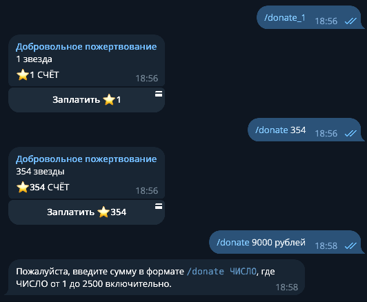
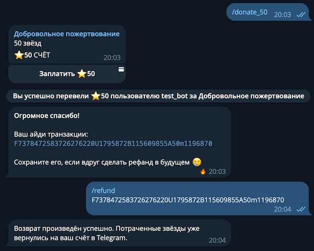

    
# Платежи в Telegram {: id="payments" }

!!! info ""
    Используемая версия aiogram: 3.7.0

Из этой главы вы узнаете, как можно реализовать покупки в своих Telegram-ботах с помощью внутренней валюты 
[Telegram Stars](https://telegram.org/blog/telegram-stars). 

## Платежи при помощи Stars {: id="pay-with-stars" }

Начиная с июня 2024 года, все платежи за **цифровые продукты и услуги** в Telegram должны осуществляться с помощью новой 
цифровой валюты Telegram Stars. Мы не будем подробно останавливаться на описании «Звёздочек», тем более, что детали могут 
меняться со временем. Нововведение довольно спорное, но судя по всему, разработчикам ботов придётся с этим как-то жить 
дальше, поэтому стоит разобраться в технологии.

### План работ {: id="plan" }

Для наглядности разработаем бота для приёма добровольных пожертвований (донатов). Должны поддерживаться пресеты
(<code>/&#8288;donate_1</code>, <code>/&#8288;donate_25</code>, <code>/&#8288;donate_50</code>), 
а также ввод произвольного числа звёздочек (<code>/&#8288;donate 777</code>, здесь число передаётся как аргумент команды). 
Также сделаем команду <code>/&#8288;refund</code>, чтобы пользователь мог вернуть потраченные Stars на свой телеграм-аккаунт. 
По [требованию Telegram](https://telegram.org/tos/bot-developers#6-2-1-payment-disputes-for-digital-goods-and-services), 
все боты, принимающие оплату за цифровые продукты и услуги, **обязаны** поддерживать команду <code>/&#8288;paysupport</code>, но поскольку 
на этот счёт нет дополнительных разъяснений, то в ней будем лишний уведомлять пользователя о команде <code>/&#8288;refund</code>.

### Технологии {: id="technologies" }

Прежде всего, aiogram, причём версии не ниже 3.7.0. Несмотря на то, что поддержка метода 
[sendInvoice](https://core.telegram.org/bots/api#sendinvoice) существует уже давно, метод 
[refundStarPayment](https://core.telegram.org/bots/api#refundstarpayment) был добавлен только в Bot API 7.4, что 
соответствует версии 3.7 у aiogram.

Для отображения логов используется библиотека [structlog](https://www.structlog.org/en/stable/). 
Её не будет видно в сниппетах в этом тексте, но в [исходных текстах к главе](https://github.com/MasterGroosha/aiogram-3-guide/tree/master/code/09_payments) 
она есть.

Информационные тексты, отправляемые ботом, используют [Project Fluent](https://projectfluent.org/) от Mozilla. 
Помимо сниппета с Python-кодом вы будете видеть соответствующие строки локализации. Дабы упростить себе задачу, 
а вам помочь сфокусироваться на новом материале, условимся, что язык пользователя роли не играет; бот всегда будет 
отдавать строки на русском языке из одного файла.

!!! info ""
    Если вы хотите узнать больше о локализации Telegram-ботов на разные языки без вышеописанных самоограничений, 
    приглашаем вас на наш [платный курс](https://stepik.org/a/153850?utm_source=aiogram3guide&utm_medium=web&utm_campaign=payments_chapter) 
    на платформе Stepik.

### Пишем код. Команда /start {: id="command-start" }

По команде <code>/&#8288;start</code> бот должен выдавать вот такой красивый текст

```fluent
cmd-start =
    Здравствуйте! Спасибо, что решили воспользоваться ботом. 
    Доступны следующие команды:

    • /donate_1: подарить 1 звезду.
    • /donate_25: подарить 25 звёзд.
    • /donate_50: подарить 50 звёзд.
    • /donate <число>: подарить <число> звёзд.
    • /paysupport: помощь с покупками.
    • /refund: возврат платежа (рефанд).
```

Код:

```python
@router.message(CommandStart())
async def cmd_start(
    message: Message,
    l10n: FluentLocalization,
):
    await message.answer(
        l10n.format_value("cmd-start"),
        parse_mode=None,
    )
```

У этого бота по умолчанию включен режим разметки HTML, но стартовое сообщение нельзя отправить с этим режимом, поскольку 
используется подстрока <code><&#8288;число&#8288;></code>. Поэтому `parse_mode` выставляется в `None`. Параметр `l10n` – 
это мидлварь для локализации, подкладывающая в хэндлер объект `FluentLocalization`. В любой непонятной ситуации смотрите 
в [исходники](https://github.com/MasterGroosha/aiogram-3-guide/tree/master/code/09_payments) к главе.

### Команды /donate {: id="commands-donate" }

Далее нужно сделать команду <code>/&#8288;donate</code> с произвольным выбором суммы, а также несколько готовых пресетов. 
По состоянию на июнь 2024 года максимальное число звёзд для покупки – 2500, при создани инвойса на бóльшую сумму 
Telegram-клиенты начинают «ломаться» и не дают приобрести новые звёзды прямо перед покупкой. Так что ограничимся 
суммой в интервале [1;2500] включительно.

Разница между командой-пресетом и обычной минимальная; можно объединить всё в один обработчик. Начнём его писать: 
получим команду и распарсим содержимое. Для пресетов надо разбить текст самой команды по подчёркиванию и вытащить 
правую половину как число, а для обычной команды аккуратно проверим, что передано после неё:

```python
@router.message(Command("donate_1"))
@router.message(Command("donate_25"))
@router.message(Command("donate_50"))
@router.message(Command("donate"))
async def cmd_donate(
    message: Message,
    command: CommandObject,
    l10n: FluentLocalization,
):
    # Если это команда /donate ЧИСЛО,
    # тогда вытаскиваем число из текста команды
    if command.command != "donate":
        amount = int(command.command.split("_")[1])
    # В противном случае пытаемся парсить пользовательский ввод
    else:
        # Проверка на число и на его диапазон
        if (
            command.args is None
            or not command.args.isdigit()
            or not 1 <= int(command.args) <= 2500
        ):
            await message.answer(
                l10n.format_value("custom-donate-input-error")
            )
            # Завершаем обработку
            return
        amount = int(command.args)
```

Теперь, когда число звёзд получено и провалидировано, отправим пользователю инвойс, т.е. счёт на оплату. 
В случае с Telegram Stars это выглядит следующим образом:

```python
    ### это продолжение хэндлера из предыдущего сниппета! ###

    # Для платежей в Telegram Stars список цен
    # ОБЯЗАН состоять РОВНО из 1 элемента
    prices = [LabeledPrice(label="XTR", amount=amount)]
    await message.answer_invoice(
        title=l10n.format_value("invoice-title"),
        description=l10n.format_value(
            "invoice-description",
            {"starsCount": amount}
        ),
        prices=prices,
        # provider_token Должен быть пустым
        provider_token="",
        # В пейлоайд можно передать что угодно,
        # например, айди того, что именно покупается
        payload=f"{amount}_stars",
        # XTR - это код валюты Telegram Stars
        currency="XTR"
    )
```



Кнопка "Оплатить" вместе с суммой генерируется телеграмом автоматически, её не нужно генерировать вручную. 
Но при желании можно создать собственную инлайн-клавиатуру и прицепить её к инвойсу. Главное требование: первой должна быть 
кнопка с параметром `pay=True`. Если в тексте кнопки использовать эмодзи ⭐ или подстроку XTR, то этот текст будет 
автоматически заменён на иконку Telegram Star:

```python
    builder = InlineKeyboardBuilder()
    builder.button(
        text=f"Оплатить {amount} XTR",
        pay=True
    )
    builder.button(
        text="Отменить покупку",
        callback_data="cancel"
    )
    builder.adjust(1)

    prices = [LabeledPrice(label="XTR", amount=amount)]
    await message.answer_invoice(
        title=l10n.format_value("invoice-title"),
        description=l10n.format_value(
            "invoice-description",
            {"starsCount": amount}
        ),
        prices=prices,
        provider_token="",
        payload=f"{amount}_stars",
        currency="XTR",
        # Переопределяем клавиатуру
        reply_markup=builder.as_markup()
    )
```


К слову, инвойс можно отправить и в виде кликабельной ссылки в тексте сообщения:

```python
@router.message(Command("donate_link"))
async def cmd_link(
    message: Message,
    bot: Bot,
    l10n: FluentLocalization,
):
    # Пример ссылки на инвойс в 1 звезду
    # В ответ на этот API-вызов, Telegram возвращает 
    # сразу ссылку.
    invoice_link = await bot.create_invoice_link(
        title=l10n.format_value("invoice-title"),
        description=l10n.format_value(
            "invoice-description",
            {"starsCount": 1}
        ),
        prices=[LabeledPrice(label="XTR", amount=1)],
        provider_token="",
        payload="demo",
        currency="XTR"
    )
    await message.answer(
        l10n.format_value(
            "invoice-link-text",
            {"link": invoice_link}
        )
    )
```

Новые строки в локализации:

```fluent
invoice-title = Добровольное пожертвование
invoice-description =
    {$starsCount ->
        [one] {$starsCount} звезда
        [few] {$starsCount} звезды
       *[other] {$starsCount} звёзд
}

custom-donate-input-error = 
    Пожалуйста, введите сумму в формате <code>/donate ЧИСЛО</code>, 
    где ЧИСЛО от 1 до 2500 включительно.

invoice-link-text =
    Воспользуйтесь <a href="{$link}">этой ссылкой</a> для доната в размере 1 звезды.
```

### Проверка перед оплатой {: id="pre-checkout" }

Если у пользователя достаточно Звёзд на счету, то Bot API присылает боту апдейт типа 
[PreCheckoutQuery](https://core.telegram.org/bots/api#precheckoutquery). У бота есть ровно 10 секунд, чтобы ещё раз 
всё проверить и либо подтвердить покупку, либо отменить её. Зачем отменять? Например, пользователь попытался купить один 
и тот же уникальный элемент дважды. Или он забанен в боте и не должен иметь возможность ничего покупать. Что угодно. 
Если стоит отменить покупку, то бот должен ответить на PreCheckoutQuery с `ok=False` и понятным текстом ошибки. Например: 

```python
# Текст ошибки в FTL-файле:
pre-checkout-failed-reason = Нет больше места для денег 😭

# Обработчик на Python:
@router.pre_checkout_query()
async def on_pre_checkout_query(
    pre_checkout_query: PreCheckoutQuery,
    l10n: FluentLocalization,
):
    await pre_checkout_query.answer(
        ok=False,
        error_message=l10n.format_value("pre-checkout-failed-reason")
    )
```

В этом случае бот увидит что-то такое:


Но чаще всего всё будет хорошо и можно разрешить оплату:

```python
@router.pre_checkout_query()
async def on_pre_checkout_query(
    pre_checkout_query: PreCheckoutQuery,
):
    await pre_checkout_query.answer(ok=True)
```

### После оплаты {: id="after-payment" }

После завершения покупки бот получит апдейт типа Message с непустым атрибутом `successful_payment`, в содержимом которого 
можно отыскать айди транзакции, пэйлоад (технические данные, которые разработчик сам передаёт при создании инвойса) и 
прочие штуки. Например, можно поздравить пользователя с покупкой, добавив с сообщением эффект огонька, прислать ID 
для последующего рефанда (если применимо), либо сразу вернуть Звезду в случае с демонстрационными ботами. 

```python
@router.message(F.successful_payment)
async def on_successful_payment(
    message: Message,
    l10n: FluentLocalization,
):
    await message.answer(
        l10n.format_value(
            "payment-successful",
            {"id": message.successful_payment.telegram_payment_charge_id}
        ),
        # Это эффект "огонь" из стандартных реакций
        message_effect_id="5104841245755180586",
    )
```

Обновляем локализацию:

```fluent
payment-successful =
    <b>Огромное спасибо!</b>

    Ваш айди транзакции:
    <code>{$id}</code>

    Сохраните его, если вдруг сделать рефанд в будущем 😢
```

{: style='height: 50%; width: 50%'}

### Возвраты покупок {: id="refunds" }

Строго говоря, перед началом пользования ботом юзер должен иметь возможность ознакомиться с условиями (Terms of Service). 
В частности, там должно быть чётко прописано, за что можно возвращать средства, а за что нельзя. Например, вы можете 
сразу сообщить, что за какой-то цифровой товар рефандов (возвратов) не предусмотрено, или что возврат становится 
недоступен после некоторого количества использований услуги или прошедших дней. Об этом решать только вам, в нашем 
демонстрационном боте мы дадим пользователю возможность возвращать средства за любую покупку. Для этого реализуем команду 
<code>/&#8288;refund</code>, аргументом к которой попросим передать айди транзакции. Метод 
[refundStarPayment](https://core.telegram.org/bots/api#refundstarpayment) может вернуть разные ошибки, в частности, о том, 
что ID транзакции некорректный или что средства за покупку в конкретной транзакции были уже возвращены. 
Обработаем эти случаи и реализуем рефанды:

```python
@router.message(Command("refund"))
async def cmd_refund(
    message: Message,
    bot: Bot,
    command: CommandObject,
    l10n: FluentLocalization,
):
    transaction_id = command.args
    if transaction_id is None:
        await message.answer(
            l10n.format_value("refund-no-code-provided")
        )
        return
    try:
        await bot.refund_star_payment(
            user_id=message.from_user.id,
            telegram_payment_charge_id=transaction_id
        )
        await message.answer(
            l10n.format_value("refund-successful")
        )
    except TelegramBadRequest as error:
        if "CHARGE_NOT_FOUND" in error.message:
            text = l10n.format_value("refund-code-not-found")
        elif "CHARGE_ALREADY_REFUNDED" in error.message:
            text = l10n.format_value("refund-already-refunded")
        else:
            # При всех остальных ошибках – такой же текст,
            # как и в первом случае
            text = l10n.format_value("refund-code-not-found")
        await message.answer(text)
        return
```

Рядом напишем обработчик команды <code>/&#8288;paysupport</code>, просто перенаправляющий на <code>/&#8288;refund</code>:

```python
@router.message(Command("paysupport"))
async def cmd_paysupport(
    message: Message,
    l10n: FluentLocalization
):
    await message.answer(l10n.format_value("cmd-paysupport"))
```

Текстов придётся добавить в этот раз побольше: 

```fluent
refund-successful =
    Возврат произведён успешно. Потраченные звёзды уже вернулись на ваш счёт в Telegram.

refund-no-code-provided =
    Пожалуйста, введите команду <code>/refund КОД</code>, где КОД – айди транзакции.
    Его можно увидеть после выполнения платежа, а также в разделе "Звёзды" в приложении Telegram.

refund-code-not-found =
    Такой код покупки не найден. Пожалуйста, проверьте вводимые данные и повторите ещё раз.

refund-already-refunded =
    За эту покупку уже ранее был произведён возврат средств.

cmd-paysupport =
    Если вы хотите вернуть средства за покупку, воспользуйтесь командой /refund
```

Результат:



!!! info "Попробовать бота в деле"
    Вы можете попробовать оплату при помощи Telegram Stars в боте [@GrooshaDonateBot](https://t.me/GrooshaDonateBot). 
    Вам потребуются Звёзды для любой транзакции, но если воспользуетесь командой <code>/&#8288;demo</code>, то 
    платёж в фиксированном размере 1 звезды сразу же вернётся обратно на ваш аккаунт после покупки.

Теперь вы готовы реализовывать оплату за цифровые товары и услуги в своих ботах при помощи Telegram Stars, ура!
