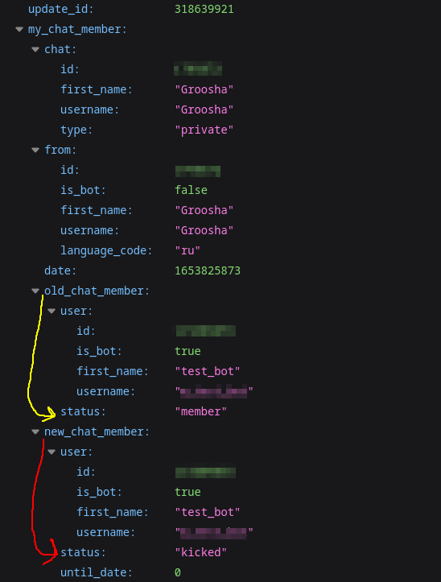
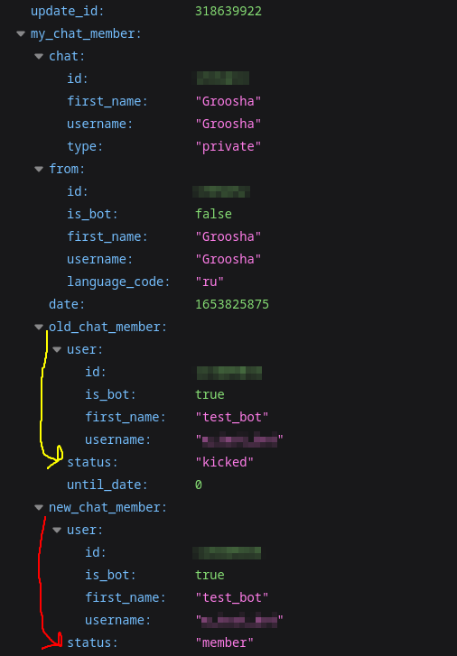
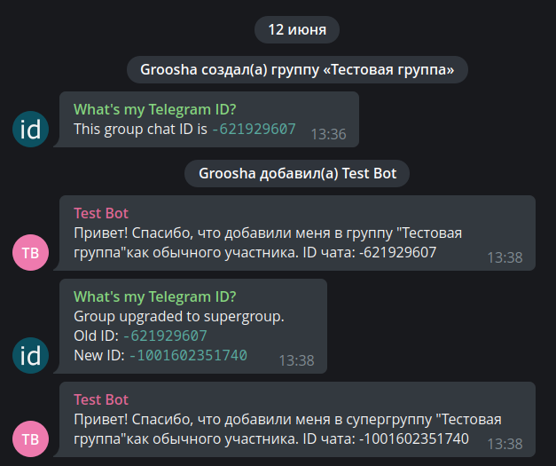

# Особые апдейты {: id="special-updates" }

!!! info ""
    Используемая версия aiogram: 3.0

## Введение {: id="intro" }

Почти все виды событий в Telegram имеют какое-то внешнее представление для юзера. Служебные сообщения, обычные, 
колбэки, инлайн-режим... но есть два вида апдейтов, предназначенные именно для самих ботов. Речь пойдёт о 
`my_chat_member` и `chat_member`

Когда-то давным-давно боты в группах существовали в «информационном вакууме»: банально на любые 
модераторские действия, будь то баны или ограничения, необходимо было проверять права вызывающего юзера через методы 
[getChatMember](https://core.telegram.org/bots/api#getchatadministrators) или 
[getChatAdministrators](https://core.telegram.org/bots/api#getchatadministrators), да ещё и кэшировать на небольшой 
промежуток времени, дабы не упереться в лимиты Bot API, точные значения которых [лимитов] по-прежнему остаются 
тайной за семью печатями. 

Или, например, какой-нибудь хитрый юзер добавлял бота в группу, убирал у того право писать и начинал дёргать команды, 
ожидая, что бот не обрабатывает такую ошибку и сломается. А уж с отправкой в личку вообще весело: не зная точно, какая 
активная аудитория бота, разработчику приходилось либо отправлять какое-нибудь сообщение по списку пользователей в 
своей базе, либо, что чуть гуманнее, отправлять этим юзерам какой-нибудь ChatAction, типа «_печатает_…»; как выяснилось, 
тем, кто заблокировал бота, это самое «_печатает_…» не придёт, вернув ошибку от Bot API.

В марте 2021 года ситуация кардинально изменилась в лучшую сторону с релизом 
[обновления Bot API v5.1](https://core.telegram.org/bots/api-changelog#march-9-2021), в котором 
добавилось два новых типа апдейтов: `my_chat_member` и `chat_member`. Оба апдейта внутри 
содержат объект одного и того же типа [ChatMemberUpdated](https://core.telegram.org/bots/api#chatmemberupdated). 
Разница между этими двумя событиями следующая:

* `my_chat_member`. Здесь всё, что касается непосредственно бота, либо ЛС юзера с ботом: (раз)блокировки бота юзером 
в ЛС, добавление бота в группу или канал, удаление оттуда, изменение прав бота и его статуса в разных чатах и т.д.
* `chat_member`. Содержит все изменения состояния пользователей в группах и каналах, где бот состоит в качестве 
администратора: приход/уход юзеров в группы, подписки/отписки в каналах, изменение прав и статусов пользователей, 
назначение/снятие админов и многое другое.

!!! warning "Важно"
    По умолчанию Telegram не присылает ботам апдейты `chat_member`, их приём надо включить отдельно. Подробнее — 
    в [соответствующем разделе](#chat-member)

В данной главе мы попробуем рассмотреть эти апдейты на наиболее часто необходимых задачах, однако перед переходом 
к следующим разделам настоятельно рекомендую ознакомиться с 
[этой страницей](https://docs.aiogram.dev/en/dev-3.x/dispatcher/filters/chat_member_updated.html) 
из документации **aiogram 3.x**.

## Объект ChatMemberUpdated {: id="chatmemberupdated" }

Сам по себе объект [ChatMemberUpdated](https://core.telegram.org/bots/api#chatmemberupdated) заслуживает отдельного 
внимания. Чтобы изучить его поближе, предположим, в некоторой группе администратор Алиса забанила 
обычного участника Витю. С полями `chat` и `date` всё очевидно, их пропустим.

Поле `from` (в вашем Python-коде это будет `from_user`) содержит информацию о субъекте действия. В нашем случае, субъект 
действия — это Алиса, поэтому во `from` (`from_user`) будет объект [User](https://core.telegram.org/bots/api#user) с 
данными об Алисе.

`old_chat_member` и `new_chat_member`. Под этими полями скрываются «состояния» 
объекта действия ДО и ПОСЛЕ события. Соответственно, в `old_chat_member` будет объект с типом 
[ChatMemberMember](https://core.telegram.org/bots/api#chatmembermember) (это не опечатка), и полем `user` с информацией 
о Вите, а в `new_chat_member` — объект [ChatMemberBanned](https://core.telegram.org/bots/api#chatmemberbanned) с полем 
`user` всё про того же несчастного Виктора.

Наконец, если в группу или канал вступила условная Маша, то в объекте ChatMemberUpdated будет непустое поле 
`invite_link`, с типом [ChatInviteLink](https://core.telegram.org/bots/api#chatinvitelink) и сведениями о том, 
по какой именно пригласительной ссылке она пришла. 

!!! warning "О пригласительных ссылках"
    Здесь стоит сделать важную ремарку: каждый администратор 
    группы/канала (включая ботов) может создать множество пригласительных ссылок с разными параметрами. Если бот 
    «поймал» вступление участника по созданной им \[ботом\] же ссылке, то в поле `invite_link` объекта ChatInviteLink 
    будет видна ссылка целиком (без `https://t.me`, разумеется). Но если участник пришёл по ссылке другого 
    администратора, то бот увидит только первую часть, вторая будет заменена на многоточие. 
    
    Вероятнее всего, это сделано для того, чтобы боты не могли отправлять кому попало пригласительные ссылки, 
    созданные другими администраторами чата.

    Кстати, по какой-то странной телеграмной логике, если вступить в публичную группу по пригласительной ссылке 
    (даже не по юзернейму), то бот не увидит ссылку (получит `None`). Телега 🤷‍♂️

## Апдейт my_chat_member {: id="my-chat-member" }

### Баны/разбаны в ЛС {: id="ban-unban-pm" }

В профильных чатах периодически возникает вопрос: «как сделать рассылку пользователям бота, 
если кто-то мог его заблокировать?». Разумеется, первым и главным советом будет: 
«создай [канал](https://telegram.org/faq_channels)», потому что каналы — это лучший способ информировать пользователей 
о чём-либо.

Но если вы всё же твёрдо решили, что будете делать рассылку пользователям прямо через бота, то существует три основных 
способа актуализации действующих пользователей бота:

1. Непосредственно во время совершения рассылки путём отлова ошибок отправки и внесения изменений в базу данных 
пользователей.
2. Через периодическую [отправку какого-либо ChatAction](https://core.telegram.org/bots/api#sendchataction), 
например, «печатает» по списку пользователей.
3. Прослушиванием апдейта my_chat_member.

Сейчас нас интересует только п.3. Научимся с помощью `my_chat_member` определять, что пользователь 
заблокировал или разблокировал бота. Но прежде, чем попробуем «магию» aiogram, разберёмся, как упомянутые ситуации 
выглядят в самом Bot API. Для этого остановим процесс с ботом, откроем диалог с ним в Telegram и последовательно 
заблокируем и разблокируем, используя опции в UI мессенджера. Далее откроем веб-браузер или какой-нибудь 
Insomnia/Postman и перейдём по ссылке `https://api.telegram.org/bot<TOKEN>/getupdates`, чтобы увидеть ещё не 
обработанные сообщения в формате JSON.

Итак, вот что приходит боту, когда кто-то его блокирует:



На что надо обратить внимание:

* Событие `my_chat_member` произошло в ЛС с пользователем Groosha (chat_id равен моему Telegram ID).
* Инициатор (субъект) события — тоже Groosha.
* В поле `old_chat_member` видно, над кем произведено действие (над ботом) и какой статус бота в ЛС был ДО: "member", 
т.е. бот НЕ был заблокирован ранее.
* В поле `new_chat_member` содержимое `user` то же самое, а вот статус уже "kicked", т.е. ПОСЛЕ события бот был 
заблокирован пользователем.

То есть, бот в ЛС с Groosha совершил переход своего состояния из "member" в "kicked". Теперь посмотрим, что пришло от 
Telegram после разблокировки:



Этот скриншот похож на предыдущий, но если присмотреться, то можно заметить разницу: другой `update_id` 
(увеличился на единицу), а также статусы ДО и ПОСЛЕ поменялись местами. Бот в ЛС с Groosha совершил переход 
из "kicked" в "member".  
Кроме того, обычно рядом будет ещё один апдейт уже с типом `message` и с командой `/start` 
в содержимом. Официальные клиенты при разблокировке бота сразу отправляют команду `/start`, но не стоит на это 
полагаться: подобные действия остаются на откуп клиентам, которые могут вести себя по-разному.

Теперь научимся реагировать на такие события через aiogram на простом примере: пусть у нас есть список из двух активных 
пользователей бота с айди 111 и 222. По команде `/start` добавим юзера в список рассылки, а по команде `/users` будем 
выводить айди тех, кто не заблокировал бота (другими словами, при блокировке бота будем убирать айди из списка, а 
при разблокировке снова добавим).

Вот готовый роутер под вышеописанные условия:

```python title="handlers/in_pm.py"
from aiogram import F, Router
from aiogram.filters.chat_member_updated import \
    ChatMemberUpdatedFilter, MEMBER, KICKED
from aiogram.filters.command import \
    CommandStart, Command
from aiogram.types import ChatMemberUpdated, Message

router = Router()
router.my_chat_member.filter(F.chat.type == "private")
router.message.filter(F.chat.type == "private")

# Исключительно для примера!
# В реальной жизни используйте более надёжные
# источники айди юзеров
users = {111, 222}


@router.my_chat_member(
    ChatMemberUpdatedFilter(member_status_changed=KICKED)
)
async def user_blocked_bot(event: ChatMemberUpdated):
    users.discard(event.from_user.id)


@router.my_chat_member(
    ChatMemberUpdatedFilter(member_status_changed=MEMBER)
)
async def user_unblocked_bot(event: ChatMemberUpdated):
    users.add(event.from_user.id)


@router.message(CommandStart())
async def cmd_start(message: Message):
    await message.answer("Hello")
    users.add(message.from_user.id)


@router.message(Command("users"))
async def cmd_users(message: Message):
    await message.answer("\n".join(f"• {user_id}" for user_id in users))

```

Обратите внимание: для хэндлеров на апдейт `my_chat_member` мы используем фильтр `ChatMemberUpdatedFilter` с 
указанием отлавливаемого результата ПОСЛЕ (т.е. атрибут `new_chat_member` у апдейта). Т.е. в данном случае нас 
не интересует, в каком состоянии был юзер ДО.

И вот как это выглядит на практике:


### Добавление в группу {: id="bot-added-to-group" }

Ещё частый вопрос от начинающих разработчиков: «как поймать событие добавления бота в группу?». Что ж, 
давайте разбираться. Но перед этим посмотрим, какие вообще могут быть 
«[статусы](https://core.telegram.org/bots/api#chatmember)» пользователя:

* creator (он же owner) — владелец чата. Судя по всему, бот не может иметь такой статус. Владелец безальтернативно имеет 
все возможные права в чате, кроме «анонимности», она переключается туда-сюда свободно.
* administrator — любой другой администратор. В интерфейсе приложений можно убрать ему вообще все права, 
но он всё равно останется администратором и сможет, например, читать Recent Actions и игнорировать slow mode.
* member — участник чата с правами по умолчанию. Узнать эти «права по умолчанию» в случае с группами можно, вызвав 
API-метод [getChat](https://core.telegram.org/bots/api#getchat) и посмотрев поле `permissions`.
* restricted — пользователь, ограниченный в каких-то правах. Например, находящийся в т.н. "read-only". 
**ВАЖНО**: в состоянии `restricted` юзер может как находиться в группе, так и не находиться, поэтому 
у [ChatMemberRestricted](https://youtu.be/ndTTmWiOS-M) надо дополнительно проверять флаг `is_member`.
* left — «[он улетел, но обещал вернуться](https://youtu.be/ndTTmWiOS-M)», т.е. пользователь вышел из группы, 
но при желании может снова зайти. И на момент выхода он не был в состоянии `restricted`.
* banned — пользователь забанен и не может вернуться самостоятельно, пока его 
не [разбанят](https://core.telegram.org/bots/api#unbanchatmember).

Имея под рукой вышеизложенную информацию, нетрудно догадаться, что событие «бота добавили в группу» — это переход из 
набора состояний `{banned, left, restricted(is_member=False)}` 
в набор `{restricted(is_member=True), member, administrator}`. Такой переход по-английски называется transition, и 
в **aiogram 3.x** уже есть заготовки. 

Вариант №1: тупо перечислим все состояния ДО и ПОСЛЕ:

```python
# Не забываем импорты:
from aiogram.filters.chat_member_updated import \
    ChatMemberUpdatedFilter, KICKED, LEFT, MEMBER, \
    RESTRICTED, ADMINISTRATOR, CREATOR

@router.my_chat_member(
    ChatMemberUpdatedFilter(
        member_status_changed=
        (KICKED | LEFT | -RESTRICTED)
        >>
        (+RESTRICTED | MEMBER | ADMINISTRATOR | CREATOR)
    )
)
```

Вертикальная черта означает "или", битовый оператор ">>" показывает направление перехода, 
а символы «плюс» и «минус» около RESTRICTED относятся к флагу `is_member` (плюс - True, минус - False).

Но разработчик aiogram пошёл дальше и обернул эти два набора в отдельные состояния `IS_NOT_MEMBER` и `IS_MEMBER` 
соответственно. Упростим наш код в виде варианта №2:

```python
# Немного другие импорты
from aiogram.filters.chat_member_updated import \
    ChatMemberUpdatedFilter, IS_NOT_MEMBER, IS_MEMBER

@router.my_chat_member(
    ChatMemberUpdatedFilter(
        member_status_changed=
        IS_NOT_MEMBER >> IS_MEMBER
    )
)
```

Но поскольку, повторюсь, такой переход довольно часто используется в ботах, то разработчик пошёл _ещё дальше_ и 
обернул такой переход в виде переменной `JOIN_TRANSITION`, получив вариант №3:

```python
# И ещё меньше импортов
from aiogram.filters.chat_member_updated import \
    ChatMemberUpdatedFilter, JOIN_TRANSITION

@router.my_chat_member(
    ChatMemberUpdatedFilter(
        member_status_changed=JOIN_TRANSITION
    )
)
```

Настоятельно рекомендую ознакомиться со всеми наборами состояний и переходов 
[в документации](https://docs.aiogram.dev/en/dev-3.x/dispatcher/filters/chat_member_updated.html), чтобы сделать 
свой код чище.

Теперь создадим ещё один роутер, под которым будут два хэндлера, реагирующие на добавление бота 
в группу или супергруппу в роли администратора и обычного участника. 
При добавлении будем отправлять в чат сводную информацию о том, куда добавили бота:

```python title="handlers/bot_in_group.py"
from aiogram import F, Router
from aiogram.filters.chat_member_updated import \
    ChatMemberUpdatedFilter, IS_NOT_MEMBER, MEMBER, ADMINISTRATOR
from aiogram.types import ChatMemberUpdated

router = Router()
router.my_chat_member.filter(F.chat.type.in_({"group", "supergroup"}))

chats_variants = {
    "group": "группу",
    "supergroup": "супергруппу"
}


# Не удалось воспроизвести случай добавления бота как Restricted,
# поэтому примера с ним не будет


@router.my_chat_member(
    ChatMemberUpdatedFilter(
        member_status_changed=IS_NOT_MEMBER >> ADMINISTRATOR
    )
)
async def bot_added_as_admin(event: ChatMemberUpdated):
    # Самый простой случай: бот добавлен как админ.
    # Легко можем отправить сообщение
    await event.answer(
        text=f"Привет! Спасибо, что добавили меня в "
             f'{chats_variants[event.chat.type]} "{event.chat.title}" '
             f"как администратора. ID чата: {event.chat.id}"
    )


@router.my_chat_member(
    ChatMemberUpdatedFilter(
        member_status_changed=IS_NOT_MEMBER >> MEMBER
    )
)
async def bot_added_as_member(event: ChatMemberUpdated):
    # Вариант посложнее: бота добавили как обычного участника.
    # Но может отсутствовать право написания сообщений, поэтому заранее проверим.
    chat_info = await bot.get_chat(event.chat.id)
    if chat_info.permissions.can_send_messages:
        await event.answer(
            text=f"Привет! Спасибо, что добавили меня в "
                 f'{chats_variants[event.chat.type]} "{event.chat.title}" '
                 f"как обычного участника. ID чата: {event.chat.id}"
        )
    else:
        print("Как-нибудь логируем эту ситуацию")
```

Но, как и всегда, есть нюанс, и чтобы его увидеть, надо добавить бота в группу, 
а затем сконвертировать её в супергруппу. Для наглядности, я создал группу 
со своим ботом [@my_id_bot](https://t.me/my_id_bot), а затем добавил туда тестового бота с кодом, описанным выше. 
Внимание на картинку:



Ой, почему-то бот отреагировал так, как будто его только что добавили, хотя вроде как ничего не изменилось. 
На деле, конвертация группы в супергруппу для бота выглядит как добавление в новый чат. К счастью, в 
этом случае боту также приходит Message с непустыми полями 
`migrate_from_chat_id` и `migrate_to_chat_id`. А дальше дело за малым: при срабатывании события `my_chat_member` 
на добавление в супергруппу проверять, что за последнее время (скажем, за пару секунд) не было сообщений 
с непустым полем `migrate_to_chat_id`.

Решение практически полностью повторяет описанные выше примеры и более того, реализовано в моём [@my_id_bot](https://t.me/my_id_bot): 
[вот так](https://github.com/MasterGroosha/my-id-bot/blob/17fa99945dd4eb186a7f2a200567829641edbe74/bot/handlers/add_or_migrate.py)
(звёздочки на гитхабе всячески приветствуются)

!!! info "Группы и супергруппы"
    Вопреки частому заблуждению, обычные группы по-прежнему существуют и никуда исчезать не собираются. Официальные 
    клиенты Telegram исходно создают именно обычную группу, которая неявно при наступлении некоторого события 
    конвертируется в супергруппу. И есть серьёзные подозрения, что такое поведение в ближайшие годы не изменится, 
    особенно в свете того, что на обычные (не-премиум) учётки действует лимит на участие в 500 супергруппах и каналах 
    суммарно.

    При конвертации, помимо смены ID чата, присутствуют также некоторые побочные эффекты, поэтому зачастую проще всего 
    после создания группы сразу её сделать супергруппой, получить окончательный айди и не париться. 
    Полный список действий, приводящий к конвертации группы в супергруппу, можно увидеть здесь: 
    [https://t.me/tgbeta/3424](https://t.me/tgbeta/3424).


## Апдейт chat_member {: id="chat-member" }

Следующий особый тип апдейтов `chat_member` — хитрый. Дело в том, что он по умолчанию не отправляется Телеграмом, 
и чтобы Bot API его присылал, необходимо при вызове **getUpdates** или **setWebhook** 
передать список нужных типов событий. Например:

```python
# тут импорты

async def main():
    # тут код
    dp = Dispatcher()
    bot = Bot("токен")
    await dp.start_polling(
        bot, 
        allowed_updates=["message", "inline_query", "chat_member"]
    )
```

Тогда после запуска бота телега начнёт присылать три указанных типа событий, но без всех остальных.

Разработчики aiogram подошли к теме изящно: если явным образом не указывать `allowed_updates`, то 
фреймворк рекурсивно пройдёт по всем роутерам, начиная с диспетчера, просмотрит хэндлеры и самостоятельно 
соберёт список желаемых для получения апдейтов. Хотите переопределить это поведение? Передавайте `allowed_updates` явно.

!!! tip "Почему мне не приходит апдейт <XXX\> ???"
    В профильных чатах регулярно спрашивают: «Мой код не работает, не реагирует на событие, почему?»

    Первое, что стоит сделать — убедиться, что нужный апдейт вообще приходит боту. Иными словами, проверить, 
    с каким `allowed_updates` был вызван поллинг/вебхуки в последний раз. Проще всего это сделать прямо в браузере:

    1. Взять токен бота, назовём его AAAAA
    2. Сформировать ссылку вида `https://api.telegram.org/botAAAAA/getWebhookInfo`
    3. Перейти по ней

    Далее внимательно изучить JSON в ответе. Если ключ `allowed_updates` присутствует, то убедиться, что желаемый 
    тип апдейтов есть в списке. Если ключа нет, это равнозначно «приходит всё, кроме `chat_member`»

### Актуализация списка админов в группах {: id="actualizing-admins" }

Частая проблема ботов-модераторов: как на вызываемые команды наложить проверку прав доступа. 
К примеру, как сделать так, чтобы банить участников по команде /ban могли только администраторы группы. 

Первая и наивная мысль — каждый раз вызывать getChatMember, чтобы определить статус вызывающего юзера в группе. 
Вторая мысль — закэшировать это знание на короткое время. 
Третья и более правильная идея — при старте бота получить список админов, 
а дальше слушать апдейты chat_member об изменении их состава и редактировать список самостоятельно. 
Бот перезапустился? Не беда, снова получили актуальный список и работаем с ним.

Напишем роутер, в котором будем следить за изменением состава админов и обновлять переданный извне список 
(точнее, в терминах python это будет множество, оно же Set):

```python title="handlers/admin_changes_in_group.py"
from aiogram import F, Router
from aiogram.filters.chat_member_updated import \
    ChatMemberUpdatedFilter, KICKED, LEFT, \
    RESTRICTED, MEMBER, ADMINISTRATOR, CREATOR
from aiogram.types import ChatMemberUpdated

from config_reader import config

router = Router()
router.chat_member.filter(F.chat.id == config.main_chat_id)


@router.chat_member(
    ChatMemberUpdatedFilter(
        member_status_changed=
        (KICKED | LEFT | RESTRICTED | MEMBER)
        >>
        (ADMINISTRATOR | CREATOR)
    )
)
async def admin_promoted(event: ChatMemberUpdated, admins: set[int]):
    admins.add(event.new_chat_member.user.id)
    await event.answer(
        f"{event.new_chat_member.user.first_name} "
        f"был(а) повышен(а) до Администратора!"
    )


@router.chat_member(
    ChatMemberUpdatedFilter(
        # Обратите внимание на направление стрелок
        # Или можно было поменять местами объекты в скобках
        member_status_changed=
        (KICKED | LEFT | RESTRICTED | MEMBER)
        <<
        (ADMINISTRATOR | CREATOR)
    )
)
async def admin_demoted(event: ChatMemberUpdated, admins: set[int]):
    admins.discard(event.new_chat_member.user.id)
    await event.answer(
        f"{event.new_chat_member.user.first_name} "
        f"был(а) понижен(а) до обычного юзера!"
    )
```

Теперь напишем другой роутер с хэндлером на команду `/ban`. В самом хэндлере будем проверять наличие айди 
вызывающего во множестве `admins` и исходя из этого разрешать или запрещать бан:

```python title="handlers/events_in_group.py"
from aiogram import Router, F
from aiogram.filters.command import Command
from aiogram.types import Message

router = Router()

# Вообще говоря, можно на роутер навесить кастомный фильтр
# с проверкой, лежит ли айди вызывающего во множестве admins.
# Тогда все хэндлеры в роутере автоматически будут вызываться
# только для людей из admins, это сократит код и избавит от лишнего if
# Но для примера сделаем через if-else, чтобы было нагляднее


@router.message(Command("ban"), F.reply_to_message)
async def cmd_ban(message: Message, admins: set[int]):
    if message.from_user.id not in admins:
        await message.answer(
            "У вас недостаточно прав для совершения этого действия"
        )
    else:
        await message.chat.ban(
            user_id=message.reply_to_message.from_user.id
        )
        await message.answer("Нарушитель заблокирован")
```

Осталось зарегистрировать роутеры в основном файле и подгрузить список админов при старте. Собственно, вот полное 
содержимое, вместе со всеми предыдущими правками.

```python title="bot.py"
import asyncio
import logging

from aiogram import Bot, Dispatcher

from config_reader import config
from handlers import in_pm, bot_in_group, admin_changes_in_group, events_in_group


async def main():
    logging.basicConfig(
        level=logging.INFO,
        format="%(asctime)s - %(levelname)s - %(name)s - %(message)s",
    )

    dp = Dispatcher()
    bot = Bot(config.bot_token.get_secret_value(), parse_mode="HTML")
    dp.include_routers(
        in_pm.router, events_in_group.router,
        bot_in_group.router, admin_changes_in_group.router
    )

    # Подгрузка списка админов
    admins = await bot.get_chat_administrators(config.main_chat_id)
    admin_ids = {admin.user.id for admin in admins}

    await dp.start_polling(bot, admins=admin_ids)


if __name__ == '__main__':
    asyncio.run(main())
```

Теперь посмотрим, что в итоге получилось. Пробуем вызвать команду `/ban` не-админом:


Идём в настройки группы и назначаем Артура администратором (бот увидит изменение и сообщит об этом в чате):


Отзовём права админа у подопытного пациента и попросим его ещё раз вызвать команду `/ban`:


Теперь вы знаете, как работать с этими «невидимыми» апдейтами, ура! Напоследок, порекомендую ознакомиться 
с [ещё одним демонстрационным ботом](https://github.com/MasterGroosha/telegram-report-bot/tree/aiogram3/), в котором 
используются некоторые вышеописанные фишки.
